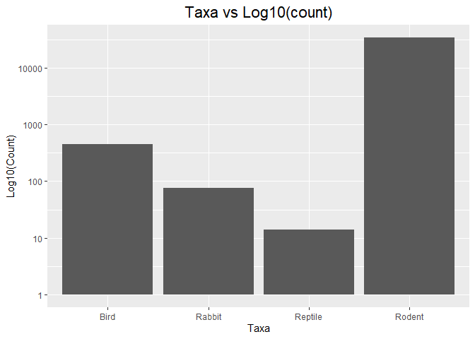
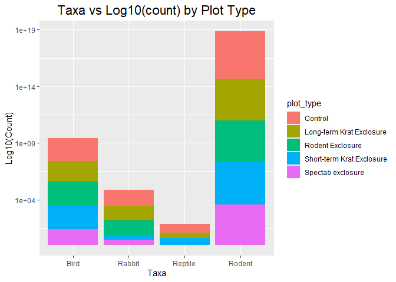
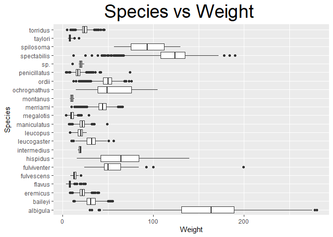
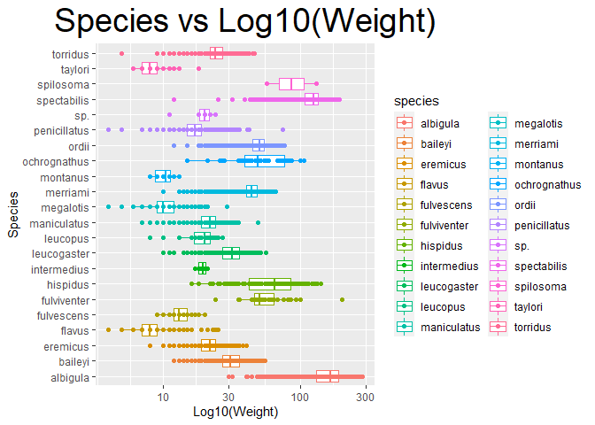
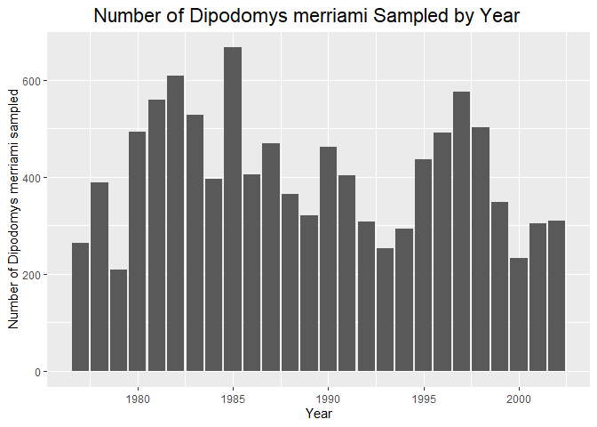
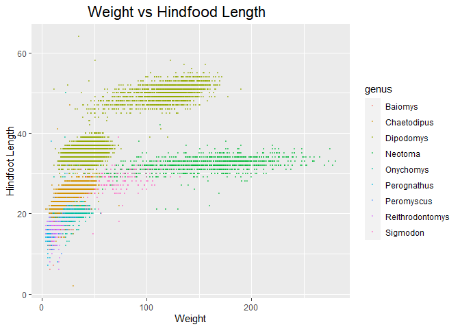
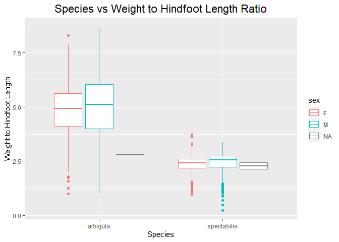
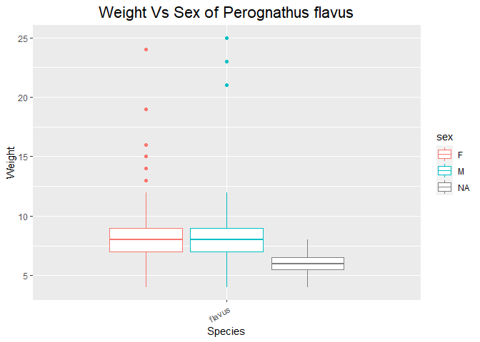

## Instructions
Answer the following questions and complete the exercises in RMarkdown. Please embed all of your code and push your final work to your repository. Your final lab report should be organized, clean, and run free from errors. Remember, you must remove the `#` for the included code chunks to run. Be sure to add your name to the author header above. For any included plots, make sure they are clearly labeled. You are free to use any plot type that you feel best communicates the results of your analysis.  

Make sure to use the formatting conventions of RMarkdown to make your report neat and clean!  

## Load the libraries

```r
library(tidyverse)
library(janitor)
library(here)
library(naniar)
library(skimr)
```


## Desert Ecology
For this assignment, we are going to use a modified data set on [desert ecology](http://esapubs.org/archive/ecol/E090/118/). The data are from: S. K. Morgan Ernest, Thomas J. Valone, and James H. Brown. 2009. Long-term monitoring and experimental manipulation of a Chihuahuan Desert ecosystem near Portal, Arizona, USA. Ecology 90:1708.

```r
deserts <- read_csv(here("lab10", "data", "surveys_complete.csv"))
```

```
## Parsed with column specification:
## cols(
##   record_id = col_double(),
##   month = col_double(),
##   day = col_double(),
##   year = col_double(),
##   plot_id = col_double(),
##   species_id = col_character(),
##   sex = col_character(),
##   hindfoot_length = col_double(),
##   weight = col_double(),
##   genus = col_character(),
##   species = col_character(),
##   taxa = col_character(),
##   plot_type = col_character()
## )
```

1. Use the function(s) of your choice to get an idea of its structure, including how NA's are treated. Are the data tidy?  


```r
glimpse(deserts)
```

```
## Rows: 34,786
## Columns: 13
## $ record_id       <dbl> 1, 2, 3, 4, 5, 6, 7, 8, 9, 10, 11, 12, 13, 14, 15, ...
## $ month           <dbl> 7, 7, 7, 7, 7, 7, 7, 7, 7, 7, 7, 7, 7, 7, 7, 7, 7, ...
## $ day             <dbl> 16, 16, 16, 16, 16, 16, 16, 16, 16, 16, 16, 16, 16,...
## $ year            <dbl> 1977, 1977, 1977, 1977, 1977, 1977, 1977, 1977, 197...
## $ plot_id         <dbl> 2, 3, 2, 7, 3, 1, 2, 1, 1, 6, 5, 7, 3, 8, 6, 4, 3, ...
## $ species_id      <chr> "NL", "NL", "DM", "DM", "DM", "PF", "PE", "DM", "DM...
## $ sex             <chr> "M", "M", "F", "M", "M", "M", "F", "M", "F", "F", "...
## $ hindfoot_length <dbl> 32, 33, 37, 36, 35, 14, NA, 37, 34, 20, 53, 38, 35,...
## $ weight          <dbl> NA, NA, NA, NA, NA, NA, NA, NA, NA, NA, NA, NA, NA,...
## $ genus           <chr> "Neotoma", "Neotoma", "Dipodomys", "Dipodomys", "Di...
## $ species         <chr> "albigula", "albigula", "merriami", "merriami", "me...
## $ taxa            <chr> "Rodent", "Rodent", "Rodent", "Rodent", "Rodent", "...
## $ plot_type       <chr> "Control", "Long-term Krat Exclosure", "Control", "...
```

```r
skim(deserts)
```


Table: Data summary

|                         |        |
|:------------------------|:-------|
|Name                     |deserts |
|Number of rows           |34786   |
|Number of columns        |13      |
|_______________________  |        |
|Column type frequency:   |        |
|character                |6       |
|numeric                  |7       |
|________________________ |        |
|Group variables          |None    |


**Variable type: character**

|skim_variable | n_missing| complete_rate| min| max| empty| n_unique| whitespace|
|:-------------|---------:|-------------:|---:|---:|-----:|--------:|----------:|
|species_id    |         0|          1.00|   2|   2|     0|       48|          0|
|sex           |      1748|          0.95|   1|   1|     0|        2|          0|
|genus         |         0|          1.00|   6|  16|     0|       26|          0|
|species       |         0|          1.00|   3|  15|     0|       40|          0|
|taxa          |         0|          1.00|   4|   7|     0|        4|          0|
|plot_type     |         0|          1.00|   7|  25|     0|        5|          0|


**Variable type: numeric**

|skim_variable   | n_missing| complete_rate|     mean|       sd|   p0|     p25|     p50|      p75|  p100|hist                                     |
|:---------------|---------:|-------------:|--------:|--------:|----:|-------:|-------:|--------:|-----:|:----------------------------------------|
|record_id       |         0|          1.00| 17804.20| 10229.68|    1| 8964.25| 17761.5| 26654.75| 35548|▇▇▇▇▇ |
|month           |         0|          1.00|     6.47|     3.40|    1|    4.00|     6.0|    10.00|    12|▇▆▆▅▇ |
|day             |         0|          1.00|    16.10|     8.25|    1|    9.00|    16.0|    23.00|    31|▆▇▇▇▆ |
|year            |         0|          1.00|  1990.50|     7.47| 1977| 1984.00|  1990.0|  1997.00|  2002|▇▆▇▇▇ |
|plot_id         |         0|          1.00|    11.34|     6.79|    1|    5.00|    11.0|    17.00|    24|▇▆▇▆▅ |
|hindfoot_length |      3348|          0.90|    29.29|     9.56|    2|   21.00|    32.0|    36.00|    70|▁▇▇▁▁ |
|weight          |      2503|          0.93|    42.67|    36.63|    4|   20.00|    37.0|    48.00|   280|▇▁▁▁▁ |

```r
naniar::miss_var_summary(deserts)
```

```
## # A tibble: 13 x 3
##    variable        n_miss pct_miss
##    <chr>            <int>    <dbl>
##  1 hindfoot_length   3348     9.62
##  2 weight            2503     7.20
##  3 sex               1748     5.03
##  4 record_id            0     0   
##  5 month                0     0   
##  6 day                  0     0   
##  7 year                 0     0   
##  8 plot_id              0     0   
##  9 species_id           0     0   
## 10 genus                0     0   
## 11 species              0     0   
## 12 taxa                 0     0   
## 13 plot_type            0     0
```


2. How many genera and species are represented in the data? What are the total number of observations? Which species is most/ least frequently sampled in the study?


```r
deserts %>% 
  count()
```

```
## # A tibble: 1 x 1
##       n
##   <int>
## 1 34786
```

```r
deserts %>% 
  count(genus)
```

```
## # A tibble: 26 x 2
##    genus                n
##    <chr>            <int>
##  1 Ammodramus           2
##  2 Ammospermophilus   437
##  3 Amphispiza         303
##  4 Baiomys             46
##  5 Calamospiza         13
##  6 Callipepla          16
##  7 Campylorhynchus     50
##  8 Chaetodipus       6029
##  9 Cnemidophorus        2
## 10 Crotalus             2
## # ... with 16 more rows
```

```r
deserts %>% 
  count(species)
```

```
## # A tibble: 40 x 2
##    species             n
##    <chr>           <int>
##  1 albigula         1252
##  2 audubonii          75
##  3 baileyi          2891
##  4 bilineata         303
##  5 brunneicapillus    50
##  6 chlorurus          39
##  7 clarki              1
##  8 eremicus         1299
##  9 flavus           1597
## 10 fulvescens         75
## # ... with 30 more rows
```


```r
deserts$species <- as.factor(deserts$species)
table(deserts$species)
```

```
## 
##        albigula       audubonii         baileyi       bilineata brunneicapillus 
##            1252              75            2891             303              50 
##       chlorurus          clarki        eremicus          flavus      fulvescens 
##              39               1            1299            1597              75 
##     fulviventer          fuscus       gramineus         harrisi        hispidus 
##              43               5               8             437             179 
##     intermedius     leucogaster      leucophrys        leucopus     maniculatus 
##               9            1006               2              36             899 
##       megalotis     melanocorys        merriami        montanus    ochrognathus 
##            2609              13           10596               8              43 
##           ordii    penicillatus      savannarum      scutalatus             sp. 
##            3027            3123               2               1              86 
##     spectabilis       spilosoma        squamata         taylori    tereticaudus 
##            2504             248              16              46               1 
##          tigris        torridus       undulatus       uniparens         viridis 
##               1            2249               5               1               1
```

3. What is the proportion of taxa included in this study? Show a table and plot that reflects this count.


```r
deserts %>% 
  tabyl(taxa)
```

```
##     taxa     n      percent
##     Bird   450 0.0129362387
##   Rabbit    75 0.0021560398
##  Reptile    14 0.0004024608
##   Rodent 34247 0.9845052607
```


```r
deserts %>% 
ggplot(aes(x=taxa))+ geom_bar()+scale_y_log10()+
    labs(title = "Taxa vs Log10(count)",
       x = "Taxa",
       y = "Log10(Count)") +
  theme(plot.title = element_text(size = rel(1.5), hjust = 0.5))
```

<!-- -->


4. For the taxa included in the study, use the fill option to show the proportion of individuals sampled by `plot_type.`


```r
deserts %>% 
ggplot(aes(x=taxa, fill=plot_type))+ geom_bar()+ scale_y_log10()+
  labs(title = "Taxa vs Log10(count) by Plot Type",
       x = "Taxa",
       y = "Log10(Count)") +
  theme(plot.title = element_text(size = rel(1.5), hjust = 0.5))
```

<!-- -->


5. What is the range of weight for each species included in the study? Remove any observations of weight that are NA so they do not show up in the plot.


```r
deserts %>% 
  filter(!is.na(weight)) %>%
  ggplot(aes(x=species, y= weight))+geom_boxplot()+ coord_flip()+
  labs(title = "Species vs Weight",
       x = "Species",
       y = "Weight") +
  theme(plot.title = element_text(size = rel(2.5), hjust = 0.4))
```

<!-- -->


6. Add another layer to your answer from #4 using `geom_point` to get an idea of how many measurements were taken for each species.


```r
deserts %>% 
  filter(!is.na(weight)) %>%
  ggplot(aes(x=species, y= weight, color=species))+geom_boxplot()+ scale_y_log10()+ coord_flip()+ geom_point()+
  labs(title = "Species vs Log10(Weight)",
       x = "Species",
       y = "Log10(Weight)") +
  theme(plot.title = element_text(size = rel(2.5), hjust = 0.4))
```

<!-- -->


7. [Dipodomys merriami](https://en.wikipedia.org/wiki/Merriam's_kangaroo_rat) is the most frequently sampled animal in the study. How have the number of observations of this species changed over the years included in the study?


```r
deserts %>% 
  filter(genus=="Dipodomys" & species == "merriami") %>% 
  ggplot(aes(x=year))+geom_bar()+
  labs(title = "Number of Dipodomys merriami Sampled by Year",
       x = "Year",
       y = "Number of Dipodomys merriami sampled") +
  theme(plot.title = element_text(size = rel(1.5), hjust = 0.4))
```

<!-- -->


8. What is the relationship between `weight` and `hindfoot` length? Consider whether or not over plotting is an issue.


```r
deserts %>% 
  filter(!is.na(weight) & !is.na(hindfoot_length)) %>% 
  ggplot(aes(x=weight, y=hindfoot_length, color = genus))+geom_point(size =.01, alpha=.5)+
  labs(title = "Weight vs Hindfood Length",
       x = "Weight",
       y = "Hindfoot Length") +
  theme(plot.title = element_text(size = rel(1.5), hjust = 0.4))
```

<!-- -->


9. Which two species have, on average, the highest weight? Once you have identified them, make a new column that is a ratio of `weight` to `hindfoot_length`. Make a plot that shows the range of this new ratio and fill by sex.


```r
deserts %>%
  group_by(species) %>% 
  summarize(meanweight = mean(weight, na.rm=T)) %>% 
  arrange(desc(meanweight))
```

```
## `summarise()` ungrouping output (override with `.groups` argument)
```

```
## # A tibble: 40 x 2
##    species      meanweight
##    <fct>             <dbl>
##  1 albigula          159. 
##  2 spectabilis       120. 
##  3 spilosoma          93.5
##  4 hispidus           65.6
##  5 fulviventer        58.9
##  6 ochrognathus       55.4
##  7 ordii              48.9
##  8 merriami           43.2
##  9 baileyi            31.7
## 10 leucogaster        31.6
## # ... with 30 more rows
```

```r
deserts<- deserts %>% 
  mutate(weight_to_hindfoot_length = (weight)/(hindfoot_length))
```

```r
deserts %>% 
  filter(!is.na(weight_to_hindfoot_length)) %>% 
  filter(species == "albigula"|species == "spectabilis") %>% 
  ggplot(aes(x=species,y=weight_to_hindfoot_length, color = sex))+geom_boxplot()+
  labs(title = "Species vs Weight to Hindfoot Length Ratio",
       x = "Species",
       y = "Weight to Hindfoot Length") +
  theme(plot.title = element_text(size = rel(1.5), hjust = 0.5))
```

<!-- -->


10. Make one plot of your choice! Make sure to include at least two of the aesthetics options you have learned.


```r
deserts %>% 
  filter(genus == "Perognathus"& species == "flavus") %>% 
  filter(!is.na(weight)) %>% 
  ggplot(aes(x=species, y=weight, color = sex))+geom_boxplot()+
  theme(axis.text.x = element_text(angle = 30, hjust = 1), plot.title = element_text(size = rel(1.5), hjust = 0.5))+
   labs(title = "Weight Vs Sex of Perognathus flavus",
       x = "Species",
       y = "Weight")
```

<!-- -->


## Push your final code to GitHub!
Please be sure that you check the `keep md` file in the knit preferences. 
