## Instructions
Answer the following questions and complete the exercises in RMarkdown. Please embed all of your code and push your final work to your repository. Your final lab report should be organized, clean, and run free from errors. Remember, you must remove the `#` for the included code chunks to run. Be sure to add your name to the author header above. For any included plots, make sure they are clearly labeled. You are free to use any plot type that you feel best communicates the results of your analysis.  

Make sure to use the formatting conventions of RMarkdown to make your report neat and clean!  

## Load the libraries

```r
library(qtl)
library(qtlcharts)
library(tidyverse)
library(ggmap)
```

**1. We have a satellite collars on a number of different individuals and want to be able to quickly look at all of their recent movements at once. Please load all the data files from `us_individual_collar_data` and use for loop to create plots for all different individuals of the path they move on longitude and latitude.**

```r
data_files <- list.files("data/us_individual_collar_data", full.names = TRUE)

for (i in 1:length(data_files)){
  data0 <- as.data.frame(read_csv(data_files[i]))
  print(
    ggplot(data0, aes(x=long,y=lat))+
      geom_path()+
      geom_point()+
      labs(title = data_files[i], x = "longitude", y = "latitude")
  )
}
```

```
## Warning: Missing column names filled in: 'X1' [1]
```

```
## 
## -- Column specification --------------------------------------------------------
## cols(
##   X1 = col_double(),
##   date = col_date(format = ""),
##   collar = col_character(),
##   time = col_datetime(format = ""),
##   lat = col_double(),
##   long = col_double()
## )
```

```
## Warning: Missing column names filled in: 'X1' [1]
```

```
## 
## -- Column specification --------------------------------------------------------
## cols(
##   X1 = col_double(),
##   date = col_date(format = ""),
##   collar = col_character(),
##   time = col_datetime(format = ""),
##   lat = col_double(),
##   long = col_double()
## )
```

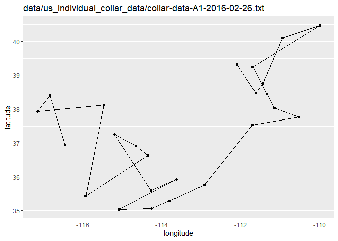<!-- -->

```
## Warning: Missing column names filled in: 'X1' [1]
```

```
## 
## -- Column specification --------------------------------------------------------
## cols(
##   X1 = col_double(),
##   date = col_date(format = ""),
##   collar = col_character(),
##   time = col_datetime(format = ""),
##   lat = col_double(),
##   long = col_double()
## )
```

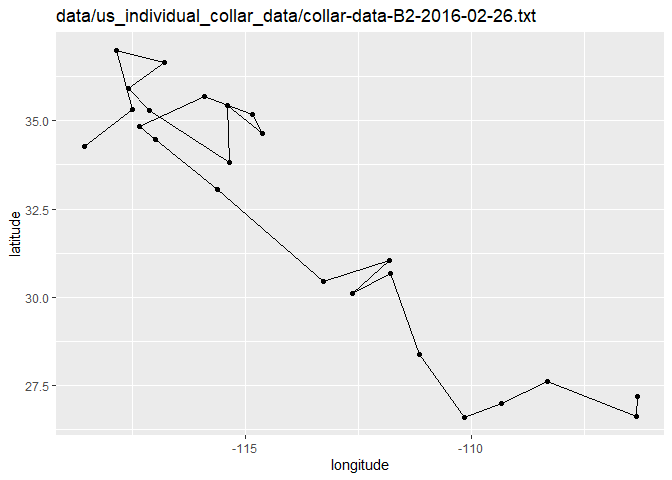<!-- -->

```
## Warning: Missing column names filled in: 'X1' [1]
```

```
## 
## -- Column specification --------------------------------------------------------
## cols(
##   X1 = col_double(),
##   date = col_date(format = ""),
##   collar = col_character(),
##   time = col_datetime(format = ""),
##   lat = col_double(),
##   long = col_double()
## )
```

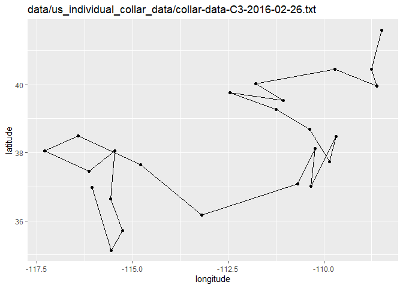<!-- -->

```
## Warning: Missing column names filled in: 'X1' [1]
```

```
## 
## -- Column specification --------------------------------------------------------
## cols(
##   X1 = col_double(),
##   date = col_date(format = ""),
##   collar = col_character(),
##   time = col_datetime(format = ""),
##   lat = col_double(),
##   long = col_double()
## )
```

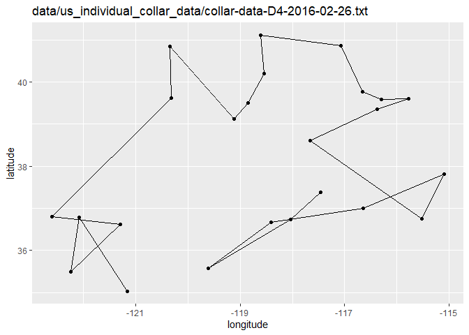<!-- -->

```
## Warning: Missing column names filled in: 'X1' [1]
```

```
## 
## -- Column specification --------------------------------------------------------
## cols(
##   X1 = col_double(),
##   date = col_date(format = ""),
##   collar = col_character(),
##   time = col_datetime(format = ""),
##   lat = col_double(),
##   long = col_double()
## )
```

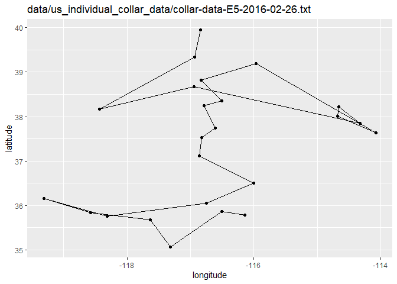<!-- -->

```
## Warning: Missing column names filled in: 'X1' [1]
```

```
## 
## -- Column specification --------------------------------------------------------
## cols(
##   X1 = col_double(),
##   date = col_date(format = ""),
##   collar = col_character(),
##   time = col_datetime(format = ""),
##   lat = col_double(),
##   long = col_double()
## )
```

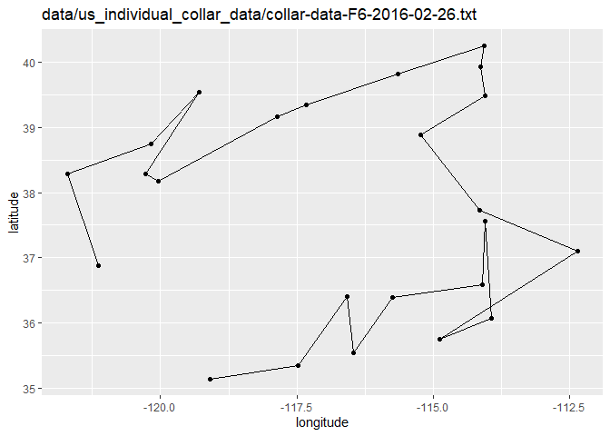<!-- -->

```
## Warning: Missing column names filled in: 'X1' [1]
```

```
## 
## -- Column specification --------------------------------------------------------
## cols(
##   X1 = col_double(),
##   date = col_date(format = ""),
##   collar = col_character(),
##   time = col_datetime(format = ""),
##   lat = col_double(),
##   long = col_double()
## )
```

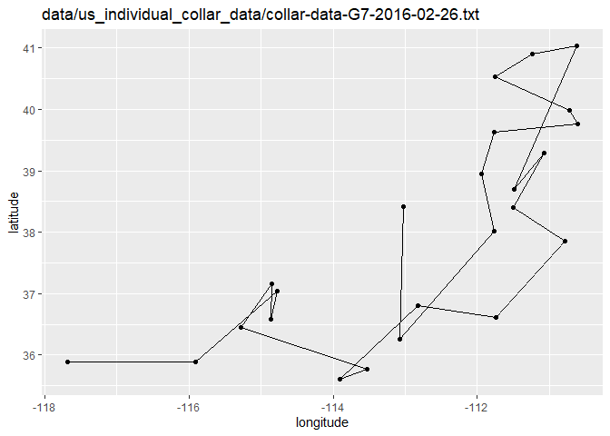<!-- -->

```
## Warning: Missing column names filled in: 'X1' [1]
```

```
## 
## -- Column specification --------------------------------------------------------
## cols(
##   X1 = col_double(),
##   date = col_date(format = ""),
##   collar = col_character(),
##   time = col_datetime(format = ""),
##   lat = col_double(),
##   long = col_double()
## )
```

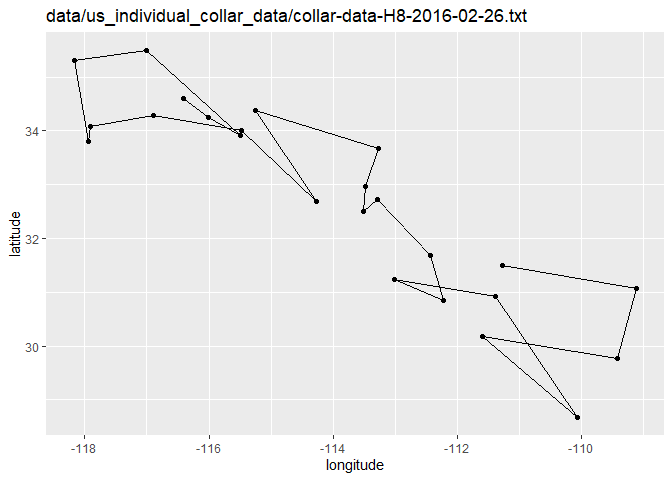<!-- -->

```
## Warning: Missing column names filled in: 'X1' [1]
```

```
## 
## -- Column specification --------------------------------------------------------
## cols(
##   X1 = col_double(),
##   date = col_date(format = ""),
##   collar = col_character(),
##   time = col_datetime(format = ""),
##   lat = col_double(),
##   long = col_double()
## )
```

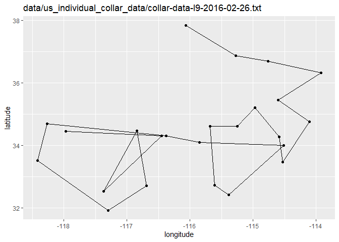<!-- -->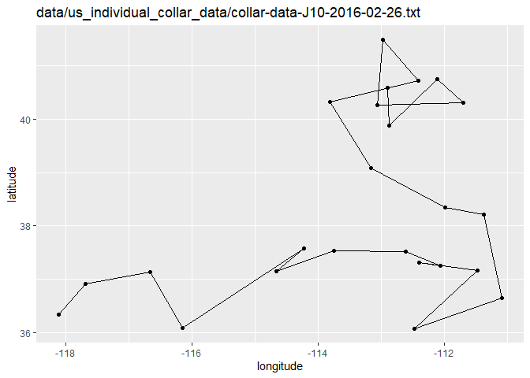<!-- -->

**2. Please load all the data files from `us_individual_collar_data` and combine all data into one data frame. Create a summary to show what is the maximum and minimum of recorded data points on longitude and latitude.**

```r
data_list <- lapply(data_files, read_csv)
```

```
## Warning: Missing column names filled in: 'X1' [1]
```

```
## 
## -- Column specification --------------------------------------------------------
## cols(
##   X1 = col_double(),
##   date = col_date(format = ""),
##   collar = col_character(),
##   time = col_datetime(format = ""),
##   lat = col_double(),
##   long = col_double()
## )
```

```
## Warning: Missing column names filled in: 'X1' [1]
```

```
## 
## -- Column specification --------------------------------------------------------
## cols(
##   X1 = col_double(),
##   date = col_date(format = ""),
##   collar = col_character(),
##   time = col_datetime(format = ""),
##   lat = col_double(),
##   long = col_double()
## )
```

```
## Warning: Missing column names filled in: 'X1' [1]
```

```
## 
## -- Column specification --------------------------------------------------------
## cols(
##   X1 = col_double(),
##   date = col_date(format = ""),
##   collar = col_character(),
##   time = col_datetime(format = ""),
##   lat = col_double(),
##   long = col_double()
## )
```

```
## Warning: Missing column names filled in: 'X1' [1]
```

```
## 
## -- Column specification --------------------------------------------------------
## cols(
##   X1 = col_double(),
##   date = col_date(format = ""),
##   collar = col_character(),
##   time = col_datetime(format = ""),
##   lat = col_double(),
##   long = col_double()
## )
```

```
## Warning: Missing column names filled in: 'X1' [1]
```

```
## 
## -- Column specification --------------------------------------------------------
## cols(
##   X1 = col_double(),
##   date = col_date(format = ""),
##   collar = col_character(),
##   time = col_datetime(format = ""),
##   lat = col_double(),
##   long = col_double()
## )
```

```
## Warning: Missing column names filled in: 'X1' [1]
```

```
## 
## -- Column specification --------------------------------------------------------
## cols(
##   X1 = col_double(),
##   date = col_date(format = ""),
##   collar = col_character(),
##   time = col_datetime(format = ""),
##   lat = col_double(),
##   long = col_double()
## )
```

```
## Warning: Missing column names filled in: 'X1' [1]
```

```
## 
## -- Column specification --------------------------------------------------------
## cols(
##   X1 = col_double(),
##   date = col_date(format = ""),
##   collar = col_character(),
##   time = col_datetime(format = ""),
##   lat = col_double(),
##   long = col_double()
## )
```

```
## Warning: Missing column names filled in: 'X1' [1]
```

```
## 
## -- Column specification --------------------------------------------------------
## cols(
##   X1 = col_double(),
##   date = col_date(format = ""),
##   collar = col_character(),
##   time = col_datetime(format = ""),
##   lat = col_double(),
##   long = col_double()
## )
```

```
## Warning: Missing column names filled in: 'X1' [1]
```

```
## 
## -- Column specification --------------------------------------------------------
## cols(
##   X1 = col_double(),
##   date = col_date(format = ""),
##   collar = col_character(),
##   time = col_datetime(format = ""),
##   lat = col_double(),
##   long = col_double()
## )
```

```
## Warning: Missing column names filled in: 'X1' [1]
```

```
## 
## -- Column specification --------------------------------------------------------
## cols(
##   X1 = col_double(),
##   date = col_date(format = ""),
##   collar = col_character(),
##   time = col_datetime(format = ""),
##   lat = col_double(),
##   long = col_double()
## )
```

```r
us_collar_data_all <- bind_rows(data_list)
us_collar_data_all %>% 
  summarise(max_lat=max(lat),
            min_lat=min(lat),
            max_long=max(long),
            min_long=min(long))
```

```
## # A tibble: 1 x 4
##   max_lat min_lat max_long min_long
##     <dbl>   <dbl>    <dbl>    <dbl>
## 1    41.6    26.6    -106.    -123.
```

**3. Use the range of the latitude and longitude from Q2 to build an appropriate bounding box for your map and load a map from `stamen` in a terrain style projection and display the map. Then, build a final map that overlays the recorded path from Q1.**

```r
lat <- c(26.6116	, 41.58802)
long <- c(-122.6017	, -106.3343	)
bbox <- make_bbox(long, lat, f = 0.5)
map <- get_map(bbox, maptype = "terrain", source = "stamen")
```

```
## Map tiles by Stamen Design, under CC BY 3.0. Data by OpenStreetMap, under ODbL.
```

```r
ggmap(map)
```

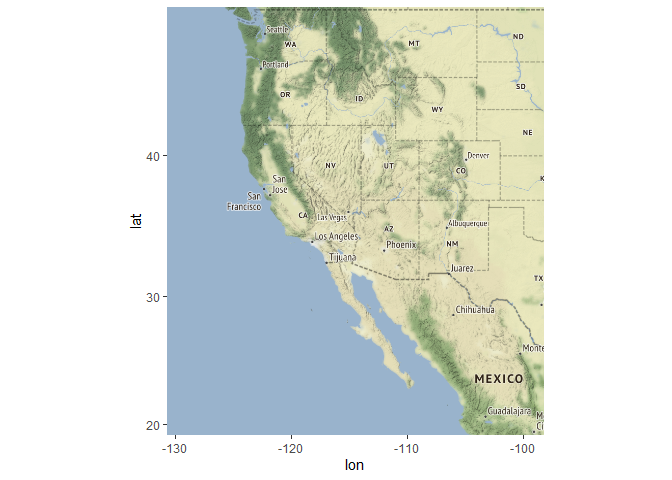<!-- -->

```r
for (i in 1:length(data_files)){
  data0 <- as.data.frame(read_csv(data_files[i]))
  print(
    ggmap(map)+
      geom_path(data = data0, aes(long,lat))+
      geom_point(data = data0, aes(long,lat))+
      labs(title = data_files[i], x = "longitude", y = "latitude")
  )
}
```

```
## Warning: Missing column names filled in: 'X1' [1]
```

```
## 
## -- Column specification --------------------------------------------------------
## cols(
##   X1 = col_double(),
##   date = col_date(format = ""),
##   collar = col_character(),
##   time = col_datetime(format = ""),
##   lat = col_double(),
##   long = col_double()
## )
```

```
## Warning: Missing column names filled in: 'X1' [1]
```

```
## 
## -- Column specification --------------------------------------------------------
## cols(
##   X1 = col_double(),
##   date = col_date(format = ""),
##   collar = col_character(),
##   time = col_datetime(format = ""),
##   lat = col_double(),
##   long = col_double()
## )
```

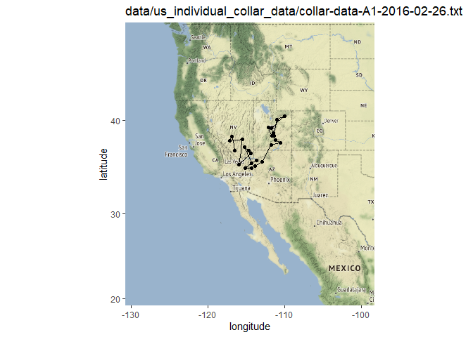<!-- -->

```
## Warning: Missing column names filled in: 'X1' [1]
```

```
## 
## -- Column specification --------------------------------------------------------
## cols(
##   X1 = col_double(),
##   date = col_date(format = ""),
##   collar = col_character(),
##   time = col_datetime(format = ""),
##   lat = col_double(),
##   long = col_double()
## )
```

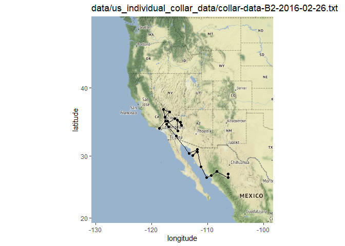<!-- -->

```
## Warning: Missing column names filled in: 'X1' [1]
```

```
## 
## -- Column specification --------------------------------------------------------
## cols(
##   X1 = col_double(),
##   date = col_date(format = ""),
##   collar = col_character(),
##   time = col_datetime(format = ""),
##   lat = col_double(),
##   long = col_double()
## )
```

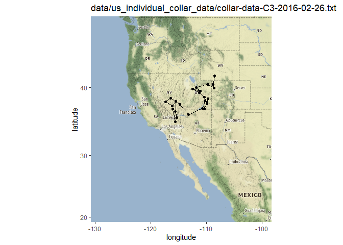<!-- -->

```
## Warning: Missing column names filled in: 'X1' [1]
```

```
## 
## -- Column specification --------------------------------------------------------
## cols(
##   X1 = col_double(),
##   date = col_date(format = ""),
##   collar = col_character(),
##   time = col_datetime(format = ""),
##   lat = col_double(),
##   long = col_double()
## )
```

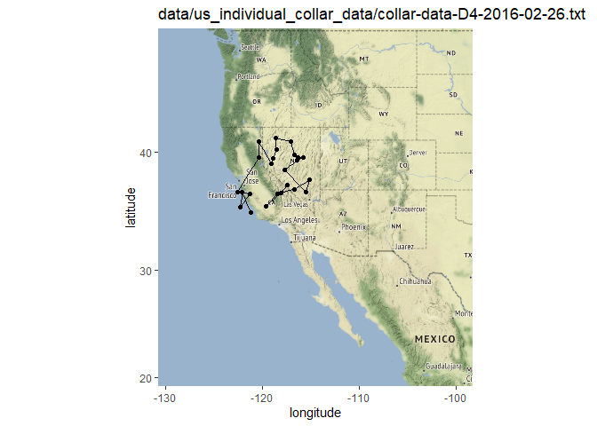<!-- -->

```
## Warning: Missing column names filled in: 'X1' [1]
```

```
## 
## -- Column specification --------------------------------------------------------
## cols(
##   X1 = col_double(),
##   date = col_date(format = ""),
##   collar = col_character(),
##   time = col_datetime(format = ""),
##   lat = col_double(),
##   long = col_double()
## )
```

<!-- -->

```
## Warning: Missing column names filled in: 'X1' [1]
```

```
## 
## -- Column specification --------------------------------------------------------
## cols(
##   X1 = col_double(),
##   date = col_date(format = ""),
##   collar = col_character(),
##   time = col_datetime(format = ""),
##   lat = col_double(),
##   long = col_double()
## )
```

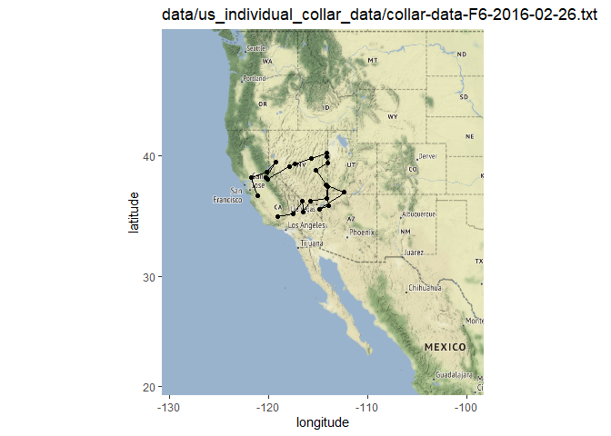<!-- -->

```
## Warning: Missing column names filled in: 'X1' [1]
```

```
## 
## -- Column specification --------------------------------------------------------
## cols(
##   X1 = col_double(),
##   date = col_date(format = ""),
##   collar = col_character(),
##   time = col_datetime(format = ""),
##   lat = col_double(),
##   long = col_double()
## )
```

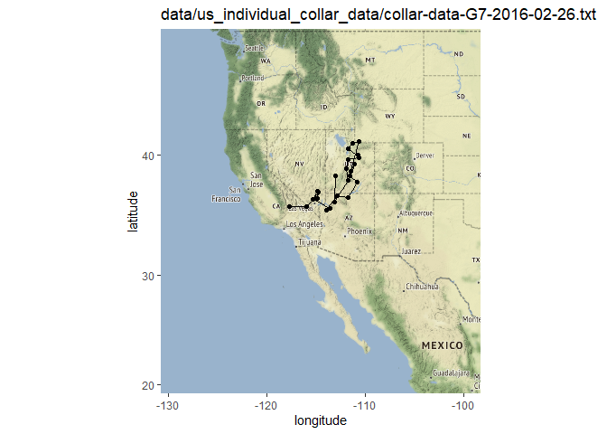<!-- -->

```
## Warning: Missing column names filled in: 'X1' [1]
```

```
## 
## -- Column specification --------------------------------------------------------
## cols(
##   X1 = col_double(),
##   date = col_date(format = ""),
##   collar = col_character(),
##   time = col_datetime(format = ""),
##   lat = col_double(),
##   long = col_double()
## )
```

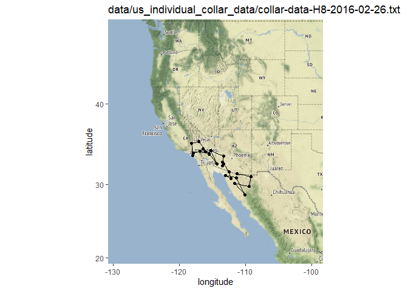<!-- -->

```
## Warning: Missing column names filled in: 'X1' [1]
```

```
## 
## -- Column specification --------------------------------------------------------
## cols(
##   X1 = col_double(),
##   date = col_date(format = ""),
##   collar = col_character(),
##   time = col_datetime(format = ""),
##   lat = col_double(),
##   long = col_double()
## )
```

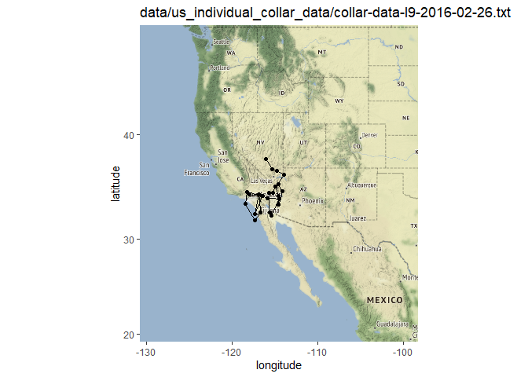<!-- -->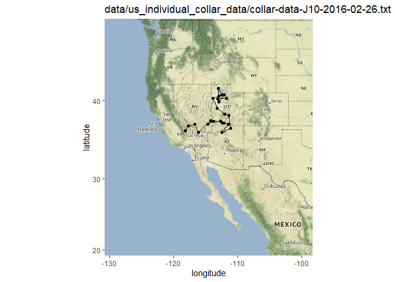<!-- -->

## Load the Data
We will use the data from an experiment on hypertension in the mouse [Sugiyama et al., Genomics 71:70-77, 2001](https://www.sciencedirect.com/science/article/pii/S0888754300964012?via%3Dihub)

```r
data(hyper)
```

**4. Create a summary of the hypertension data. How many individuals and phenotypes are included in this data set? How many gene markers and chromosomes are included in this data set? Please create a table to show the number of markers on each chromosome.**

```r
summary(hyper)
```

```
##     Backcross
## 
##     No. individuals:    250 
## 
##     No. phenotypes:     2 
##     Percent phenotyped: 100 100 
## 
##     No. chromosomes:    20 
##         Autosomes:      1 2 3 4 5 6 7 8 9 10 11 12 13 14 15 16 17 18 19 
##         X chr:          X 
## 
##     Total markers:      174 
##     No. markers:        22 8 6 20 14 11 7 6 5 5 14 5 5 5 11 6 12 4 4 4 
##     Percent genotyped:  47.7 
##     Genotypes (%):    
##           Autosomes:    BB:50.1  BA:49.9 
##        X chromosome:    BY:53.0  AY:47.0
```

#### There are 250 individuals, and 2 phenotypes in this dataset. There are 174 total markers and 20 chromosomes ####

**5. Please make an interactive genetic map of markers for the hypertension data.**

```r
iplotMap(hyper)
```

```
## Set screen size to height=700 x width=1000
```

```{=html}
<div id="htmlwidget-d60edd8257d15ccd8ba8" style="width:672px;height:480px;" class="iplotMap html-widget"></div>
<script type="application/json" data-for="htmlwidget-d60edd8257d15ccd8ba8">{"x":{"data":{"chr":["1","1","1","1","1","1","1","1","1","1","1","1","1","1","1","1","1","1","1","1","1","1","2","2","2","2","2","2","2","2","3","3","3","3","3","3","4","4","4","4","4","4","4","4","4","4","4","4","4","4","4","4","4","4","4","4","5","5","5","5","5","5","5","5","5","5","5","5","5","5","6","6","6","6","6","6","6","6","6","6","6","7","7","7","7","7","7","7","8","8","8","8","8","8","9","9","9","9","9","10","10","10","10","10","11","11","11","11","11","11","11","11","11","11","11","11","11","11","12","12","12","12","12","13","13","13","13","13","14","14","14","14","14","15","15","15","15","15","15","15","15","15","15","15","16","16","16","16","16","16","17","17","17","17","17","17","17","17","17","17","17","17","18","18","18","18","19","19","19","19","X","X","X","X"],"pos":[3.3,19.7,32.8,35,37.2,41.5,43.7,43.7,49.2,54.6,64.5,67.8,69.9,74.3,75.4,82,82,82,82,86.3,94,115.8,7.7,17.5,29.5,49.2,54.6,66.7,85.2,98.4,2.2,17.5,37.2,44.8,57.9,66.7,0,14.2,16.4,17.5,18.6,21.9,23,23,25.1,28.4,29.5,30.6,31.7,31.7,32.8,33.9,35,47,56.8,74.3,0,5.5,10.9,14.2,15.3,18.6,32.8,51.4,60.1,66.7,73.2,74.3,77.6,82,0,9.8,21.9,25.1,29.5,40.4,51.4,56.8,63.4,65.6,66.7,1.1,13.1,26.2,28.4,37.2,53.6,55.6,6.6,19.7,33.9,40.4,59,75.4,12,24,40.4,56.8,68.9,2.2,15.3,50.3,69.9,75.4,2.2,4.4,4.4,8.7,8.7,10.9,13.1,17.5,17.5,19.7,25.1,43.7,60.1,80.9,1.1,16.4,23,40.4,56.8,5.7,7.7,16.4,40.4,59,0,16.4,36.1,52.5,67.8,5.5,5.5,7.7,13.1,16.4,16.4,17.5,17.5,29.5,55.7,63.4,0,25.1,31.7,32.8,51.4,51.4,1.1,1.1,1.1,2.2,3.3,3.3,5.5,6.6,10.9,19.7,33.9,50.3,2.2,14.2,26.2,37.2,0,17.5,32.8,55.7,1.1,20.8,29.5,43.7],"marker":["D1Mit296","D1Mit123","D1Mit156","D1Mit178","D1Mit19","D1Mit7","D1Mit46","D1Mit132","D1Mit334","D1Mit305","D1Mit26","D1Mit94","D1Mit218","D1Mit100","D1Mit102","D1Mit14","D1Mit105","D1Mit159","D1Mit267","D1Mit15","D1Mit456","D1Mit155","D2Mit359","D2Mit82","D2Mit241","D2Mit14","D2Mit62","D2Mit280","D2Mit229","D2Mit266","D3Mit164","D3Mit6","D3Mit11","D3Mit14","D3Mit44","D3Mit19","D4Mit149","D4Mit41","D4Mit108","D4Mit237","D4Mit286","D4Mit214","D4Mit53","D4Mit89","D4Mit111","D4Mit288","D4Mit164","D4Mit178","D4Mit80","D4Mit81","D4Mit276","D4Mit152","D4Mit302","D4Mit175","D4Mit16","D4Mit14","D5Mit193","D5Mit61","D5Mit387","D5Mit148","D5Mit13","D5Mit55","D5Mit312","D5Mit188","D5Mit213","D5Mit31","D5Mit99","D5Mit101","D5Mit409","D5Mit169","D6Mit86","D6Mit273","D6Mit188","D6Mit8","D6Mit213","D6Mit36","D6Mit135","D6Mit59","D6Mit295","D6Mit201","D6Mit15","D7Mit306","D7Mit25","D7Mit297","D7Mit30","D7Mit37","D7Mit71","D7Nds4","D8Mit3","D8Mit292","D8Mit25","D8Mit45","D8Mit271","D8Mit156","D9Mit297","D9Mit27","D9Mit8","D9Mit24","D9Mit18","D10Mit166","D10Mit214","D10Mit11","D10Mit14","D10Mit297","D11Mit74","D11Mit2","D11Mit78","D11Mit79","D11Mit80","D11Mit82","D11Mit163","D11Mit110","D11Mit136","D11Mit20","D11Mit310","D11Mit35","D11Mit67","D11Mit48","D12Mit37","D12Mit110","D12Mit34","D12Mit118","D12Mit20","D13Mit16","D13Mit59","D13Mit91","D13Mit148","D13Mit78","D14Mit48","D14Mit14","D14Mit37","D14Mit7","D14Mit266","D15Mit11","D15Mit175","D15Mit53","D15Mit111","D15Mit56","D15Mit22","D15Mit206","D15Mit152","D15Mit156","D15Mit108","D15Mit79","D16Mit32","D16Mit4","D16Mit171","D16Mit5","D16Mit70","D16Mit106","D17Mit164","D17Mit143","D17Mit57","D17Mit113","D17Mit131","D17Mit46","D17Mit45","D17Mit23","D17Mit11","D17Mit10","D17Mit53","D17Mit221","D18Mit67","D18Mit17","D18Mit50","D18Mit4","D19Mit59","D19Mit40","D19Mit53","D19Mit137","DXMit55","DXMit22","DXMit16","DXMit130"],"chrname":["1","2","3","4","5","6","7","8","9","10","11","12","13","14","15","16","17","18","19","X"]},"chartOpts":{"shiftStart":false}},"evals":[],"jsHooks":[]}</script>
```

**6. Make a plot shows the pattern of missing genotype data in the hypertension dataset. Please reorder the recorded individuals according to their blood pressure phenotypes. Is there a specific pattern of missing genotype? Please explain it.**

```r
plot(hyper)
```

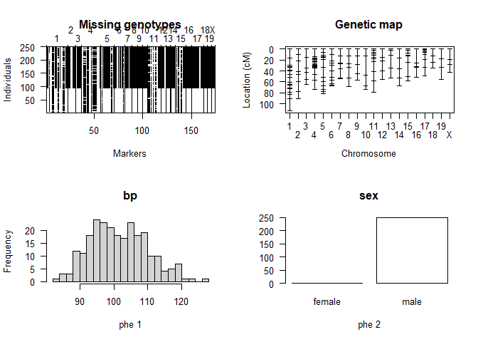<!-- -->

```r
head(hyper$pheno)
```

```
##      bp  sex
## 1 109.6 male
## 2 109.8 male
## 3 110.1 male
## 4 110.6 male
## 5 115.0 male
## 6 109.8 male
```

```r
plotMissing(hyper, main="", reorder=1)
```

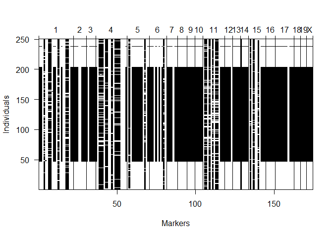<!-- -->

#### Most of the missing data is coming from individuals 50-200 ####


**7. Based on your answer from previous question, you probably noticed that there are gene markers without data. Please use the function `drop.nullmarkers` to remove markers that have no genotype data. After this, make a new summary to show the number of markers on each chromosome. How many gene markers were dropped? Where were the dropped markers located? Please use the data without nullmarkers for the following questions.**

```r
hyper_drop <- drop.nullmarkers(hyper)

summary(hyper_drop)
```

```
##     Backcross
## 
##     No. individuals:    250 
## 
##     No. phenotypes:     2 
##     Percent phenotyped: 100 100 
## 
##     No. chromosomes:    20 
##         Autosomes:      1 2 3 4 5 6 7 8 9 10 11 12 13 14 15 16 17 18 19 
##         X chr:          X 
## 
##     Total markers:      173 
##     No. markers:        22 8 6 20 14 11 7 6 5 5 14 5 5 4 11 6 12 4 4 4 
##     Percent genotyped:  48 
##     Genotypes (%):    
##           Autosomes:    BB:50.1  BA:49.9 
##        X chromosome:    BY:53.0  AY:47.0
```
#### Only one marker from chromosome 14 was dropped ####

**8. Please conduct single-QTL analysis and create a table to give the maximum LOD score on each chromosome based on their blood pressure phenotypes. Which gene marker has the higiest LOD score? Which chromosome contains the gene marker that has the highest LOD score? Then, creates an interactive chart with LOD curves from a genome scan for all chromosomes.**

```r
hyper_drop <- calc.genoprob(hyper_drop)
singqtl <- scanone(hyper_drop, pheno.col=1)
singqtl %>% 
  arrange(desc(lod))
```

```
##           chr   pos          lod
## D4Mit164    4  29.5 8.0936611995
## D4Mit214    4  21.9 6.8496711335
## D4Mit237    4  17.5 6.5578757800
## D4Mit286    4  18.6 6.5092502945
## D4Mit178    4  30.6 6.3749215180
## D4Mit111    4  25.1 6.3078995597
## D4Mit288    4  28.4 6.1784364828
## D4Mit53     4  23.0 5.8422220345
## D4Mit89     4  23.0 5.8422220345
## D4Mit108    4  16.4 5.4854360206
## D4Mit41     4  14.2 5.3803971305
## D4Mit81     4  31.7 5.1375886310
## D4Mit80     4  31.7 5.1375886310
## D4Mit276    4  32.8 4.8875613687
## D4Mit152    4  33.9 4.7648501857
## D4Mit302    4  35.0 3.7286727716
## D1Mit334    1  49.2 3.5267044634
## D1Mit94     1  67.8 3.3629179514
## D1Mit132    1  43.7 3.3421871787
## D1Mit46     1  43.7 3.3421871507
## D1Mit102    1  75.4 3.2198347634
## D1Mit100    1  74.3 3.1758610981
## D1Mit7      1  41.5 3.1328781519
## D1Mit218    1  69.9 3.0963729397
## D1Mit159    1  82.0 3.0292173193
## D1Mit267    1  82.0 3.0292172820
## D1Mit14     1  82.0 3.0290986270
## D1Mit105    1  82.0 3.0290985093
## D1Mit19     1  37.2 2.9441481443
## D4Mit175    4  47.0 2.7395652003
## D4Mit16     4  56.8 2.4330012251
## D4Mit14     4  74.3 2.1736121580
## D1Mit26     1  64.5 2.1623610729
## D4Mit149    4   0.0 2.0619239320
## D1Mit305    1  54.6 2.0065693641
## D6Mit188    6  21.9 1.8211658159
## D6Mit8      6  25.1 1.7993072464
## D15Mit152  15  17.5 1.7053688802
## D15Mit206  15  17.5 1.7053688374
## D1Mit156    1  32.8 1.6943724765
## D1Mit178    1  35.0 1.6519940836
## D5Mit31     5  66.7 1.5447695317
## D1Mit15     1  86.3 1.5124874334
## D2Mit62     2  54.6 1.4451669255
## D5Mit99     5  73.2 1.4008517779
## D15Mit22   15  16.4 1.3672909546
## D15Mit56   15  16.4 1.3672909477
## D5Mit101    5  74.3 1.3523879809
## D5Mit169    5  82.0 1.3352994035
## D1Mit456    1  94.0 1.3031277002
## D5Mit409    5  77.6 1.2961121884
## D15Mit111  15  13.1 1.2863047439
## D2Mit14     2  49.2 1.2477059750
## D2Mit280    2  66.7 1.1551254989
## D6Mit36     6  40.4 1.1322955298
## D15Mit11   15   5.5 1.0675142338
## D15Mit175  15   5.5 1.0675142315
## D15Mit156  15  29.5 1.0457533483
## D6Mit295    6  63.4 0.9842684697
## D15Mit79   15  63.4 0.9666623557
## D6Mit213    6  29.5 0.9416037768
## DXMit130    X  43.7 0.9274964233
## D6Mit135    6  51.4 0.8835488689
## D6Mit273    6   9.8 0.8353447217
## D2Mit241    2  29.5 0.8286552497
## D6Mit59     6  56.8 0.8142005652
## D19Mit59   19   0.0 0.7917868438
## D8Mit271    8  59.0 0.7907409143
## D3Mit11     3  37.2 0.7807048362
## D9Mit18     9  68.9 0.7502459166
## D15Mit53   15   7.7 0.7459694196
## DXMit16     X  29.5 0.7128611939
## D6Mit15     6  66.7 0.6595297122
## D6Mit201    6  65.6 0.6410131121
## D11Mit35   11  43.7 0.6259820641
## D15Mit108  15  55.7 0.6078228353
## D3Mit6      3  17.5 0.5885098768
## D2Mit82     2  17.5 0.5368659034
## D18Mit17   18  14.2 0.5057623851
## DXMit22     X  20.8 0.4472058101
## D12Mit37   12   1.1 0.4286562092
## D1Mit296    1   3.3 0.4117448071
## D5Mit213    5  60.1 0.4021080017
## D7Mit297    7  26.2 0.4000641331
## D11Mit310  11  25.1 0.4000344400
## D1Mit123    1  19.7 0.3995970550
## D11Mit20   11  19.7 0.3920578178
## D8Mit156    8  75.4 0.3871432575
## D19Mit137  19  55.7 0.3801939921
## D5Mit193    5   0.0 0.3728645888
## D16Mit70   16  51.4 0.3701823277
## D16Mit106  16  51.4 0.3701823244
## D5Mit55     5  18.6 0.3380438352
## D19Mit53   19  32.8 0.3202410984
## D13Mit78   13  59.0 0.3127863765
## D11Mit110  11  17.5 0.3004352659
## D11Mit136  11  17.5 0.3004352512
## D1Mit155    1 115.8 0.2659435308
## D5Mit188    5  51.4 0.2654893375
## D10Mit214  10  15.3 0.2466849472
## D16Mit4    16  25.1 0.2435883302
## D11Mit163  11  13.1 0.2401204010
## D2Mit359    2   7.7 0.2247897209
## D5Mit61     5   5.5 0.2246562321
## D16Mit171  16  31.7 0.2198068608
## D10Mit166  10   2.2 0.2143123352
## D17Mit46   17   3.3 0.2066625662
## D17Mit131  17   3.3 0.2066625525
## D11Mit67   11  60.1 0.1964948082
## D13Mit148  13  40.4 0.1844976670
## D9Mit24     9  56.8 0.1800599409
## D19Mit40   19  17.5 0.1721772554
## D11Mit74   11   2.2 0.1716721453
## D3Mit14     3  44.8 0.1651759629
## D5Mit13     5  15.3 0.1630030540
## D11Mit82   11  10.9 0.1617231382
## D17Mit143  17   1.1 0.1557464648
## D17Mit164  17   1.1 0.1557464620
## D17Mit57   17   1.1 0.1557464377
## D11Mit2    11   4.4 0.1553722304
## D11Mit78   11   4.4 0.1553721963
## D7Mit30     7  28.4 0.1540588132
## D16Mit5    16  32.8 0.1418847041
## D7Mit306    7   1.1 0.1369746934
## D17Mit221  17  50.3 0.1302639649
## D18Mit67   18   2.2 0.1187825317
## D6Mit86     6   0.0 0.1172057408
## D7Mit25     7  13.1 0.1149397404
## D5Mit148    5  14.2 0.1139450913
## D9Mit297    9  12.0 0.1098126972
## D7Nds4      7  55.6 0.1093732137
## D14Mit7    14  52.5 0.1060170996
## D17Mit113  17   2.2 0.1024779096
## D13Mit16   13   5.7 0.0910047160
## D3Mit44     3  57.9 0.0899287390
## D10Mit297  10  75.4 0.0886546315
## D9Mit8      9  40.4 0.0882056000
## D14Mit14   14  16.4 0.0854485049
## D11Mit80   11   8.7 0.0699343995
## D11Mit79   11   8.7 0.0699343963
## D5Mit387    5  10.9 0.0649209336
## D8Mit3      8   6.6 0.0574090158
## D10Mit14   10  69.9 0.0507749899
## D2Mit266    2  98.4 0.0503093973
## D5Mit312    5  32.8 0.0474201810
## D18Mit4    18  37.2 0.0408141197
## D3Mit164    3   2.2 0.0370327430
## D14Mit37   14  36.1 0.0356625059
## D13Mit59   13   7.7 0.0327909578
## D16Mit32   16   0.0 0.0284895729
## D9Mit27     9  24.0 0.0278178870
## D17Mit53   17  33.9 0.0270201207
## D17Mit45   17   5.5 0.0262508589
## D2Mit229    2  85.2 0.0259369317
## D17Mit23   17   6.6 0.0255827405
## D13Mit91   13  16.4 0.0253706523
## D14Mit266  14  67.8 0.0242861774
## D8Mit45     8  40.4 0.0208415111
## D7Mit71     7  53.6 0.0190184791
## D17Mit11   17  10.9 0.0181788482
## D12Mit20   12  56.8 0.0136085794
## D7Mit37     7  37.2 0.0127470023
## D3Mit19     3  66.7 0.0122171169
## D18Mit50   18  26.2 0.0097073614
## D17Mit10   17  19.7 0.0059936347
## D12Mit118  12  40.4 0.0044248100
## D8Mit292    8  19.7 0.0035117015
## D10Mit11   10  50.3 0.0034444127
## D11Mit48   11  80.9 0.0033157554
## D12Mit34   12  23.0 0.0025417998
## DXMit55     X   1.1 0.0015569926
## D8Mit25     8  33.9 0.0007018864
## D12Mit110  12  16.4 0.0003539764
```
#### Chromosome 4 ####


```r
iplotScanone(singqtl)
```

```{=html}
<div id="htmlwidget-6bde4a64fd139d6622e5" style="width:672px;height:480px;" class="iplotScanone html-widget"></div>
<script type="application/json" data-for="htmlwidget-6bde4a64fd139d6622e5">{"x":{"scanone_data":{"chr":["1","1","1","1","1","1","1","1","1","1","1","1","1","1","1","1","1","1","1","1","1","1","2","2","2","2","2","2","2","2","3","3","3","3","3","3","4","4","4","4","4","4","4","4","4","4","4","4","4","4","4","4","4","4","4","4","5","5","5","5","5","5","5","5","5","5","5","5","5","5","6","6","6","6","6","6","6","6","6","6","6","7","7","7","7","7","7","7","8","8","8","8","8","8","9","9","9","9","9","10","10","10","10","10","11","11","11","11","11","11","11","11","11","11","11","11","11","11","12","12","12","12","12","13","13","13","13","13","14","14","14","14","15","15","15","15","15","15","15","15","15","15","15","16","16","16","16","16","16","17","17","17","17","17","17","17","17","17","17","17","17","18","18","18","18","19","19","19","19","X","X","X","X"],"pos":[3.3,19.7,32.8,35,37.2,41.5,43.7,43.7,49.2,54.6,64.5,67.8,69.9,74.3,75.4,82,82,82,82,86.3,94,115.8,7.7,17.5,29.5,49.2,54.6,66.7,85.2,98.4,2.2,17.5,37.2,44.8,57.9,66.7,0,14.2,16.4,17.5,18.6,21.9,23,23,25.1,28.4,29.5,30.6,31.7,31.7,32.8,33.9,35,47,56.8,74.3,0,5.5,10.9,14.2,15.3,18.6,32.8,51.4,60.1,66.7,73.2,74.3,77.6,82,0,9.8,21.9,25.1,29.5,40.4,51.4,56.8,63.4,65.6,66.7,1.1,13.1,26.2,28.4,37.2,53.6,55.6,6.6,19.7,33.9,40.4,59,75.4,12,24,40.4,56.8,68.9,2.2,15.3,50.3,69.9,75.4,2.2,4.4,4.4,8.7,8.7,10.9,13.1,17.5,17.5,19.7,25.1,43.7,60.1,80.9,1.1,16.4,23,40.4,56.8,5.7,7.7,16.4,40.4,59,16.4,36.1,52.5,67.8,5.5,5.5,7.7,13.1,16.4,16.4,17.5,17.5,29.5,55.7,63.4,0,25.1,31.7,32.8,51.4,51.4,1.1,1.1,1.1,2.2,3.3,3.3,5.5,6.6,10.9,19.7,33.9,50.3,2.2,14.2,26.2,37.2,0,17.5,32.8,55.7,1.1,20.8,29.5,43.7],"lod":[0.41174,0.3996,1.6944,1.652,2.9441,3.1329,3.3422,3.3422,3.5267,2.0066,2.1624,3.3629,3.0964,3.1759,3.2198,3.0291,3.0291,3.0292,3.0292,1.5125,1.3031,0.26594,0.22479,0.53687,0.82866,1.2477,1.4452,1.1551,0.025937,0.050309,0.037033,0.58851,0.7807,0.16518,0.089929,0.012217,2.0619,5.3804,5.4854,6.5579,6.5093,6.8497,5.8422,5.8422,6.3079,6.1784,8.0937,6.3749,5.1376,5.1376,4.8876,4.7649,3.7287,2.7396,2.433,2.1736,0.37286,0.22466,0.064921,0.11395,0.163,0.33804,0.04742,0.26549,0.40211,1.5448,1.4009,1.3524,1.2961,1.3353,0.11721,0.83534,1.8212,1.7993,0.9416,1.1323,0.88355,0.8142,0.98427,0.64101,0.65953,0.13697,0.11494,0.40006,0.15406,0.012747,0.019018,0.10937,0.057409,0.0035117,0.00070189,0.020842,0.79074,0.38714,0.10981,0.027818,0.088206,0.18006,0.75025,0.21431,0.24668,0.0034444,0.050775,0.088655,0.17167,0.15537,0.15537,0.069934,0.069934,0.16172,0.24012,0.30044,0.30044,0.39206,0.40003,0.62598,0.19649,0.0033158,0.42866,0.00035398,0.0025418,0.0044248,0.013609,0.091005,0.032791,0.025371,0.1845,0.31279,0.085449,0.035663,0.10602,0.024286,1.0675,1.0675,0.74597,1.2863,1.3673,1.3673,1.7054,1.7054,1.0458,0.60782,0.96666,0.02849,0.24359,0.21981,0.14188,0.37018,0.37018,0.15575,0.15575,0.15575,0.10248,0.20666,0.20666,0.026251,0.025583,0.018179,0.0059936,0.02702,0.13026,0.11878,0.50576,0.0097074,0.040814,0.79179,0.17218,0.32024,0.38019,0.001557,0.44721,0.71286,0.9275],"marker":["D1Mit296","D1Mit123","D1Mit156","D1Mit178","D1Mit19","D1Mit7","D1Mit46","D1Mit132","D1Mit334","D1Mit305","D1Mit26","D1Mit94","D1Mit218","D1Mit100","D1Mit102","D1Mit14","D1Mit105","D1Mit159","D1Mit267","D1Mit15","D1Mit456","D1Mit155","D2Mit359","D2Mit82","D2Mit241","D2Mit14","D2Mit62","D2Mit280","D2Mit229","D2Mit266","D3Mit164","D3Mit6","D3Mit11","D3Mit14","D3Mit44","D3Mit19","D4Mit149","D4Mit41","D4Mit108","D4Mit237","D4Mit286","D4Mit214","D4Mit53","D4Mit89","D4Mit111","D4Mit288","D4Mit164","D4Mit178","D4Mit80","D4Mit81","D4Mit276","D4Mit152","D4Mit302","D4Mit175","D4Mit16","D4Mit14","D5Mit193","D5Mit61","D5Mit387","D5Mit148","D5Mit13","D5Mit55","D5Mit312","D5Mit188","D5Mit213","D5Mit31","D5Mit99","D5Mit101","D5Mit409","D5Mit169","D6Mit86","D6Mit273","D6Mit188","D6Mit8","D6Mit213","D6Mit36","D6Mit135","D6Mit59","D6Mit295","D6Mit201","D6Mit15","D7Mit306","D7Mit25","D7Mit297","D7Mit30","D7Mit37","D7Mit71","D7Nds4","D8Mit3","D8Mit292","D8Mit25","D8Mit45","D8Mit271","D8Mit156","D9Mit297","D9Mit27","D9Mit8","D9Mit24","D9Mit18","D10Mit166","D10Mit214","D10Mit11","D10Mit14","D10Mit297","D11Mit74","D11Mit2","D11Mit78","D11Mit79","D11Mit80","D11Mit82","D11Mit163","D11Mit110","D11Mit136","D11Mit20","D11Mit310","D11Mit35","D11Mit67","D11Mit48","D12Mit37","D12Mit110","D12Mit34","D12Mit118","D12Mit20","D13Mit16","D13Mit59","D13Mit91","D13Mit148","D13Mit78","D14Mit14","D14Mit37","D14Mit7","D14Mit266","D15Mit11","D15Mit175","D15Mit53","D15Mit111","D15Mit56","D15Mit22","D15Mit206","D15Mit152","D15Mit156","D15Mit108","D15Mit79","D16Mit32","D16Mit4","D16Mit171","D16Mit5","D16Mit70","D16Mit106","D17Mit164","D17Mit143","D17Mit57","D17Mit113","D17Mit131","D17Mit46","D17Mit45","D17Mit23","D17Mit11","D17Mit10","D17Mit53","D17Mit221","D18Mit67","D18Mit17","D18Mit50","D18Mit4","D19Mit59","D19Mit40","D19Mit53","D19Mit137","DXMit55","DXMit22","DXMit16","DXMit130"],"chrname":["1","2","3","4","5","6","7","8","9","10","11","12","13","14","15","16","17","18","19","X"],"lodname":"lod"},"pxg_data":null,"pxg_type":"none","chartOpts":null},"evals":[],"jsHooks":[]}</script>
```

#### The D4Mit164 marker on chromosome 4 has the highest LOD score ####

**9. Based on your genome scan results, create a table which only includes those chromosomes with LOD > 1. Creates an interactive chart with LOD curves linked to estimated QTL effects for only those chromosomes with LOD > 1. Find the gene maker with the highest LOD score and describe how does the genetype of this marker influence the individual's phenotype.**

```r
summary(singqtl, threshold=1) %>% 
  arrange(desc(lod))
```

```
##           chr  pos  lod
## D4Mit164    4 29.5 8.09
## D1Mit334    1 49.2 3.53
## D6Mit188    6 21.9 1.82
## D15Mit152  15 17.5 1.71
## D5Mit31     5 66.7 1.54
## D2Mit62     2 54.6 1.45
```

```r
iplotScanone(singqtl,hyper_drop, chr=c(1,2,4,5,6,15))
```

```{=html}
<div id="htmlwidget-40fa0da9be2340199bde" style="width:672px;height:480px;" class="iplotScanone html-widget"></div>
<script type="application/json" data-for="htmlwidget-40fa0da9be2340199bde">{"x":{"scanone_data":{"chr":["1","1","1","1","1","1","1","1","1","1","1","1","1","1","1","1","1","1","1","1","1","1","2","2","2","2","2","2","2","2","4","4","4","4","4","4","4","4","4","4","4","4","4","4","4","4","4","4","4","4","5","5","5","5","5","5","5","5","5","5","5","5","5","5","6","6","6","6","6","6","6","6","6","6","6","15","15","15","15","15","15","15","15","15","15","15"],"pos":[3.3,19.7,32.8,35,37.2,41.5,43.7,43.7,49.2,54.6,64.5,67.8,69.9,74.3,75.4,82,82,82,82,86.3,94,115.8,7.7,17.5,29.5,49.2,54.6,66.7,85.2,98.4,0,14.2,16.4,17.5,18.6,21.9,23,23,25.1,28.4,29.5,30.6,31.7,31.7,32.8,33.9,35,47,56.8,74.3,0,5.5,10.9,14.2,15.3,18.6,32.8,51.4,60.1,66.7,73.2,74.3,77.6,82,0,9.8,21.9,25.1,29.5,40.4,51.4,56.8,63.4,65.6,66.7,5.5,5.5,7.7,13.1,16.4,16.4,17.5,17.5,29.5,55.7,63.4],"lod":[0.41174,0.3996,1.6944,1.652,2.9441,3.1329,3.3422,3.3422,3.5267,2.0066,2.1624,3.3629,3.0964,3.1759,3.2198,3.0291,3.0291,3.0292,3.0292,1.5125,1.3031,0.26594,0.22479,0.53687,0.82866,1.2477,1.4452,1.1551,0.025937,0.050309,2.0619,5.3804,5.4854,6.5579,6.5093,6.8497,5.8422,5.8422,6.3079,6.1784,8.0937,6.3749,5.1376,5.1376,4.8876,4.7649,3.7287,2.7396,2.433,2.1736,0.37286,0.22466,0.064921,0.11395,0.163,0.33804,0.04742,0.26549,0.40211,1.5448,1.4009,1.3524,1.2961,1.3353,0.11721,0.83534,1.8212,1.7993,0.9416,1.1323,0.88355,0.8142,0.98427,0.64101,0.65953,1.0675,1.0675,0.74597,1.2863,1.3673,1.3673,1.7054,1.7054,1.0458,0.60782,0.96666],"marker":["D1Mit296","D1Mit123","D1Mit156","D1Mit178","D1Mit19","D1Mit7","D1Mit46","D1Mit132","D1Mit334","D1Mit305","D1Mit26","D1Mit94","D1Mit218","D1Mit100","D1Mit102","D1Mit14","D1Mit105","D1Mit159","D1Mit267","D1Mit15","D1Mit456","D1Mit155","D2Mit359","D2Mit82","D2Mit241","D2Mit14","D2Mit62","D2Mit280","D2Mit229","D2Mit266","D4Mit149","D4Mit41","D4Mit108","D4Mit237","D4Mit286","D4Mit214","D4Mit53","D4Mit89","D4Mit111","D4Mit288","D4Mit164","D4Mit178","D4Mit80","D4Mit81","D4Mit276","D4Mit152","D4Mit302","D4Mit175","D4Mit16","D4Mit14","D5Mit193","D5Mit61","D5Mit387","D5Mit148","D5Mit13","D5Mit55","D5Mit312","D5Mit188","D5Mit213","D5Mit31","D5Mit99","D5Mit101","D5Mit409","D5Mit169","D6Mit86","D6Mit273","D6Mit188","D6Mit8","D6Mit213","D6Mit36","D6Mit135","D6Mit59","D6Mit295","D6Mit201","D6Mit15","D15Mit11","D15Mit175","D15Mit53","D15Mit111","D15Mit56","D15Mit22","D15Mit206","D15Mit152","D15Mit156","D15Mit108","D15Mit79"],"chrname":["1","2","4","5","6","15"],"lodname":"lod"},"pxg_data":{"geno":[[2,2,1,2,2,1,2,1,2,1,2,1,1,2,2,2,2,1,1,2,1,2,1,1,2,1,2,1,1,2,2,2,1,1,1,1,2,2,2,1,1,2,2,2,1,2,1,2,1,2,2,2,2,2,1,1,2,2,1,1,2,2,2,2,2,2,2,2,1,2,2,1,1,1,2,1,1,2,2,1,2,1,2,2,2,2,2,2,1,2,2,1,-1,-1,-1,-1,-2,-1,-1,-1,-2,-1,-1,-2,-2,-2,-2,-2,-1,-1,-1,-2,-1,-1,-2,-1,-2,-2,-1,-2,-1,-2,-2,-2,-2,-1,-2,-2,-1,-1,-2,-1,-1,-1,-1,-1,-2,-2,-2,-2,-2,-2,-2,-2,-1,-1,-1,-1,-1,-1,-2,-1,-2,-1,-1,-2,-2,-2,-2,-2,-2,-1,-1,-1,-2,-1,-1,-2,-1,-2,-1,-2,-1,-1,-1,-1,-2,-2,-2,-2,-1,-2,-2,-2,-1,-1,-1,-2,-2,-2,-1,-1,-2,-1,-1,-1,-1,-2,-1,-1,-2,-2,-1,-1,-1,-1,-2,-1,-1,-2,-1,-2,-1,-2,-2,-1,-1,-1,-1,-2,-2,-2,-2,-1,-2,-2,-2,-2,-1,-2,-2,-2,-2,-2,-2,-2,-2,-1,-2,-1,-2,-2,-1,-2,-2,-2,-1,-1,-1,-2],[2,2,1,2,2,1,2,1,2,1,2,1,1,2,2,1,2,1,1,2,1,2,1,1,2,2,2,1,1,2,2,2,1,1,2,1,2,1,2,2,2,2,2,2,1,1,1,2,1,2,2,2,1,2,1,1,2,2,2,2,2,2,1,2,2,2,2,2,1,2,2,1,1,1,2,1,1,2,1,1,2,1,2,2,2,2,2,2,2,2,2,1,-1,-1,-1,-1,-1,-1,-1,-1,-2,-1,-1,-2,-1,-2,-2,-2,-2,-1,-1,-2,-1,-1,-2,-1,-2,-2,-2,-2,-1,-1,-2,-1,-2,-1,-2,-2,-1,-1,-2,-1,-1,-1,-1,-1,-2,-2,-2,-2,-2,-2,-2,-2,-1,-1,-1,-1,-1,-1,-1,-1,-2,-2,-2,-2,-2,-2,-2,-2,-2,-2,-1,-1,-2,-1,-1,-2,-1,-2,-2,-2,-1,-1,-2,-1,-2,-2,-2,-2,-1,-2,-2,-2,-2,-1,-1,-2,-1,-2,-1,-1,-1,-2,-1,-1,-1,-2,-1,-1,-1,-2,-2,-2,-1,-1,-2,-1,-1,-2,-1,-2,-1,-2,-2,-1,-1,-1,-1,-2,-2,-2,-2,-1,-2,-2,-2,-2,-1,-2,-1,-2,-2,-2,-2,-2,-2,-1,-1,-1,-2,-2,-1,-2,-2,-2,-1,-1,-1,-2],[2,2,1,2,1,1,2,1,2,1,2,1,1,2,2,1,2,1,1,1,1,2,1,1,1,2,2,1,1,1,1,2,1,1,2,1,2,1,2,2,2,2,2,1,1,1,2,2,1,2,2,2,1,2,2,2,1,2,2,2,2,2,1,2,2,1,2,2,1,1,2,1,1,2,2,2,1,1,1,1,2,1,2,2,2,2,2,2,2,2,2,1,1,1,1,2,1,1,2,1,2,1,1,2,1,1,2,2,1,1,1,1,1,2,2,1,1,2,2,2,1,1,2,1,2,2,2,2,1,1,2,1,1,1,1,1,2,2,2,2,1,2,2,2,1,1,1,1,1,1,2,1,2,2,2,2,2,2,2,2,2,2,1,1,1,1,1,1,1,2,2,2,1,1,1,2,2,2,2,2,1,2,2,2,2,2,1,2,1,2,1,1,1,2,1,1,1,2,1,1,1,2,2,2,1,1,2,1,1,2,1,2,1,2,2,1,1,1,2,2,2,2,2,2,2,2,2,2,1,1,1,2,2,2,2,2,2,1,1,1,2,2,2,2,2,2,1,1,1,2],[-2,1,-1,2,-1,-1,2,-1,2,-1,-2,-1,-1,-2,2,-1,-2,-1,-1,-1,-1,-2,-1,-1,-1,-2,-2,-1,-1,-1,-1,-2,-1,-1,-2,-1,-2,-1,-2,-2,-2,-2,-2,-1,-1,-1,-2,-2,-1,-2,-2,-2,-1,-2,-2,-2,-1,-2,-2,-2,-2,-2,-1,-2,-2,-1,-2,-2,-1,-1,-2,-1,1,-2,-2,-2,-1,-1,-1,-1,-2,-1,-2,-2,-2,-2,-2,-2,-2,-2,-2,-1,-1,-1,-1,-2,-1,-1,2,-1,-2,-1,-1,-2,-1,-1,-2,-2,-1,-1,-1,-1,-1,-2,-2,2,-1,-2,-2,-2,-1,-1,-2,-1,-2,-2,-2,-2,-1,-1,-2,-1,-1,-1,-1,-1,-2,-2,-2,-2,1,1,-2,-2,-1,-1,-1,-1,-1,-1,-2,-1,-2,-2,-2,-2,-2,-2,1,-2,-2,-2,-1,-1,1,1,1,1,1,-2,-2,1,1,-1,1,-2,2,1,1,1,1,-2,-2,-2,-2,2,-1,-2,-1,-2,-1,-1,-1,-2,-1,-1,-1,2,-1,-1,-1,-2,2,2,1,1,2,1,1,2,1,2,1,2,2,-1,1,-1,2,2,2,2,1,2,1,-2,-2,1,2,-1,-1,-2,-2,-2,-2,-2,-2,-1,-1,-1,-2,-2,-2,-2,-2,-2,-1,-1,-1,-2],[2,1,1,1,1,1,1,1,1,1,2,1,1,2,1,1,2,1,1,1,1,2,1,1,1,2,2,1,1,1,1,2,1,1,2,1,2,1,2,2,2,2,2,1,1,1,2,2,1,2,2,2,1,2,2,2,1,2,2,2,2,2,1,2,2,1,2,2,1,1,2,1,2,2,2,2,1,1,1,1,2,1,2,2,2,2,2,2,2,2,2,1,1,1,1,2,1,1,1,1,2,1,1,2,1,1,2,2,1,1,1,1,1,2,2,2,1,2,2,2,1,1,2,1,2,2,2,2,1,1,2,1,1,1,1,1,2,2,2,2,1,1,2,2,1,1,1,1,1,1,2,1,2,2,2,2,2,2,1,2,2,2,1,1,1,1,2,1,1,2,2,1,2,1,1,2,2,1,1,1,1,2,2,2,2,2,1,2,1,2,1,1,1,2,1,1,1,2,1,1,1,2,1,2,1,1,2,1,1,-2,1,2,1,2,2,1,1,1,2,2,2,2,1,2,1,2,2,1,2,1,1,2,2,2,2,2,2,1,1,1,2,2,2,2,2,2,1,1,1,2],[2,1,1,1,1,1,1,1,1,1,2,1,1,2,1,1,2,1,1,1,1,2,1,1,1,2,2,1,1,1,1,2,1,1,2,1,2,1,2,2,2,2,2,1,1,1,2,2,1,2,2,2,1,2,2,2,1,2,2,2,2,2,1,2,2,1,2,2,1,1,2,1,2,2,2,2,1,1,1,1,2,1,2,2,2,2,2,2,2,2,2,1,1,1,1,2,1,1,1,1,2,1,1,2,1,1,2,2,1,1,1,1,1,2,2,2,1,2,2,2,1,1,2,1,2,2,2,2,1,1,2,1,1,1,1,1,2,2,2,2,1,1,2,2,1,1,1,1,1,1,2,1,2,2,2,2,2,2,1,2,2,2,1,1,1,1,2,1,1,2,2,1,2,1,2,2,1,1,1,1,2,2,2,2,2,2,1,2,1,2,1,1,1,2,1,1,1,2,1,1,1,2,1,2,1,1,2,1,1,2,1,2,1,2,2,1,1,1,2,2,2,2,1,2,1,2,2,1,2,1,1,2,2,2,2,2,2,1,1,1,2,2,2,2,2,2,1,1,1,2],[-2,-1,-1,-1,-1,-1,-1,-2,-1,-1,-2,-1,-1,-2,-1,-1,-2,-1,-1,-1,-1,-2,-1,-1,-1,-2,-2,-1,-1,-1,-1,2,-1,-1,-2,-1,-2,-1,-2,-2,-2,-2,-2,-1,-1,-1,-2,-2,-1,-2,-2,-2,-1,-2,-2,-2,-1,-2,-2,-2,-2,-2,-1,-2,-2,-1,-2,-2,-1,-1,-2,-1,-2,-2,-2,-2,-1,-1,-1,-1,-2,-1,-2,-2,-2,-2,-2,-2,-2,-2,-2,-1,-1,-1,-1,-2,-1,-1,-1,-1,-2,-1,1,2,-1,1,-2,-2,1,-1,1,-1,1,-2,-2,-2,-1,-2,-2,2,1,1,2,-1,-2,-2,-2,-2,1,-1,-2,1,-1,-1,-1,1,-2,-2,2,-2,-1,-1,-2,-2,2,2,-1,-1,-1,-1,-2,-1,-2,-2,-2,-2,-2,-2,-1,-2,-2,-2,-1,-1,-1,-1,2,-1,-1,-2,-2,-1,-2,-1,-2,-2,-1,-1,-1,-1,-2,-2,-2,-2,-2,-2,-1,-2,-1,-2,-1,-1,1,-2,-1,-1,-1,-2,1,1,-1,-2,-1,-2,1,-1,-2,1,-1,-2,-1,-2,-1,-2,-2,-1,-1,-1,-2,-2,-2,-2,-1,-2,-1,-2,2,-1,-2,-1,-1,-2,-2,-2,-2,-2,-2,-1,-1,-1,-2,2,-2,-2,-2,-2,-1,-1,-1,-2],[-2,-1,-1,-1,-1,-1,-1,2,-1,-1,-2,-1,-1,-2,-1,-1,-2,-1,-1,-1,-1,-2,-1,-1,-1,-2,-2,-1,-1,-1,-1,-2,-1,-1,-2,-1,-2,-1,-2,-2,-2,-2,-2,-1,-1,-1,-2,-2,-1,-2,-2,-2,-1,-2,-2,-2,-1,-2,-2,-2,-2,-2,-1,-2,-2,-1,-2,-2,-1,-1,-2,-1,-2,-2,-2,-2,-1,-1,-1,-1,-2,-1,-2,-2,-2,-2,-2,-2,-2,-2,-2,-1,-1,-1,-1,-2,-1,-1,-1,-1,-2,-1,1,2,-1,1,-2,-2,1,-1,1,-1,1,-2,-2,-2,-1,-2,-2,2,1,1,2,-1,-2,-2,-2,-2,1,-1,-2,1,-1,-1,-1,1,-2,-2,-2,-2,-1,-1,-2,-2,2,2,-1,-1,-1,-1,-2,-1,-2,-2,-2,-2,-2,-2,-1,-2,-2,-2,-1,-1,-1,-1,2,-1,-1,-2,-2,-1,-2,-1,-2,-2,-1,-1,-1,-1,-2,-2,-2,-2,-2,-2,-1,-2,-1,-2,-1,-1,1,-2,-1,-1,-1,-2,1,1,-1,-2,-1,-2,-1,-1,-2,-1,-1,-2,-1,-2,-1,-2,-2,-1,-1,-1,-2,-2,-2,-2,-1,-2,-1,-2,2,-1,-2,-1,-1,-2,-2,-2,-2,-2,-2,-1,-1,-1,-2,2,-2,-2,-2,-2,-1,-1,-1,-2],[2,1,1,1,1,1,1,2,1,1,2,1,1,2,1,1,2,1,1,1,1,2,1,1,1,2,2,1,1,1,1,1,1,1,2,1,2,1,2,2,2,2,2,1,1,1,2,2,1,2,2,2,1,2,2,2,1,2,2,2,2,2,1,2,2,1,2,2,1,1,2,1,2,2,2,2,1,1,1,1,2,1,2,2,2,2,2,2,2,2,2,1,1,1,1,2,1,1,1,1,2,1,1,2,1,1,2,2,2,1,1,1,2,2,2,2,1,2,2,2,1,1,2,1,2,2,2,2,1,1,2,1,1,1,1,-1,2,2,1,2,1,1,2,2,2,2,1,1,1,1,2,1,2,2,2,2,2,2,1,2,2,2,1,1,1,1,2,1,1,2,2,1,2,1,2,2,1,1,1,1,2,2,2,2,2,2,1,2,1,2,1,1,2,2,1,1,1,2,1,1,1,2,1,2,2,1,2,2,1,2,1,2,1,2,2,1,1,1,2,2,2,2,1,2,1,2,1,1,2,1,1,2,2,2,2,2,2,1,1,1,2,1,2,2,2,2,1,1,1,2],[2,1,2,1,1,1,1,2,1,1,2,1,1,2,1,1,2,1,1,1,1,2,1,1,1,2,2,2,1,1,1,1,1,1,2,1,2,1,2,2,2,2,2,1,1,1,2,2,1,2,2,2,1,2,2,2,1,1,2,2,2,2,1,2,2,1,1,2,1,1,1,1,2,2,2,2,1,1,1,1,2,2,2,2,2,2,2,2,2,2,2,1,-1,-1,-1,-2,-1,-1,-1,-1,-2,-1,-1,-2,-1,-1,-2,-2,-2,-1,-1,-1,-2,-2,-2,-2,-1,-2,-2,-2,-1,-2,-2,-1,-2,-2,-2,-2,-1,-2,-2,-1,-1,-1,-1,-1,-2,-2,-1,-1,-1,-1,-2,-2,-2,-2,-1,-1,-1,-1,-2,-1,-2,-1,-2,-2,-2,-2,-1,-2,-2,-2,-1,-1,-1,-1,-2,-1,-1,-2,-2,-2,-2,-1,-2,-2,-1,-1,-1,-1,-2,-2,-2,-2,-2,-1,-1,-2,-1,-2,-1,-1,-2,-2,-1,-1,-1,-2,-1,-1,-1,-2,-1,-2,-2,-1,-2,-2,-1,-2,-1,-2,-1,-2,-2,-1,-1,-1,-2,-2,-2,-1,-2,-2,-1,-2,-1,-1,-2,-1,-1,-2,-2,-2,-2,-2,-2,-1,-1,-1,-2,-1,-2,-2,-2,-2,-1,-1,-1,-2],[2,1,2,1,1,1,1,2,1,1,2,1,1,2,1,2,2,1,1,1,1,2,1,1,1,2,2,2,1,1,1,1,1,1,2,1,1,1,1,2,2,1,2,1,1,1,2,2,1,2,2,2,1,2,2,2,1,1,2,2,2,2,1,1,2,1,1,2,1,1,1,1,2,2,2,2,1,1,1,1,2,2,2,2,2,2,2,2,2,2,2,1,-1,-1,-1,-2,-1,-1,-1,-1,-2,-1,-2,-1,-1,-2,-2,-2,-2,-1,-2,-1,-2,-2,-2,-2,-1,-2,-2,-1,-2,-2,-2,-1,-2,-2,-2,-2,-2,-1,-2,-2,-1,-1,-1,-2,-2,-2,-1,-1,-1,-1,-1,-2,-2,-2,-1,-1,-1,-1,-2,-1,-2,-1,-1,-2,-2,-2,-1,-2,-2,-2,-1,-1,-1,-1,-2,-1,-1,-2,-2,-2,-1,-1,-1,-1,-1,-1,-1,-1,-2,-2,-2,-2,-2,-1,-1,-2,-1,-2,-1,-1,-2,-2,-1,-1,-1,-2,-2,-2,-1,-2,-1,-1,-2,-1,-2,-2,-1,-2,-1,-2,-1,-1,-2,-1,-1,-1,-2,-2,-2,-1,-2,-2,-1,-2,-1,-1,-1,-1,-1,-2,-2,-2,-2,-2,-2,-1,-1,-1,-2,-1,-2,-2,-2,-2,-1,-1,-1,-1],[1,1,2,1,1,1,1,2,1,1,2,1,1,2,1,2,2,1,1,1,1,2,1,1,1,2,2,2,1,1,2,1,1,1,1,1,1,1,1,2,1,1,1,1,1,1,2,2,1,2,2,2,1,2,2,2,1,1,2,2,2,2,1,1,2,1,1,2,1,1,1,2,2,2,2,2,1,1,1,1,2,2,2,2,2,2,2,2,2,2,2,1,1,1,1,2,1,1,1,1,2,1,2,1,1,2,2,2,2,1,2,1,2,2,2,2,1,2,2,1,2,2,1,1,2,2,2,2,2,1,2,2,1,1,1,2,2,2,1,1,1,1,1,2,2,2,1,1,1,1,2,1,2,1,1,2,2,2,1,2,2,2,1,1,1,1,1,1,1,2,2,2,1,1,1,1,1,1,1,1,2,2,2,2,2,1,1,2,1,2,2,1,2,2,1,1,1,2,2,2,1,2,1,1,2,1,2,2,1,2,1,2,1,1,2,1,1,1,2,2,2,1,2,2,1,2,1,1,1,1,1,2,2,2,2,2,2,1,1,1,2,1,2,2,2,2,1,1,1,1],[-1,-1,-2,-1,-1,-1,-1,2,-1,-1,-2,-1,-1,-2,-1,-2,2,-1,-1,-1,-1,-2,-1,-1,-1,-2,-2,-2,-1,-1,-2,-1,-1,-1,-1,-1,-1,-1,-1,2,-1,-1,-1,-1,-1,-1,-2,-2,-1,-2,-2,2,-1,-2,-2,2,-1,-1,-2,-2,-2,-2,-1,-1,-2,-1,-1,-2,-1,-1,-1,-2,-2,-2,-2,-2,1,-1,-1,-1,-2,-2,-2,-2,-2,2,-2,-2,-2,-2,-2,-1,-1,-1,-1,-2,-1,-1,-1,-1,-2,2,-2,-1,-1,-2,-2,-2,-2,-1,-2,-1,-2,-2,-2,-2,-1,-2,-2,-1,-2,-2,-1,-1,-2,-2,-2,-2,-2,-1,-2,-2,-1,-1,-1,-2,-2,-2,-1,-1,-1,-1,-1,-2,-2,2,-1,2,-1,-1,-2,-1,2,2,2,-2,-2,-2,2,-2,2,-2,-1,-1,-1,-1,-1,-1,2,-2,-2,-2,1,1,-1,-1,-1,-1,2,-1,-2,-2,-2,-2,-2,1,-1,2,-1,2,-2,-1,2,-2,1,-1,-1,2,-2,-2,1,2,1,-1,-2,-1,-2,-2,-1,1,2,1,-1,-1,-2,1,-1,-1,-2,-2,2,-1,-2,2,-1,-2,-1,-1,-1,-1,-1,1,-2,-2,-2,-2,-2,-1,-1,-1,-2,-1,-2,1,-2,2,-1,-1,-1,-1],[1,1,2,1,1,1,1,1,1,1,2,1,1,2,1,2,1,1,1,1,1,2,1,1,1,2,2,2,1,1,2,1,1,1,1,1,1,1,1,2,2,1,2,1,1,1,2,2,1,2,2,1,1,2,2,1,1,1,2,2,2,2,1,1,2,1,1,2,1,1,1,2,2,2,2,2,2,1,1,1,2,2,2,2,2,1,2,2,2,2,2,1,1,1,1,2,1,1,1,1,2,2,2,1,1,2,2,2,2,1,2,1,2,2,2,2,1,2,2,1,2,2,1,1,2,2,2,2,2,1,2,2,1,1,1,2,2,2,1,1,1,1,1,2,2,2,1,2,1,1,2,1,1,2,2,2,2,2,2,2,1,2,1,1,1,1,1,1,2,2,2,2,1,1,1,1,1,1,2,1,2,2,2,2,2,1,1,1,1,2,2,1,1,2,2,1,1,1,2,2,2,1,2,1,2,1,2,2,1,1,2,1,1,1,2,2,1,1,2,2,1,1,2,1,1,2,1,1,1,1,1,1,2,2,2,2,2,1,1,1,2,1,2,1,2,1,1,1,1,1],[1,1,2,1,1,1,1,1,1,1,2,1,1,2,1,2,1,1,1,1,1,2,1,1,1,2,2,2,1,1,2,1,1,1,1,1,1,1,1,2,2,1,2,1,1,1,2,2,1,2,2,1,1,2,2,1,1,1,2,2,2,2,1,1,2,1,1,2,1,1,1,2,2,2,2,2,2,1,1,1,2,2,2,2,2,1,2,2,2,2,2,1,-1,-1,-1,-2,-1,-1,-1,-1,-1,-2,-2,-1,-1,-2,-2,-2,-2,-1,-2,-1,-2,-2,-2,-2,-1,-2,-2,-1,-2,-2,-1,-1,-1,-2,-2,-2,-2,-1,-2,-2,-1,-1,-1,-2,-2,-2,-1,-1,-1,-1,-1,-2,-2,-2,-1,-2,-1,-1,-2,-1,-1,-2,-2,-2,-2,-2,-2,-2,-1,-2,-1,-1,-1,-1,-1,-1,-2,-2,-2,-2,-1,-1,-1,-1,-1,-1,-2,-1,-2,-2,-2,-1,-2,-1,-1,-1,-1,-2,-2,-1,-1,-2,-2,-1,-1,-1,-2,-2,-1,-1,-2,-1,-2,-1,-2,-2,-1,-1,-2,-1,-1,-1,-2,-2,-1,-1,-2,-2,-1,-1,-2,-1,-1,-2,-1,-1,-1,-1,-1,-1,-2,-2,-2,-2,-2,-1,-1,-1,-2,-1,-2,-1,-2,-1,-1,-1,-1,-1],[1,1,2,1,1,1,1,1,1,1,1,1,1,2,1,1,1,1,1,2,1,2,1,1,1,1,2,2,1,1,2,1,1,1,1,1,1,1,1,2,2,1,2,1,1,1,2,2,1,2,2,1,1,2,2,1,1,1,2,2,2,2,2,1,-1,1,1,1,1,1,1,2,-1,2,2,1,2,1,1,1,2,2,2,2,2,1,2,-1,2,2,2,1,1,2,1,2,1,1,1,1,1,2,2,1,1,2,2,2,2,1,2,1,2,2,2,2,1,-2,2,1,2,2,1,1,2,2,2,2,2,1,2,2,1,1,1,2,2,2,1,1,1,1,1,1,1,2,1,2,1,1,2,1,1,2,2,1,2,2,-2,2,1,-2,1,1,1,1,2,1,2,-2,2,2,1,1,1,1,1,1,2,1,2,1,2,-1,2,1,1,1,1,2,1,1,2,2,1,1,1,2,2,2,1,2,2,1,2,1,2,2,2,1,2,1,2,1,2,2,1,2,2,2,1,1,2,1,1,2,1,1,1,1,1,1,2,2,2,2,2,1,1,1,-1,1,2,1,2,1,1,1,1,1],[1,1,2,1,1,1,1,1,1,1,1,1,1,2,1,1,1,1,1,2,1,2,1,1,1,1,2,2,1,1,2,1,1,1,1,1,1,1,1,2,2,1,2,1,1,1,2,2,1,2,2,1,1,2,2,1,1,1,2,2,2,2,2,1,1,1,1,1,1,1,1,2,1,2,2,1,2,1,1,1,2,2,2,2,2,1,2,1,2,2,2,1,1,2,1,2,1,1,1,1,1,2,2,1,1,2,2,2,2,1,2,1,2,2,2,2,1,2,2,1,2,2,1,1,2,2,2,2,2,1,2,2,1,1,1,2,2,2,1,1,1,1,1,1,1,2,1,2,1,1,2,1,1,2,2,1,2,2,2,2,1,2,1,1,1,1,2,1,2,2,2,2,1,1,1,1,1,1,2,1,2,1,2,1,2,1,1,1,1,2,1,1,2,2,1,1,1,2,2,2,1,2,2,1,2,1,2,2,2,1,2,1,2,1,2,2,1,2,2,2,1,1,2,1,1,2,1,1,1,1,1,1,2,2,2,2,2,1,1,1,1,1,2,1,2,1,1,1,1,1],[-1,-1,-2,-1,1,1,-1,-1,-1,-1,-1,1,-1,-2,-1,-1,-1,-1,-1,-2,-1,-2,-1,-1,-1,-1,-2,-2,1,-1,-2,-1,-1,-1,-1,-1,-1,-1,-1,-2,-2,-1,-2,1,-1,-1,-2,-2,-1,-2,-2,-1,-1,-2,-2,-1,-1,-1,-2,-2,-2,-2,-2,-1,1,-1,-1,-1,-1,-1,-1,-2,1,-2,-2,-1,-2,-1,-1,-1,-2,-2,-2,2,-2,-1,-2,1,-2,-2,-2,-1,-1,-2,-1,-2,-1,-1,-1,-1,-1,-2,-2,-1,-1,-2,-2,2,-2,-1,-2,1,-2,-2,-2,-2,-1,2,-2,-1,-2,-2,-1,-1,-2,-2,-2,-2,-2,-1,-2,-2,-1,-1,-1,-2,-2,2,-1,-1,-1,-1,-1,-1,1,-2,-1,-2,-1,-1,-2,-1,-1,-2,-2,1,-2,-2,2,-2,-1,2,-1,-1,-1,-1,-2,-1,-2,2,-2,-2,1,1,-1,-1,-1,-1,-2,-1,-2,1,2,1,-2,-1,-1,-1,-1,2,-1,-1,2,-2,-1,-1,-1,-2,2,-2,-1,-2,-2,-1,-2,-1,-2,-2,-2,-1,2,-1,2,-1,2,-2,-1,-2,-2,-2,-1,-1,-2,-1,-1,2,-1,-1,-1,-1,-1,-1,-2,-2,-2,-2,-2,-1,1,-1,1,1,-2,-1,-2,-1,-1,-1,1,-1],[-1,-1,-2,-1,1,1,-1,-1,-1,-1,-1,1,-1,-2,-1,-1,-1,-1,-1,-2,-1,-2,-1,-1,-1,-1,-2,-2,1,-1,-2,-1,-1,-1,-1,-1,-1,-1,-1,-2,-2,-1,-2,1,-1,-1,-2,-2,-1,-2,-2,-1,-1,-2,-2,-1,-1,-1,-2,-2,-2,-2,-2,-1,1,-1,-1,-1,-1,-1,-1,-2,1,-2,-2,-1,-2,-1,-1,-1,-2,-2,-2,-2,-2,-1,-2,1,-2,-2,-2,-1,-1,-2,-1,-2,-1,-1,-1,-1,-1,-2,-2,-1,-1,-2,-2,-2,-2,-1,-2,1,-2,-2,-2,-2,-1,2,-2,-1,-2,-2,-1,-1,-2,-2,-2,-2,-2,-1,-2,-2,-1,-1,-1,-2,-2,-2,-1,-1,-1,-1,-1,-1,1,-2,-1,-2,-1,-1,-2,-1,-1,-2,-2,1,-2,-2,2,-2,-1,2,-1,-1,-1,-1,-2,-1,-2,2,-2,-2,1,1,-1,-1,-1,-1,-2,-1,-2,1,2,1,-2,-1,-1,-1,-1,2,-1,-1,2,-2,-1,-1,-1,-2,-2,-2,-1,-2,-2,-1,-2,-1,-2,-2,-2,-1,2,-1,2,-1,-2,-2,-1,-2,-2,-2,-1,-1,-2,-1,-1,-2,-1,-1,-1,-1,-1,-1,-2,-2,-2,-2,-2,-1,1,-1,1,1,-2,-1,-2,-1,-1,-1,1,-1],[1,1,2,1,2,2,1,1,1,1,1,2,1,2,1,1,1,1,1,2,1,2,1,1,1,1,2,2,2,1,2,1,1,1,1,1,1,1,1,2,2,1,2,2,1,1,2,2,1,2,2,1,1,2,2,1,1,1,2,2,2,2,2,1,1,1,1,1,1,1,1,2,1,2,2,1,2,1,1,1,2,2,2,1,2,1,2,1,2,2,2,1,1,2,1,2,1,1,1,1,1,2,2,1,1,2,2,1,2,1,2,2,2,2,2,2,1,2,2,1,2,2,1,1,2,2,2,2,2,1,2,2,1,1,1,2,2,1,1,1,1,1,1,1,2,2,1,2,1,1,2,1,1,2,2,2,2,2,2,2,1,2,1,1,1,1,2,1,2,2,2,2,2,1,1,1,1,1,2,1,2,1,2,1,2,1,1,1,1,1,1,1,2,2,1,1,1,2,1,2,1,2,2,1,2,1,2,2,2,1,2,1,2,1,1,2,1,2,2,2,1,1,2,1,1,1,1,1,1,1,1,1,2,2,1,2,2,1,2,1,1,1,2,1,2,1,1,1,2,1],[1,1,2,1,2,1,1,1,1,1,1,2,1,2,1,1,1,1,1,2,1,2,1,1,1,1,2,2,2,1,2,2,1,1,1,1,1,1,1,2,2,1,2,2,1,1,2,2,1,2,2,1,1,2,2,1,1,1,2,2,2,2,2,1,1,1,1,1,1,1,1,2,1,2,2,1,2,1,1,1,2,2,2,1,2,1,2,1,2,2,2,1,-1,-2,-1,-2,-1,-1,-1,-2,-1,-2,-2,-1,-1,-2,-2,-1,-2,-1,-2,-1,-2,-2,-2,-2,-1,-2,-2,-1,-1,-2,-1,-1,-2,-2,-2,-2,-2,-1,-1,-2,-1,-1,-1,-2,-2,-1,-1,-1,-1,-2,-1,-1,-1,-1,-1,-2,-1,-1,-2,-1,-2,-2,-1,-2,-2,-2,-2,-2,-1,-2,-1,-1,-1,-1,-2,-1,-2,-2,-2,-2,-2,-1,-1,-1,-2,-1,-2,-1,-2,-1,-2,-1,-1,-1,-2,-1,-1,-1,-1,-1,-2,-2,-1,-1,-1,-2,-1,-2,-1,-2,-2,-1,-2,-1,-2,-2,-2,-1,-2,-1,-2,-1,-1,-2,-1,-2,-2,-2,-1,-1,-2,-1,-1,-1,-1,-1,-1,-1,-1,-1,-2,-2,-1,-1,-2,-1,-2,-1,-1,-1,-2,-1,-2,-1,-1,-1,-2,-1],[1,2,2,1,1,2,2,1,2,2,1,2,1,2,1,1,1,1,1,2,1,2,1,1,1,1,2,1,2,1,2,2,1,1,1,2,1,1,1,2,2,1,2,2,1,1,1,1,1,2,2,1,2,2,1,1,1,1,2,2,2,2,2,1,1,1,1,1,1,1,1,2,1,2,2,1,2,1,1,1,2,2,2,1,2,1,2,1,1,2,2,1,-1,-2,-2,-2,-1,-1,-2,-2,-1,-2,-1,-1,-1,-2,-2,-1,-2,-1,-2,-1,-2,-2,-1,-1,-1,-2,-2,-1,-1,-2,-1,-1,-2,-2,-1,-2,-1,-1,-1,-2,-2,-1,-1,-2,-2,-1,-1,-1,-1,-2,-1,-1,-1,-1,-1,-2,-1,-1,-2,-2,-2,-2,-1,-1,-1,-2,-2,-2,-1,-1,-1,-1,-1,-2,-2,-1,-2,-2,-2,-2,-2,-1,-1,-1,-2,-1,-1,-1,-1,-1,-2,-1,-1,-1,-2,-1,-2,-1,-1,-1,-2,-2,-1,-2,-1,-2,-1,-2,-1,-2,-2,-2,-2,-1,-2,-1,-2,-1,-2,-1,-2,-1,-2,-2,-1,-2,-2,-2,-1,-1,-2,-2,-1,-1,-2,-1,-1,-1,-1,-1,-2,-2,-1,-1,-2,-1,-2,-1,-1,-1,-2,-1,-2,-1,-1,-1,-2,-1],[1,1,2,2,1,2,2,2,2,2,1,1,1,1,2,2,2,1,1,2,2,2,2,1,2,2,1,2,2,1,2,1,2,2,1,2,2,1,1,2,2,2,1,1,1,1,2,2,1,2,1,2,1,1,2,2,2,1,1,2,2,1,2,1,1,1,1,2,1,2,2,2,1,2,1,2,2,2,2,2,2,2,1,2,1,1,2,2,2,2,2,2,-1,-2,-2,-1,-2,-2,-2,-1,-1,-1,-2,-2,-2,-1,-1,-1,-2,-2,-2,-2,-1,-1,-2,-1,-2,-1,-1,-2,-2,-1,-2,-2,-2,-2,-1,-2,-1,-1,-2,-2,-2,-2,-2,-2,-1,-1,-2,-2,-1,-1,-1,-2,-2,-2,-2,-2,-2,-1,-2,-2,-2,-1,-1,-2,-2,-1,-1,-2,-1,-1,-2,-1,-2,-1,-1,-1,-1,-1,-2,-2,-2,-1,-1,-1,-1,-1,-1,-2,-1,-2,-2,-2,-2,-2,-1,-1,-1,-2,-2,-2,-1,-1,-1,-2,-1,-2,-2,-2,-2,-2,-1,-2,-1,-2,-2,-2,-1,-1,-1,-2,-1,-2,-1,-2,-2,-1,-1,-2,-1,-2,-1,-2,-2,-2,-1,-2,-2,-1,-2,-1,-2,-1,-1,-1,-1,-2,-1,-1,-2,-1,-1,-1,-1,-1,-2,-1,-2,-1],[1,1,2,1,1,2,2,1,2,2,1,1,1,1,2,2,2,1,1,2,2,2,2,1,2,2,1,2,2,1,2,1,1,1,1,1,2,1,2,2,2,1,1,1,1,2,2,2,1,2,1,2,1,2,2,2,2,2,1,2,1,1,2,1,1,1,1,2,1,2,2,2,1,2,1,2,2,2,1,1,1,2,1,2,1,1,2,2,2,2,2,2,-1,-2,-1,-1,-2,-2,-2,-1,-2,-1,-2,-1,-1,-1,-1,-1,-2,-2,-2,-2,-1,-1,-2,-1,-2,-1,-1,-2,-2,-1,-2,-2,-2,-2,-1,-2,-1,-1,-2,-2,-2,-2,-2,-2,-1,-1,-2,-1,-1,-1,-1,-2,-2,-2,-2,-2,-2,-1,-2,-2,-2,-2,-1,-2,-2,-1,-1,-2,-2,-1,-2,-1,-1,-1,-1,-1,-1,-1,-1,-2,-2,-1,-1,-1,-1,-1,-1,-2,-1,-2,-1,-1,-2,-2,-1,-1,-1,-1,-2,-2,-1,-1,-1,-2,-1,-2,-2,-2,-2,-2,-1,-2,-1,-2,-2,-2,-1,-1,-1,-2,-1,-2,-1,-1,-2,-1,-1,-2,-1,-2,-1,-2,-2,-2,-1,-2,-2,-1,-2,-1,-2,-1,-2,-1,-2,-2,-1,-1,-2,-2,-1,-1,-2,-1,-2,-1,-2,-1],[1,1,2,1,1,2,2,1,2,2,1,1,1,1,2,2,2,1,1,2,2,1,1,1,2,2,1,2,2,1,2,1,2,2,1,1,2,1,2,2,2,1,1,1,1,2,2,2,1,2,1,2,1,2,2,2,2,2,1,2,1,1,2,1,1,1,2,2,1,2,2,2,2,2,1,1,2,2,2,2,1,2,1,2,1,1,2,2,2,1,2,2,-1,-2,-1,-2,-2,-2,-2,-1,-2,-1,-2,-1,-1,-1,-1,-1,-1,-2,-2,-2,-1,-1,-1,-1,-2,-1,-1,-2,-2,-1,-2,-2,-2,-1,-1,-2,-1,-1,-2,-2,-2,-2,-2,-2,-1,-1,-2,-1,-1,-1,-1,-2,-2,-2,-2,-1,-2,-1,-2,-2,-2,-2,-2,-2,-2,-1,-1,-2,-1,-2,-2,-1,-1,-1,-1,-1,-1,-1,-1,-2,-2,-1,-2,-1,-2,-1,-1,-2,-1,-1,-1,-1,-2,-2,-1,-1,-1,-1,-2,-2,-1,-1,-1,-2,-1,-2,-2,-2,-2,-2,-1,-2,-2,-2,-2,-2,-1,-1,-1,-2,-1,-2,-1,-1,-2,-1,-1,-2,-1,-2,-1,-1,-2,-2,-1,-2,-2,-2,-1,-1,-2,-2,-2,-1,-1,-2,-1,-1,-2,-2,-1,-1,-2,-1,-2,-1,-2,-1],[1,1,2,1,1,1,2,1,2,2,1,2,1,1,2,2,1,1,1,2,1,1,1,1,2,1,1,1,2,2,2,2,2,2,2,1,2,1,2,1,2,1,1,1,1,2,2,2,1,2,2,2,1,2,2,2,2,2,2,2,1,1,1,2,2,1,2,2,1,1,2,2,2,2,1,1,2,2,2,2,1,2,1,2,1,2,2,2,2,1,2,2,1,1,1,2,2,2,2,1,2,1,1,1,1,1,2,1,1,2,2,2,1,1,1,1,2,1,1,2,1,1,2,1,2,2,1,2,1,2,2,2,1,2,2,2,1,1,2,1,1,1,1,2,2,2,2,1,2,1,2,2,2,2,2,2,2,1,1,1,1,2,1,1,1,1,1,1,1,1,1,2,2,1,2,1,2,2,1,2,1,2,1,1,1,1,1,1,1,1,1,2,2,2,1,2,1,2,2,1,2,1,1,2,2,2,2,1,1,2,1,2,1,2,1,1,2,1,1,1,2,1,1,2,2,2,1,2,2,2,1,1,2,2,1,2,1,2,1,1,2,2,1,1,1,1,2,1,2,1],[1,2,2,1,1,1,2,1,1,1,1,2,1,1,1,1,1,2,1,2,1,1,1,1,2,1,1,1,2,2,1,2,2,2,2,1,1,1,2,1,2,1,1,1,1,2,2,1,2,2,2,1,1,1,2,2,2,2,2,2,1,1,1,2,2,1,2,2,1,1,2,1,2,1,1,2,1,2,1,2,1,2,2,1,1,2,2,2,2,1,2,2,1,1,1,1,2,2,2,1,2,1,1,1,1,1,2,1,2,2,2,2,1,1,1,1,2,1,1,2,1,1,2,1,2,2,1,2,1,2,2,2,1,2,2,2,1,2,2,1,2,1,1,2,2,2,2,1,1,1,2,1,2,1,2,2,1,2,1,1,1,2,1,1,1,1,1,1,1,1,1,2,2,1,2,1,1,2,2,2,1,2,1,1,1,1,1,1,1,1,2,2,2,2,1,2,1,2,2,1,2,1,1,2,2,2,2,2,1,2,1,2,2,2,1,1,2,1,1,1,2,1,1,2,2,2,1,2,2,2,2,1,2,2,2,2,1,2,1,1,2,2,1,2,1,1,2,1,2,1],[1,2,2,1,1,1,1,1,1,1,1,1,2,1,1,1,2,2,1,2,1,1,1,1,1,1,1,1,2,2,1,1,2,2,2,2,1,1,2,1,2,1,2,1,1,2,2,1,2,2,2,1,1,1,2,2,2,2,2,2,1,1,1,1,1,1,2,2,2,1,2,1,2,1,2,2,1,1,1,2,1,2,2,1,1,2,2,2,1,1,2,2,-1,-1,-1,-2,-2,-2,-2,-1,-2,-1,-1,-1,-1,-1,-2,-1,-2,-2,-2,-2,-1,-1,-1,-1,-2,-1,-1,-2,-1,-1,-2,-2,-2,-1,-1,-2,-1,-2,-2,-2,-2,-2,-2,-2,-1,-2,-2,-1,-1,-1,-1,-1,-2,-2,-2,-1,-1,-2,-2,-1,-2,-1,-2,-2,-2,-2,-1,-1,-1,-2,-2,-2,-1,-1,-2,-1,-1,-2,-1,-2,-2,-1,-2,-1,-1,-2,-2,-2,-1,-2,-1,-1,-1,-2,-1,-1,-1,-1,-2,-2,-2,-2,-1,-1,-1,-2,-2,-1,-1,-1,-1,-2,-2,-1,-2,-2,-1,-2,-1,-2,-2,-2,-1,-1,-2,-1,-2,-1,-2,-1,-1,-2,-2,-2,-1,-1,-2,-2,-2,-1,-2,-2,-2,-2,-2,-2,-2,-2,-2,-1,-2,-2,-1,-1,-2,-1,-2,-1],[2,2,2,1,2,1,1,2,1,1,1,1,2,1,1,1,2,2,1,2,2,2,1,1,2,1,1,1,2,2,1,1,2,2,2,2,1,2,2,1,2,2,2,1,1,2,2,1,2,1,2,1,1,1,2,2,2,2,2,2,1,1,2,1,1,1,2,2,1,1,1,1,1,1,2,2,1,1,1,2,1,1,1,1,2,2,2,1,1,1,2,1,-1,-1,-1,-2,-2,-1,-2,-1,-2,-1,-1,-1,-1,-2,-2,-1,-2,-2,-2,-2,-2,-1,-1,-1,-2,-1,-2,-2,-1,-2,-2,-2,-2,-1,-1,-2,-2,-2,-2,-2,-1,-2,-2,-2,-1,-2,-1,-1,-2,-1,-1,-1,-2,-1,-2,-1,-1,-2,-1,-1,-2,-1,-2,-1,-2,-2,-1,-1,-1,-2,-2,-2,-1,-1,-1,-1,-1,-2,-1,-1,-2,-1,-2,-1,-1,-2,-2,-2,-1,-2,-1,-1,-1,-2,-1,-1,-1,-1,-2,-2,-2,-2,-1,-2,-1,-2,-2,-1,-1,-1,-2,-2,-2,-1,-2,-1,-2,-2,-1,-2,-2,-2,-2,-1,-2,-1,-2,-1,-2,-1,-2,-2,-1,-2,-1,-1,-2,-1,-2,-1,-2,-1,-2,-2,-2,-2,-2,-2,-2,-1,-1,-2,-1,-2,-2,-1,-2,-1],[2,2,2,2,2,1,1,2,1,1,1,1,2,2,1,1,2,2,1,2,2,2,1,1,2,1,1,1,2,2,1,1,2,1,2,2,1,2,1,1,2,2,2,1,1,1,2,1,2,1,2,1,1,1,2,2,2,2,2,2,2,1,2,1,1,1,2,2,1,1,1,1,1,1,1,2,1,1,1,2,1,1,1,1,2,2,1,1,1,1,2,1,-1,-1,-1,-2,-2,-1,-2,-1,-1,-1,-2,-1,-1,-2,-2,-1,-2,-2,-2,-2,-2,-1,-1,-2,-2,-1,-2,-2,-1,-2,-2,-2,-2,-1,-1,-2,-2,-2,-2,-2,-1,-2,-2,-1,-1,-2,-1,-1,-2,-1,-1,-1,-2,-1,-2,-2,-1,-2,-1,-1,-2,-1,-2,-1,-2,-2,-2,-1,-1,-2,-2,-2,-2,-1,-1,-2,-1,-2,-1,-1,-2,-1,-1,-1,-1,-2,-2,-2,-1,-2,-1,-1,-1,-2,-2,-1,-1,-1,-2,-2,-1,-2,-1,-2,-1,-2,-2,-1,-1,-1,-2,-2,-2,-1,-1,-1,-1,-2,-1,-2,-2,-2,-2,-1,-2,-1,-2,-1,-2,-1,-2,-2,-1,-2,-1,-1,-2,-1,-1,-1,-2,-1,-2,-2,-2,-2,-2,-2,-2,-1,-1,-2,-1,-2,-2,-1,-2,-1],[2,1,2,1,1,1,1,1,2,1,2,2,2,2,2,1,1,2,2,2,2,2,2,1,2,1,1,1,1,2,2,1,1,2,1,1,2,2,1,1,1,1,1,2,2,2,1,1,1,2,1,1,2,2,2,1,1,2,2,2,2,2,2,2,2,1,2,1,2,1,2,1,1,1,1,2,2,1,2,2,1,2,1,2,2,1,2,1,2,2,2,2,-2,-1,-1,-2,-2,-1,-1,-2,-2,-1,-1,-1,-1,-1,-1,-2,-2,-1,-2,-2,-2,-2,-1,-2,-1,-1,-1,-2,-1,-2,-2,-2,-2,-2,-1,-2,-1,-1,-1,-2,-1,-2,-1,-1,-2,-1,-1,-2,-2,-2,-2,-2,-1,-1,-1,-2,-2,-1,-1,-1,-1,-1,-2,-1,-1,-1,-2,-1,-1,-1,-2,-2,-2,-1,-2,-2,-1,-1,-2,-1,-2,-2,-2,-1,-1,-1,-1,-2,-1,-2,-2,-2,-2,-2,-1,-1,-2,-2,-1,-2,-2,-2,-1,-1,-1,-1,-1,-1,-1,-1,-1,-1,-1,-2,-1,-2,-2,-2,-1,-1,-1,-2,-1,-1,-2,-2,-2,-2,-1,-2,-2,-1,-2,-1,-1,-1,-1,-1,-2,-2,-2,-1,-1,-1,-2,-1,-1,-1,-2,-2,-2,-1,-1,-2,-1,-2,-2,-2],[1,1,1,1,1,1,1,1,1,1,2,2,2,2,2,1,1,1,2,2,2,2,2,1,1,1,1,1,1,2,1,1,1,2,1,1,1,2,1,1,1,1,1,2,2,2,2,1,2,2,2,2,2,2,2,1,1,2,2,1,2,2,2,2,1,1,2,1,2,1,2,1,1,1,1,2,2,1,2,2,1,2,1,2,2,1,2,1,2,2,2,2,2,1,1,2,2,1,2,1,1,2,1,2,1,1,1,2,2,1,2,2,1,2,1,2,1,1,1,2,1,1,2,1,1,1,1,2,1,1,1,2,2,1,1,1,2,2,1,1,2,2,2,2,1,1,2,2,1,1,1,2,1,2,2,1,1,1,2,1,1,1,2,1,2,1,2,2,1,1,2,1,2,2,2,1,1,1,1,2,1,2,2,2,2,1,1,1,2,2,1,2,2,2,1,1,1,1,1,1,1,1,1,1,1,2,2,2,2,2,1,1,1,1,1,2,2,2,2,2,1,2,2,2,2,1,1,1,1,1,1,2,2,1,1,1,2,1,1,2,2,2,2,1,1,1,1,2,2,2],[-1,-1,-1,-1,-1,-1,-1,-1,-1,-1,2,1,-2,-2,-2,-1,-1,-1,-2,-2,-2,-2,-2,-1,-1,-1,-1,-1,-1,-2,-1,1,-1,-2,-1,-1,-1,2,-1,-1,-1,-1,-1,-2,-2,-2,-2,1,-2,-2,-2,-2,-2,-2,-2,-1,-1,-2,2,-1,-2,-2,-2,-2,-1,-1,-2,-1,-2,-1,-2,-1,-1,-1,-1,-2,-2,-1,-2,-2,-1,-2,-1,-2,-2,-1,-2,-1,-2,-2,-2,-2,-2,2,-1,-2,-2,-1,-2,-1,-1,-2,-1,-2,-1,-1,-1,2,-2,-1,-2,-2,-1,-2,-1,-2,-1,-1,-1,-2,-1,-1,-2,-1,-1,-1,-1,-2,-1,2,-1,-2,-2,2,2,-1,-2,-2,-1,-1,-2,-2,-2,-2,-1,-1,-2,-2,-1,-1,-1,-2,-1,2,-2,-1,-1,-1,-2,-1,-1,-1,-2,-1,-2,-1,-2,-2,-1,2,-2,-1,-2,-2,-2,-1,-1,-1,-1,-2,1,1,1,-2,1,2,-1,-1,-2,1,1,1,-2,-2,2,2,1,-1,-1,-1,1,1,-1,-1,-1,-2,-2,-2,2,-2,2,1,2,-1,-1,2,-2,2,-2,-2,-1,-2,-2,-2,-2,2,-1,-1,2,-1,-1,2,2,-1,-1,2,-2,1,-1,-2,1,-2,-2,-1,1,2,-1,-2,-2,-2],[-1,-1,-1,-1,-1,-1,-1,-1,-1,-1,1,1,-2,-2,-2,-1,-1,-1,-2,-2,-2,-2,-2,-1,-1,-1,-1,-1,-1,-2,-1,2,-1,-2,-1,-1,-1,1,-1,-1,-1,-1,-1,-2,-2,-2,-2,2,-2,-2,-2,-2,-2,-2,-2,-1,-1,-2,1,-1,-2,-2,-2,-2,-1,-1,-2,-1,-2,-1,-2,-1,-1,-1,-1,-2,-2,-1,-2,-2,-1,-2,-1,-2,-2,-1,-2,-1,-2,-2,-2,-2,-2,2,-1,-2,-2,-1,-2,-1,-1,-2,-1,-2,-1,-1,-1,2,-2,-1,-2,-2,-1,-2,-1,-2,-1,-1,-1,-2,-1,-1,-2,-1,-1,-1,-1,-2,-1,2,-1,-2,-2,2,2,-1,-2,-2,-1,-1,-2,-2,-2,-2,-1,-1,-2,-2,-1,-1,-1,-2,-1,2,-2,-1,-1,-1,-2,-1,-1,-1,-2,-1,-2,-1,-2,-2,-1,2,-2,-1,-2,-2,-2,-1,-1,-1,-1,-2,1,1,1,-2,1,2,-1,-1,-2,1,1,1,-2,-2,2,2,1,-1,-1,-1,2,1,-1,-1,-1,-2,-2,-2,2,-2,2,1,2,1,-1,2,-2,1,-2,-2,-1,-2,-2,-2,-2,2,-1,-1,2,-1,-1,2,2,-1,-1,2,-2,1,-1,-2,1,-2,-2,-1,1,2,-1,-2,-2,-2],[-1,-1,-1,-1,-1,-1,-1,-1,-1,-1,1,1,-2,-2,-2,-1,-1,-1,-2,-2,-2,-2,-2,-1,-1,-1,-1,-1,-1,-2,-1,2,-1,-2,-1,-1,-1,1,-1,-1,-1,-1,-1,-2,-2,-2,-2,2,-2,-2,-2,-2,-2,-2,-2,-1,-1,-2,1,-1,-2,-2,-2,-2,-1,-1,-2,-1,-2,-1,-2,-1,-1,-1,-1,-2,-2,-1,-2,-2,-1,-2,-1,-2,-2,-1,-2,-1,-2,-2,-2,-2,-2,2,-1,-2,-2,-1,-2,-1,-1,-2,-1,-2,-1,-1,-1,2,-2,-1,-2,-2,-1,-2,-1,-2,-1,-1,-1,-2,-1,-1,-2,-1,-1,-1,-1,-2,-1,2,-1,-2,-2,2,2,-1,-2,-2,-1,-1,-2,-2,-2,-2,-1,-1,-2,-2,-1,-1,-1,-2,-1,2,-2,-1,-1,-1,-2,-1,-1,-1,-2,-1,-2,-1,-2,-2,-1,2,-2,-1,-2,-2,-2,-1,-1,-1,-1,-2,1,1,1,-2,1,2,-1,-1,-2,1,1,1,-2,-2,2,2,1,-1,-1,-1,2,1,-1,-1,-1,-2,-2,-2,2,-2,2,1,2,-1,-1,2,-2,1,-2,-2,-1,-2,-2,-2,-2,2,-1,-1,2,-1,-1,2,2,-1,-1,2,-2,1,-1,-2,1,-2,-2,-1,1,2,-1,-2,-2,-2],[1,1,1,1,1,1,1,1,1,1,1,1,2,2,2,1,1,1,2,2,2,2,2,1,1,1,1,1,1,2,1,2,1,2,1,1,1,1,1,1,1,1,1,2,2,2,2,2,2,2,2,2,2,2,2,1,1,2,1,1,2,2,2,2,1,1,2,1,2,1,2,1,1,1,1,2,2,1,2,2,1,2,1,2,2,1,2,1,2,2,2,2,2,2,1,2,2,1,2,1,1,2,1,2,1,1,1,2,2,1,2,2,1,2,1,2,1,1,1,2,1,1,2,1,1,1,1,2,1,2,1,2,2,2,2,1,2,2,1,1,2,2,2,2,1,1,2,2,1,1,1,2,1,1,2,1,1,1,2,1,1,1,2,1,2,1,2,2,1,2,2,1,2,2,2,1,1,1,1,2,1,1,1,2,1,2,1,1,2,1,1,1,2,2,2,2,2,1,1,1,2,1,1,1,1,2,2,2,1,2,2,1,2,2,1,1,2,1,2,2,1,2,2,2,2,2,1,1,2,1,1,2,1,1,1,2,2,1,1,2,1,2,2,1,1,2,1,2,2,2],[-1,-1,-1,-1,-1,-1,-1,-1,-1,-1,-1,-1,-2,-2,-2,-1,-1,-1,-2,-2,-2,-2,-2,-1,-1,-1,-1,-1,-1,-2,-1,-2,-1,-2,-1,-1,-1,-1,-1,-1,-1,-1,-1,-2,-2,2,-2,-2,-2,-2,-2,-2,-2,2,-2,-1,-1,-2,-1,-1,-2,-2,-2,-2,-1,-1,-2,-1,-2,-1,-2,-1,-1,-1,-1,-2,-2,1,-2,-2,-1,-2,-1,-2,-2,-1,1,-1,-2,-2,-2,-2,-2,-2,-1,-2,-2,-1,-2,-1,-1,-2,-1,-2,1,-1,1,2,2,-1,-2,-2,-1,-2,-1,-2,2,-1,-1,-2,-1,-1,-2,-1,-1,-1,-1,-2,-1,2,-1,-2,-2,-2,-2,-1,2,-2,-1,-1,-2,-2,-2,-2,-1,-1,-2,-2,-1,-1,-1,-2,-1,-1,-2,2,-1,-1,-2,1,-1,-1,-2,-1,-2,-1,-2,-2,-1,-2,-2,-1,-2,-2,-2,-1,-1,-1,-1,-2,-1,-1,-1,-2,-1,-2,-1,-1,-2,-1,1,-1,-2,-2,-2,-2,-2,-1,-1,-1,-2,1,-1,-1,-1,-2,-2,-2,-1,-2,-2,-1,-2,-2,-1,2,-2,-1,-2,-2,-1,-2,-2,-2,-2,-2,-1,-1,-2,-1,-1,2,-1,-1,-1,-2,-2,1,-1,-2,-1,-2,-2,-1,1,-2,-1,-2,-2,1],[-1,-1,-1,-1,-1,-1,-1,-1,-1,-1,-1,-1,-2,-2,-2,-1,-1,-1,-2,-2,-2,-2,-2,-1,-1,-1,-1,-1,-1,-2,-1,-2,-1,-2,-1,-1,-1,-1,-1,-1,-1,-1,-1,-2,-2,2,-2,-2,-2,-2,-2,-2,-2,2,-2,-1,-1,-2,-1,-1,-2,-2,-2,-2,-1,-1,-2,-1,-2,-1,-2,-1,-1,-1,-1,-2,-2,1,-2,-2,-1,-2,-1,-2,-2,-1,1,-1,-2,-2,-2,-2,-2,-2,-1,-2,-2,-1,-2,-1,-1,-2,-1,-2,1,-1,1,2,2,-1,-2,-2,-1,-2,-1,-2,2,-1,-1,-2,-1,-1,-2,-1,-1,-1,-1,-2,-1,2,-1,-2,-2,-2,-2,-1,2,-2,-1,-1,-2,-2,-2,-2,-1,-1,-2,-2,-1,-1,-1,-2,-1,-1,-2,2,-1,-1,-2,1,-1,-1,-2,-1,-2,-1,-2,-2,-1,-2,-2,-1,-2,-2,-2,-1,-1,-1,-1,-2,-1,-1,-1,-2,-1,-2,-1,-1,-2,-1,1,-1,-2,-2,-2,-2,-2,-1,-1,-1,-2,1,-1,-1,-1,-2,-2,-2,-1,-2,-2,-1,-2,-2,-1,2,-2,-1,-2,-2,-1,-2,-2,-2,-2,-2,-1,-1,-2,-1,-1,2,-1,-1,-1,-2,-2,1,-1,-2,-1,-2,-2,-1,1,-2,-1,-2,-2,1],[1,1,1,1,1,1,1,1,1,1,1,1,2,2,2,1,1,1,2,2,2,2,2,1,1,1,1,1,1,2,1,2,1,2,1,1,1,1,1,1,1,1,1,2,2,1,2,2,2,2,2,2,2,1,2,1,1,2,1,1,2,2,2,2,1,1,2,1,2,1,2,1,1,1,1,2,2,2,2,2,1,2,1,2,2,1,1,1,2,2,2,2,2,2,1,2,2,1,2,1,1,2,1,2,1,1,-1,2,2,1,2,2,1,2,1,2,2,1,1,2,1,1,2,1,1,1,1,2,1,1,1,2,2,2,2,1,1,2,1,1,2,2,2,2,1,1,2,2,1,1,1,2,1,1,2,2,1,1,2,1,1,1,2,1,2,1,2,2,1,2,2,1,2,2,2,1,1,1,1,2,1,1,1,2,1,2,1,1,2,1,1,1,2,2,2,2,2,1,1,1,2,1,1,1,1,2,2,2,1,2,2,1,2,2,1,1,2,1,2,2,1,2,2,2,2,2,1,1,2,1,1,2,1,1,1,2,2,1,1,2,1,2,2,1,1,2,1,2,2,1],[1,1,1,1,1,1,1,1,1,1,1,1,2,2,2,1,1,1,2,2,2,2,2,1,1,1,1,1,1,2,1,2,1,2,1,1,1,1,1,1,1,1,1,2,2,1,2,2,2,2,2,2,2,1,2,1,1,2,1,1,2,2,2,2,1,1,2,1,2,1,2,1,1,1,1,2,2,2,2,2,1,2,1,2,2,1,1,1,2,2,2,2,2,2,1,2,2,1,2,1,1,1,1,2,1,1,1,2,2,1,2,2,1,2,1,2,2,1,1,2,1,1,2,1,1,1,1,2,1,1,1,2,2,2,2,1,1,2,2,1,2,2,2,2,1,1,2,2,1,1,1,2,1,1,2,1,1,1,2,1,1,1,2,1,2,1,2,2,1,2,2,1,2,2,2,1,1,1,1,2,1,1,1,2,1,2,1,1,2,1,1,1,2,2,2,2,2,1,1,1,1,1,1,1,1,2,2,2,1,2,2,1,2,2,1,1,2,1,2,2,1,2,2,2,2,2,1,1,2,1,1,2,1,1,1,2,2,1,1,2,1,2,2,1,1,2,1,2,2,1],[-1,-1,-1,-1,-1,-1,-1,-1,-1,-1,-1,-1,-2,-2,-2,-1,-1,-1,-2,-2,-2,-2,-2,-1,-1,-1,-1,-1,-1,1,-1,-2,-1,-2,-1,1,-1,-1,-1,-1,-1,-1,-1,1,-2,-1,-2,-2,-2,-2,-2,-2,-2,-1,2,-1,-1,-2,-1,-1,-2,-2,-2,-2,-1,1,-2,-1,2,-1,-2,-1,-1,-1,-1,-2,-2,-2,-2,-2,-1,-2,-1,-2,-2,-1,-1,-1,-2,-2,-2,-2,-2,-2,-1,-2,-2,1,-2,-1,-1,2,1,-2,-1,-1,-1,2,-2,-1,-2,-2,-1,-2,-1,-2,-2,-1,-1,-2,-1,-1,-2,-1,-1,-1,-1,-2,-1,-1,-1,2,-2,-2,-2,-1,-1,-2,-2,-1,-2,-2,-2,-2,-1,-1,-2,-2,-1,-1,-1,-2,-1,-1,2,-1,-1,-1,-2,-1,-1,-1,-2,1,-2,-1,-2,-2,-1,-2,-2,-1,-2,-2,-2,-1,-1,1,-1,-2,-1,-1,-1,-2,-1,-2,-1,-1,-2,-1,2,-1,-2,-2,-2,-2,2,-1,-1,-1,1,-1,-1,-1,-1,-2,-2,-2,2,-2,-2,-1,-2,1,-1,1,-2,-1,-2,-2,-1,-2,-2,-2,-2,-2,-1,-1,-2,-1,-1,-2,1,-1,-1,-2,-2,-1,-1,-2,-1,-2,-2,-1,-1,-2,-1,-2,-2,-1],[1,1,1,1,1,1,1,1,1,1,1,1,2,2,2,1,1,1,2,2,2,2,2,1,1,1,1,1,1,1,1,2,1,2,1,2,1,1,1,1,1,1,1,1,2,1,2,2,2,2,2,2,2,1,1,1,1,2,1,1,2,2,2,2,1,2,2,1,1,1,2,1,1,1,1,2,2,2,2,2,1,2,1,2,2,1,1,1,2,2,2,2,2,2,1,2,2,2,2,1,1,2,1,2,1,1,1,1,2,1,2,2,1,2,1,2,2,1,1,2,1,1,2,1,1,1,1,2,1,1,1,1,2,2,2,1,1,2,2,1,2,2,2,2,1,1,2,2,1,1,1,2,1,1,1,1,1,1,2,1,1,1,2,1,2,1,2,2,1,2,2,1,2,2,2,1,1,2,1,2,1,1,1,2,1,2,1,1,2,1,2,1,2,2,2,2,2,1,1,1,2,1,1,1,1,2,2,2,2,2,2,1,2,1,1,1,2,1,2,2,1,2,2,2,2,2,1,1,2,1,1,2,1,1,1,2,2,1,1,2,1,2,2,1,1,2,1,2,2,1],[-1,1,-1,-1,1,-1,2,-1,-1,-1,-1,-1,1,-2,-2,-1,-1,-1,-2,-2,-2,1,-2,-1,-1,1,2,-1,-1,-1,-1,-2,-1,-2,-1,-2,-1,-1,-1,-1,-1,-1,-1,-1,-2,-1,2,-2,-2,1,-2,-2,-2,-1,-1,-1,-1,-2,-1,-1,-2,-2,-2,-2,-1,-2,-2,-1,-1,-1,-2,-1,-1,-1,-1,-2,-2,-2,-2,-2,-1,-2,-1,-2,-2,-1,-1,-1,-2,-2,-2,-2,-2,-2,-1,-2,-2,-2,-2,-1,-1,-2,-1,-2,-1,-1,-1,-1,-2,1,-2,-2,-1,-2,-1,-2,1,-1,-1,-2,-1,-1,1,-1,-1,-1,-1,-2,-1,-1,-1,-1,-2,-2,-2,-1,-1,-2,-2,-1,-2,-2,-2,2,-1,-1,-2,-2,2,-1,-1,-2,-1,-1,-1,-1,1,2,-2,-1,-1,-1,-2,-1,-2,1,-2,-2,-1,-2,-2,-1,-2,-2,-2,2,-1,-2,-1,-2,-1,-1,-1,-2,-1,-2,-1,-1,-2,-1,-2,-1,-2,-2,-2,-2,2,-1,2,-1,-2,-1,-1,-1,-1,-2,-2,-2,1,-2,-2,1,-2,2,-1,1,-2,-1,-2,-2,-1,-2,-2,-2,-2,-2,-1,-1,-2,-1,-1,1,1,-1,-1,1,-2,2,-1,-2,-1,-2,-2,-1,2,-2,-1,-2,-2,-1],[-1,1,-1,-1,1,-1,2,-1,-1,-1,-1,-1,1,-2,-2,-1,-1,-1,-2,-2,-2,1,-2,-1,-1,1,2,-1,-1,-1,-1,-2,-1,-2,-1,-2,-1,-1,-1,-1,-1,-1,-1,-1,-2,-1,2,-2,-2,1,-2,-2,-2,-1,-1,-1,-1,-2,-1,-1,-2,-2,-2,-2,-1,-2,-2,-1,-1,-1,-2,-1,-1,-1,-1,-2,-2,-2,-2,-2,-1,-2,-1,-2,-2,-1,-1,-1,-2,-2,-2,-2,-2,-2,-1,-2,-2,-2,-2,-1,-1,-2,-1,-2,-1,-1,-1,-1,-2,1,-2,-2,-1,-2,-1,-2,1,-1,-1,-2,-1,-1,1,-1,-1,-1,-1,-2,-1,-1,-1,-1,-2,-2,-2,-1,-1,-2,-2,-1,-2,-2,-2,2,-1,-1,-2,-2,2,-1,-1,-2,-1,-1,-1,-1,1,2,-2,-1,-1,-1,-2,-1,-2,1,-2,-2,-1,-2,-2,-1,-2,-2,-2,2,-1,-2,-1,-2,-1,-1,-1,-2,-1,-2,-1,-1,-2,-1,-2,-1,-2,-2,-2,-2,2,-1,2,-1,-2,-1,-1,-1,-1,-2,-2,-2,1,-2,-2,1,-2,2,-1,1,-2,-1,-2,-2,-1,-2,-2,-2,-2,-2,-1,-1,-2,-1,-1,1,1,-1,-1,1,-2,2,-1,-2,-1,-2,-2,-1,2,-2,-1,-2,-2,-1],[-1,1,-1,-1,2,-1,2,-1,-1,-1,-1,-1,1,-2,-2,-1,-1,-1,-2,-2,-2,1,-2,-1,-1,1,2,-1,-1,-1,-1,-2,-1,-2,-1,-2,-1,-1,-1,-1,-1,-1,-1,-1,-2,-1,2,-2,-2,1,-2,-2,-2,-1,-1,-1,-1,-2,-1,-1,-2,-2,-2,-2,-1,-2,-2,-1,-1,-1,-2,-1,-1,-1,-1,-2,-2,-2,-2,-2,-1,-2,-1,-2,-2,-1,-1,-1,-2,-2,-2,-2,-2,-2,-1,-2,-2,-2,-2,-1,-1,-2,-1,-2,-1,-1,-1,-1,-2,1,-2,-2,-1,-2,-1,-2,1,-1,-1,-2,-1,-1,1,-1,-1,-1,-1,-2,-1,-1,-1,-1,-2,-2,-2,-1,-1,-2,-2,-1,-2,-2,-2,2,-1,-1,-2,-2,2,-1,-1,-2,-1,-1,-1,-1,1,2,-2,-1,-1,-1,-2,-1,-2,1,-2,-2,-1,-2,-2,-1,-2,-2,-2,2,-1,-2,-1,-2,-1,-1,-1,-2,-1,-2,-1,-1,-2,-1,-2,-1,-2,-2,-2,-2,2,-1,2,-1,-2,-1,-1,-1,-1,-2,-2,-2,1,-2,-2,2,-2,2,-1,1,-2,-1,-2,-2,-1,-2,-2,-2,-2,-2,-1,-1,-2,-1,-1,1,1,-1,-1,1,-2,2,-1,-2,-1,-2,-2,-1,2,-2,-1,-2,-2,-1],[-1,1,-1,-1,2,-1,2,-1,-1,-1,-1,-1,1,-2,-2,-1,-1,-1,-2,-2,-2,1,-2,-1,-1,1,2,-1,-1,-1,-1,-2,-1,-2,-1,-2,-1,-1,-1,-1,-1,-1,-1,-1,-2,-1,2,-2,-2,1,-2,-2,-2,-1,-1,-1,-1,-2,-1,-1,-2,-2,-2,-2,-1,-2,-2,-1,-1,-1,-2,-1,-1,-1,-1,-2,-2,-2,-2,-2,-1,-2,-1,-2,-2,-1,-1,-1,-2,-2,-2,-2,-2,-2,-1,-2,-2,-2,-2,-1,-1,-2,-1,-2,-1,-1,-1,-1,-2,1,-2,-2,-1,-2,-1,-2,1,-1,-1,-2,-1,-1,1,-1,-1,-1,-1,-2,-1,-1,-1,-1,-2,-2,-2,-1,-1,-2,-2,-1,-2,-2,-2,1,-1,-1,-2,-2,2,-1,-1,-2,-1,-1,-1,-1,1,1,-2,-1,-1,-1,-2,-1,-2,1,-2,-2,-1,-2,-2,-1,-2,-2,-2,2,-1,-2,-1,-2,-1,-1,-1,-2,-1,-2,-1,-1,-2,-1,-2,-1,-2,-2,-2,-2,2,-1,2,-1,-2,-1,-1,-1,-1,-2,-2,-2,1,-2,-2,2,-2,2,-1,1,-2,-1,-2,-2,-1,-2,-2,-2,-2,-2,-1,-1,-2,-1,-1,1,1,-1,-1,1,-2,2,-1,-2,-1,-2,-2,-1,2,-2,-1,-2,-2,-1],[1,2,1,1,2,1,2,1,1,1,1,1,1,2,2,1,1,1,2,2,2,1,2,1,1,2,2,1,1,1,1,2,1,2,1,2,1,1,1,1,1,1,1,1,2,1,1,2,2,1,2,2,2,1,1,1,1,2,1,1,2,2,2,2,1,2,2,1,1,1,2,1,1,1,1,2,2,2,2,2,1,2,1,2,2,1,1,1,2,2,2,2,2,2,1,2,2,2,2,1,1,2,1,2,1,1,1,1,2,2,2,2,1,2,1,2,1,1,1,2,1,1,1,1,1,1,1,2,1,1,1,1,2,2,2,1,1,2,2,1,2,2,2,1,1,1,2,2,2,1,1,2,1,1,1,1,1,1,2,1,1,1,2,1,2,2,2,2,1,2,2,1,2,2,2,2,1,2,1,2,1,1,1,2,1,2,1,1,2,1,2,1,2,2,2,2,2,1,2,1,2,1,1,1,1,2,2,2,1,2,2,2,2,2,1,1,2,1,2,2,1,2,2,2,2,2,1,1,2,1,1,1,1,1,1,1,2,2,1,2,1,2,2,1,2,2,1,2,2,1],[1,2,1,1,2,2,2,1,1,1,1,1,1,2,2,1,1,1,2,2,2,1,2,1,1,2,2,1,1,1,1,2,1,2,1,2,1,1,1,1,1,1,1,1,2,1,1,2,2,1,2,2,2,1,1,1,1,2,1,1,1,2,2,2,1,2,2,1,1,1,2,1,1,1,1,2,2,2,2,2,1,2,1,2,2,1,1,1,2,2,2,2,2,2,1,2,2,2,2,1,1,2,1,2,1,1,1,1,2,2,2,2,1,2,1,2,1,2,1,2,1,1,1,1,1,1,1,2,2,1,2,1,2,2,2,1,1,2,2,1,2,2,2,1,1,1,2,2,2,1,1,2,1,1,1,1,1,1,2,1,2,1,2,1,1,2,2,2,1,2,2,1,2,2,2,2,1,2,1,2,1,1,1,2,1,2,1,1,2,1,2,1,2,2,2,2,2,1,2,1,2,1,1,1,1,1,2,2,1,2,2,2,2,2,1,1,1,1,1,1,1,2,2,1,2,1,2,2,2,1,1,1,1,1,1,1,2,2,1,2,1,2,2,1,2,2,1,2,2,2],[1,2,1,1,2,2,2,2,1,1,1,1,1,2,2,1,1,1,2,1,2,1,2,1,1,2,2,1,1,1,1,2,2,2,1,2,1,1,1,1,1,1,1,1,2,2,1,2,2,1,2,2,2,1,1,1,2,1,2,1,1,2,2,2,1,2,2,1,1,2,1,2,1,1,2,2,2,2,2,2,1,2,1,2,2,2,1,1,2,2,2,2,2,2,1,1,2,2,2,1,1,2,1,2,1,1,1,1,1,2,1,2,2,2,1,2,1,2,1,2,2,1,1,1,1,2,1,2,2,1,2,1,2,2,2,1,1,1,2,1,2,1,2,1,1,1,2,2,2,1,1,2,1,2,1,1,2,1,2,1,2,1,2,1,1,2,1,2,1,2,2,1,2,2,1,2,2,2,1,1,1,1,2,2,2,2,1,1,2,1,2,1,2,2,1,2,2,1,2,1,2,1,1,1,2,1,2,1,1,2,2,2,1,2,2,1,1,1,2,2,1,1,1,2,2,2,1,1,2,1,1,1,1,1,1,1,2,2,2,2,1,2,2,1,2,2,1,2,2,2],[1,2,1,1,2,2,2,2,1,1,1,1,1,2,2,1,1,1,2,1,2,1,2,2,1,2,2,1,1,2,2,2,2,2,1,2,1,1,1,2,1,1,1,1,2,2,2,2,2,2,1,1,2,2,2,2,2,1,2,1,1,2,2,2,1,2,2,2,1,2,1,2,2,1,2,2,2,2,2,2,1,1,1,2,2,2,1,1,2,2,2,2,-2,-2,-1,-2,-2,-2,-2,-2,-1,-2,-1,-2,-2,-1,-1,-2,-1,-2,-1,-2,-2,-2,-1,-2,-1,-1,-2,-2,-1,-1,-1,-1,-1,-2,-1,-2,-1,-1,-1,-2,-2,-2,-1,-1,-1,-2,-2,-1,-2,-1,-2,-1,-2,-1,-2,-2,-2,-1,-1,-2,-1,-2,-1,-1,-1,-1,-2,-1,-1,-1,-2,-1,-2,-2,-2,-2,-1,-2,-2,-1,-2,-2,-2,-2,-2,-2,-1,-1,-2,-1,-2,-2,-2,-2,-1,-1,-2,-1,-2,-1,-2,-2,-1,-2,-2,-1,-2,-1,-2,-2,-1,-1,-2,-1,-1,-1,-1,-2,-2,-1,-2,-2,-2,-1,-1,-1,-2,-1,-1,-1,-1,-2,-2,-2,-1,-1,-2,-1,-2,-1,-1,-2,-1,-1,-2,-2,-2,-2,-1,-2,-2,-1,-2,-2,-1,-2,-2,-2],[1,1,2,1,2,1,1,1,1,1,2,1,1,2,1,2,2,1,2,2,2,2,1,2,2,1,2,1,1,1,2,2,1,1,2,2,2,2,2,2,2,2,2,1,1,1,1,2,2,1,1,1,1,1,1,2,1,2,1,2,2,2,2,1,1,2,2,1,1,2,1,2,2,1,1,1,2,2,1,2,1,2,2,2,2,1,1,1,1,1,2,1,1,1,1,1,1,2,2,2,2,1,2,1,2,2,2,2,1,2,1,1,1,2,1,1,2,1,1,2,1,2,2,2,1,2,2,2,1,1,1,2,2,1,1,1,1,1,1,2,1,2,1,2,1,2,1,1,1,1,1,2,1,1,2,2,2,2,2,1,2,1,1,2,2,2,2,1,1,2,2,2,1,2,2,1,1,1,1,2,2,1,2,1,2,2,1,1,2,2,2,1,2,2,2,1,1,2,1,1,1,2,1,2,2,2,1,2,1,2,1,1,1,1,1,2,1,1,2,1,2,2,2,1,1,2,1,1,2,2,1,1,1,2,2,2,1,2,1,1,2,1,2,1,1,-1,2,2,1,1],[-1,-1,-2,-1,-2,-1,2,-1,-1,-1,-2,-1,-1,-2,-1,-2,-2,-1,-2,-2,-2,-2,-1,-2,-2,-1,-2,-1,-1,2,-2,-2,-1,-1,-2,-2,-2,1,-2,2,-2,-2,-2,2,-1,-1,-1,-2,1,-1,2,-1,-1,-1,-1,1,-1,-2,-1,-2,-2,-2,-2,-1,-1,-2,-2,1,-1,-2,-1,-2,-2,-1,-1,-1,-2,-2,2,-2,-1,-2,-2,-2,-2,-1,2,2,-1,-1,-2,-1,-1,-1,-1,-1,-1,-2,-2,-2,-2,-1,-2,-1,1,-2,-2,-2,-1,-2,-1,-1,-1,-2,-1,-1,-2,-1,-1,-2,-1,-2,-2,-2,-1,-2,-2,-2,-1,-1,-1,-2,-2,-1,-1,-1,-1,-1,-1,-2,-1,-2,-1,-2,-1,-2,-1,-1,-1,-1,-1,-2,-1,-2,-2,-2,-2,-2,-2,-2,-2,-2,-1,-2,-1,-2,-2,-1,-1,-2,-2,-2,-1,-2,-2,2,-1,-1,-1,-2,-2,-1,-2,-1,-2,-2,-2,-1,-2,-2,-2,-1,-2,-2,-2,-1,-1,-2,-1,-1,-1,-2,-1,-2,-2,-2,-1,-2,-1,-1,-1,-1,-1,-1,-1,-2,-2,-1,-2,-1,-2,-2,-2,-1,-1,-1,-1,-1,-2,-2,-1,-1,-1,-2,-1,-1,-1,-2,-1,-1,-2,-1,-2,-1,-1,-1,-2,-1,-1,1],[1,1,2,1,2,1,2,1,1,1,2,1,1,2,1,2,2,1,2,2,2,2,1,2,2,1,2,1,1,2,2,2,1,1,2,2,2,1,2,1,2,2,2,2,1,1,1,2,1,1,2,1,1,1,1,1,1,2,1,2,2,2,2,1,1,2,2,2,1,2,1,2,2,1,1,1,2,2,2,2,1,2,2,2,2,1,2,2,1,1,2,1,1,1,1,1,1,2,2,2,2,1,2,1,1,2,2,2,1,2,1,1,1,2,1,1,2,2,1,2,1,2,2,2,2,2,2,2,1,1,1,2,2,1,2,1,1,1,1,2,1,1,1,2,1,2,1,1,1,1,1,2,1,2,2,2,2,2,2,2,2,2,1,2,2,1,1,1,1,2,2,2,2,2,2,2,1,1,1,2,2,1,2,1,2,1,2,1,2,2,2,1,2,2,2,1,1,2,1,1,1,2,1,2,2,2,1,2,1,1,1,1,1,1,1,2,2,1,2,1,2,2,2,1,1,1,1,1,2,2,1,1,2,2,1,1,1,2,1,2,2,1,2,1,1,1,1,1,1,2],[1,1,2,1,2,1,2,1,1,1,2,1,1,2,1,2,2,1,2,2,2,2,1,2,2,1,2,1,1,2,2,2,1,1,2,2,2,1,2,1,2,2,2,2,1,1,1,2,1,1,2,1,1,1,1,1,1,2,1,2,2,2,2,1,1,2,2,2,1,2,1,2,2,1,1,1,2,2,2,2,1,2,2,2,2,1,2,2,1,1,1,1,-1,-1,-1,-1,-1,-2,-2,-2,-2,-2,-2,-1,-1,-2,-2,-2,-1,-2,-1,-1,-1,-2,-1,-1,-2,-2,-1,-2,-1,-2,-2,-2,-2,-2,-2,-2,-1,-1,-1,-2,-2,-1,-2,-1,-1,-2,-1,-2,-1,-1,-1,-2,-1,-2,-1,-1,-1,-1,-1,-2,-1,-2,-2,-2,-2,-2,-2,-2,-2,-2,-1,-2,-2,-1,-1,-2,-1,-1,-2,-2,-2,-2,-2,-2,-1,-1,-1,-2,-2,-1,-2,-1,-2,-1,-2,-1,-2,-2,-2,-1,-2,-2,-2,-2,-1,-2,-1,-1,-1,-2,-1,-1,-2,-2,-2,-2,-1,-1,-1,-1,-1,-1,-1,-2,-2,-1,-2,-1,-2,-2,-2,-1,-1,-1,-1,-1,-2,-2,-1,-1,-2,-2,-1,-1,-1,-2,-1,-2,-2,-1,-1,-1,-1,-1,-1,-1,-1,-2],[1,1,2,1,2,1,2,1,1,1,2,1,1,2,1,2,2,1,2,2,2,2,1,2,2,1,2,1,1,2,2,2,2,1,2,2,2,1,2,1,2,2,2,2,1,1,1,2,1,1,2,1,1,1,1,1,1,2,1,2,2,2,2,1,1,2,2,2,1,2,1,2,2,1,1,1,2,2,2,2,1,2,2,2,2,1,2,2,1,1,1,1,-1,-1,-1,-1,-1,-2,-2,-2,-2,-2,-2,-1,-1,-2,-2,-2,-1,-2,-1,-1,-1,-2,-2,-1,-2,-2,-1,-2,-1,-2,-2,-2,-2,-2,-2,-2,-1,-1,-1,-2,-2,-1,-2,-1,-1,-1,-1,-2,-1,-1,-1,-2,-1,-2,-1,-1,-1,-1,-1,-2,-1,-2,-2,-2,-2,-2,-2,-2,-2,-2,-1,-2,-2,-1,-1,-2,-1,-1,-2,-2,-2,-2,-2,-2,-1,-1,-1,-2,-2,-1,-2,-1,-2,-1,-2,-1,-2,-2,-2,-1,-2,-2,-2,-2,-1,-2,-1,-1,-1,-2,-1,-1,-2,-2,-2,-2,-1,-1,-1,-1,-1,-1,-1,-2,-2,-1,-2,-1,-2,-2,-2,-1,-1,-1,-1,-1,-2,-2,-1,-1,-2,-2,-1,-1,-1,-2,-1,-2,-2,-1,-1,-1,-1,-1,-1,-1,-1,-2],[1,2,2,1,2,1,2,2,1,1,2,1,1,2,1,2,2,1,2,2,2,2,1,2,2,1,2,1,1,2,2,2,2,2,2,2,2,1,2,1,2,2,2,2,1,1,1,2,1,2,2,1,1,1,1,1,1,2,1,1,2,2,2,1,1,2,1,2,1,2,1,2,2,1,2,1,2,2,2,2,1,2,2,2,2,1,2,2,1,1,1,1,-1,-2,-1,-1,-1,-2,-2,-2,-2,-2,-2,-1,-1,-2,-2,-2,-2,-2,-1,-1,-1,-2,-2,-1,-2,-2,-1,-2,-1,-2,-2,-2,-2,-2,-2,-2,-1,-1,-2,-2,-2,-1,-2,-1,-1,-1,-1,-2,-1,-1,-1,-2,-1,-2,-1,-1,-1,-1,-1,-2,-1,-2,-2,-2,-2,-2,-2,-2,-2,-2,-1,-2,-2,-1,-1,-2,-1,-1,-2,-2,-2,-2,-2,-2,-1,-1,-1,-2,-1,-1,-2,-1,-2,-1,-2,-1,-2,-2,-2,-1,-2,-2,-2,-1,-1,-2,-1,-1,-1,-2,-1,-1,-2,-2,-2,-2,-1,-1,-1,-1,-1,-1,-1,-2,-2,-1,-2,-1,-2,-2,-2,-1,-2,-2,-1,-1,-2,-2,-1,-1,-2,-2,-1,-1,-1,-2,-1,-2,-1,-1,-1,-1,-2,-1,-1,-1,-1,-2],[1,2,2,1,2,1,2,2,1,1,2,1,1,2,1,2,1,1,2,2,1,2,1,2,2,2,1,1,1,1,2,2,2,2,2,1,2,1,2,1,2,1,2,2,1,1,1,2,1,2,2,1,1,1,2,1,2,2,1,1,2,2,2,1,1,2,1,2,2,2,2,2,2,1,2,1,1,2,2,2,2,2,1,2,2,1,2,2,1,1,1,1,-1,-2,-1,-1,-1,-2,-2,-2,-1,-2,-2,-1,-1,-2,-2,-2,-2,-2,-1,-2,-2,-2,-2,-1,-2,-2,-1,-2,-1,-2,-2,-2,-2,-2,-2,-1,-1,-1,-2,-1,-2,-1,-2,-1,-1,-1,-1,-1,-2,-2,-1,-2,-1,-2,-1,-1,-1,-1,-1,-2,-1,-2,-2,-2,-2,-2,-2,-2,-2,-2,-1,-2,-2,-1,-1,-2,-1,-1,-2,-2,-1,-2,-2,-1,-1,-1,-1,-1,-1,-1,-2,-1,-2,-1,-2,-2,-2,-2,-1,-1,-2,-2,-2,-1,-1,-2,-1,-1,-1,-2,-1,-2,-2,-2,-2,-2,-1,-1,-1,-1,-1,-1,-1,-2,-2,-1,-2,-1,-2,-2,-2,-1,-2,-2,-1,-2,-2,-2,-1,-1,-2,-2,-1,-1,-1,-2,-1,-2,-1,-1,-1,-1,-2,-1,-1,-1,-1,-2],[2,2,2,1,2,1,2,2,1,1,2,1,1,2,1,2,1,1,2,1,1,2,1,2,1,2,1,1,1,1,2,2,2,2,2,1,1,1,2,1,2,1,2,2,1,1,1,2,1,2,2,1,1,1,2,1,2,2,1,1,2,2,2,1,1,1,2,2,2,2,2,2,1,1,2,2,1,2,2,2,2,2,1,2,2,2,2,2,1,1,1,1,-1,-2,-1,-1,-1,-2,-1,-2,-1,-1,-1,-1,-1,-2,-2,-1,-1,-1,-1,-2,-2,-2,-2,-1,-2,-2,-1,-2,-1,-2,-2,-1,-2,-2,-2,-1,-1,-2,-2,-1,-2,-1,-2,-2,-1,-1,-1,-2,-2,-2,-1,-2,-2,-2,-2,-1,-2,-1,-1,-2,-1,-2,-2,-2,-2,-1,-2,-2,-1,-2,-1,-2,-2,-1,-1,-2,-2,-1,-2,-2,-2,-2,-2,-1,-1,-1,-1,-1,-1,-1,-2,-1,-1,-1,-2,-2,-2,-2,-1,-1,-1,-2,-2,-1,-1,-2,-1,-2,-2,-2,-1,-2,-1,-2,-2,-2,-2,-1,-1,-1,-1,-1,-2,-2,-2,-2,-1,-1,-2,-2,-2,-1,-1,-2,-1,-2,-1,-2,-1,-1,-2,-2,-2,-1,-1,-2,-1,-2,-1,-1,-1,-1,-2,-1,-1,-2,-1,-2],[2,2,2,1,2,1,2,2,1,1,2,1,1,2,1,2,1,1,2,1,1,1,1,2,1,2,1,1,1,1,2,2,2,2,2,1,1,1,2,1,2,1,2,2,1,1,1,2,1,2,2,1,1,1,2,2,1,2,2,1,2,2,2,1,1,1,2,2,2,2,2,2,1,1,2,2,1,2,2,2,2,2,1,2,2,2,2,2,1,1,1,1,-1,-2,-1,-1,-1,-2,-1,-2,-1,-1,-1,-1,-1,-2,-2,-1,-1,-1,-2,-2,-2,-2,-2,-1,-2,-2,-1,-1,-1,-2,-2,-1,-2,-2,-2,-1,-1,-2,-2,-1,-2,-1,-2,-2,-1,-1,-1,-2,-2,-2,-2,-2,-2,-2,-2,-1,-2,-1,-1,-2,-1,-2,-2,-2,-2,-1,-2,-2,-1,-2,-1,-2,-2,-1,-1,-2,-2,-1,-1,-2,-2,-1,-2,-1,-2,-2,-2,-1,-1,-1,-2,-1,-1,-1,-2,-2,-1,-2,-1,-1,-1,-2,-2,-1,-1,-2,-1,-2,-2,-2,-1,-2,-1,-2,-2,-2,-2,-2,-1,-1,-1,-1,-2,-2,-2,-2,-1,-1,-2,-2,-2,-1,-1,-2,-1,-1,-1,-2,-1,-1,-2,-2,-1,-1,-1,-2,-1,-2,-1,-1,-1,-1,-2,-1,-1,-2,-1,-2],[2,1,2,1,2,1,2,2,1,1,1,1,1,2,1,2,1,1,1,1,1,1,1,2,1,2,1,1,1,1,2,2,1,2,1,1,1,1,2,2,2,1,2,2,1,1,1,2,1,2,2,1,1,1,2,2,1,2,2,1,2,2,2,2,1,1,2,2,2,2,2,2,1,1,2,2,1,2,2,2,2,2,1,2,2,2,2,1,1,1,2,1,-1,-2,-2,-2,-1,-2,-1,-2,-1,-1,-1,-1,-1,-2,-2,-1,-1,-1,-2,-2,-2,-1,-2,-1,-2,-2,-1,-1,-1,-2,-2,-1,-2,-2,-1,-1,-1,-2,-2,-1,-2,-2,-2,-2,-1,-1,-1,-2,-2,-2,-2,-2,-2,-2,-2,-1,-2,-1,-1,-1,-2,-2,-2,-2,-2,-1,-2,-2,-1,-2,-2,-2,-2,-2,-2,-2,-2,-1,-1,-2,-2,-1,-1,-1,-2,-2,-2,-1,-1,-1,-2,-1,-1,-1,-2,-2,-1,-2,-1,-1,-1,-2,-2,-1,-1,-2,-1,-2,-2,-2,-1,-2,-1,-2,-2,-2,-2,-2,-2,-1,-1,-1,-2,-2,-2,-2,-1,-2,-2,-2,-2,-1,-1,-2,-1,-1,-2,-2,-1,-1,-2,-2,-1,-1,-1,-2,-1,-2,-1,-1,-1,-1,-2,-1,-1,-2,-1,-2],[2,1,2,1,1,1,2,2,1,1,1,1,1,2,1,2,1,1,1,1,1,1,1,2,1,2,1,1,1,1,2,2,2,2,1,1,1,1,2,2,2,1,2,2,1,1,2,2,1,2,2,1,1,1,2,1,1,2,2,1,2,2,2,2,1,1,2,2,2,2,2,2,1,1,1,2,1,2,2,2,2,2,1,2,2,2,2,1,1,1,2,1,2,2,2,2,1,2,1,2,1,1,1,1,1,2,2,1,1,1,2,2,2,1,2,1,2,2,1,1,1,2,2,1,2,2,1,1,1,2,2,1,2,2,2,2,1,1,1,1,2,2,2,2,2,2,2,1,2,1,1,1,2,2,2,2,2,1,2,2,1,2,2,2,2,2,2,2,2,1,1,2,2,1,1,1,2,2,2,1,1,2,2,1,1,1,2,2,1,2,1,1,1,2,2,1,2,2,1,2,2,2,1,1,1,2,2,2,2,2,2,1,1,1,2,2,2,2,1,2,2,2,2,1,1,2,1,1,1,2,1,1,1,2,1,1,1,2,1,1,1,1,1,1,2,1,1,2,2,2],[-2,-1,-2,-1,-1,-1,-2,-2,-1,-1,-1,-1,-1,-2,-1,-2,-1,1,-1,-1,-1,-1,-1,-2,-1,-2,-1,-1,-1,-1,-2,-2,1,2,-1,-1,-1,-1,-2,-2,-2,-1,-2,-2,-1,-1,-2,-2,-1,-2,-2,-1,-1,-1,-2,2,1,-2,-2,-1,-2,-2,-2,-2,-1,-1,-2,-2,-2,-2,-2,-2,-1,-1,-1,-2,-1,-2,-2,-2,-2,-2,-1,-2,-2,-2,-2,-1,-1,-1,-2,-1,-2,-2,-2,-2,-1,-2,-1,-2,1,-1,-1,-1,-1,-2,-2,-1,-1,-1,-2,-2,-2,-1,-2,-1,-2,-2,-1,-1,-1,-2,-2,-1,-2,-2,-1,-1,-1,-2,-2,-1,-2,2,-2,-2,-1,-1,-1,-1,1,-2,-2,-2,1,1,-2,-1,-2,-1,-1,-1,1,1,1,1,-2,-1,-2,-2,-1,-2,1,-2,2,-2,-2,-2,-2,1,-1,2,-2,1,-1,-1,2,-2,-2,-1,1,2,-2,1,-1,-1,2,-2,-1,-2,-1,-1,-1,-2,-2,-2,-2,-2,-1,-2,-2,-2,-1,-1,-1,-2,-2,-2,-2,-2,-2,-1,-1,-1,-2,-2,-2,-2,-1,-2,-2,-2,-2,-1,1,-2,2,-1,-1,1,2,1,-1,2,2,-1,1,-2,-1,-1,-1,1,-1,-1,-2,1,-1,-2,-2,-2],[2,1,2,1,1,1,2,2,1,1,1,1,1,2,1,2,1,2,1,1,1,1,1,2,1,2,1,1,1,1,2,2,1,1,1,1,1,1,2,2,2,1,2,2,1,1,2,2,1,2,2,1,1,1,2,2,1,2,2,1,2,2,2,2,1,1,2,2,2,2,2,2,1,1,1,2,1,2,2,2,2,2,1,2,2,2,2,1,1,1,2,1,2,2,2,2,1,2,1,2,2,1,1,1,1,2,2,1,1,1,2,2,2,1,2,1,2,2,1,1,1,2,2,1,2,2,1,1,1,2,2,1,2,1,2,2,1,1,1,1,1,2,2,2,1,1,2,1,2,1,1,1,1,1,1,1,2,1,2,2,1,2,1,2,1,2,2,2,2,2,1,1,2,2,1,1,1,2,2,1,2,1,2,2,1,1,1,2,1,2,1,1,1,2,2,1,2,2,1,2,2,2,1,1,1,2,2,2,2,2,2,1,1,1,2,2,2,2,1,2,2,2,2,1,1,2,2,1,1,1,2,1,1,2,2,1,2,2,1,1,1,2,1,1,2,2,1,2,2,2],[2,1,2,1,1,1,2,2,1,1,1,1,1,2,1,2,2,2,1,1,1,1,1,2,1,2,1,1,1,1,2,2,1,1,1,1,1,1,2,2,2,1,2,1,1,1,2,2,1,2,2,1,1,1,2,1,2,2,2,1,2,2,2,2,1,1,2,2,2,2,2,2,1,1,1,2,1,1,2,2,2,2,1,2,2,2,2,1,1,1,2,1,-2,-2,-2,-2,-1,-2,-1,-2,-2,-1,-1,-1,-1,-2,-2,-1,-1,-1,-2,-2,-2,-1,-2,-2,-2,-2,-1,-1,-1,-2,-2,-1,-2,-2,-1,-1,-1,-2,-1,-1,-2,-1,-2,-2,-1,-1,-1,-1,-1,-2,-2,-2,-1,-1,-2,-1,-2,-1,-1,-1,-1,-2,-1,-1,-2,-1,-2,-2,-1,-2,-1,-2,-1,-2,-2,-2,-2,-2,-1,-1,-2,-1,-1,-1,-1,-2,-2,-1,-2,-1,-2,-2,-1,-1,-1,-2,-1,-2,-1,-2,-1,-2,-2,-1,-2,-2,-1,-2,-1,-2,-1,-1,-1,-2,-2,-2,-2,-2,-2,-1,-1,-1,-2,-2,-1,-2,-1,-2,-2,-2,-2,-1,-1,-2,-2,-1,-1,-1,-1,-1,-1,-2,-2,-1,-2,-2,-1,-1,-1,-2,-1,-1,-2,-2,-1,-2,-2,-2],[2,1,2,2,1,2,1,2,2,1,2,2,1,1,2,2,2,2,2,2,1,1,2,1,2,2,2,1,1,1,1,1,2,1,2,1,2,2,2,2,1,2,1,1,1,2,1,2,2,1,2,1,1,1,2,1,1,1,2,2,1,1,2,2,1,2,1,2,1,2,1,2,2,2,2,1,1,1,1,2,1,2,1,1,2,1,2,2,2,2,1,2,-2,-2,-2,-2,-2,-1,-1,-2,-2,-2,-1,-1,-1,-2,-1,-1,-1,-1,-1,-2,-2,-1,-2,-1,-2,-2,-2,-1,-1,-1,-2,-1,-2,-1,-2,-1,-1,-2,-1,-1,-1,-2,-2,-2,-2,-1,-1,-1,-2,-2,-2,-2,-1,-2,-1,-1,-1,-2,-2,-2,-2,-1,-2,-2,-1,-2,-2,-2,-2,-1,-2,-1,-1,-2,-1,-1,-2,-1,-2,-2,-1,-2,-2,-1,-2,-2,-2,-2,-1,-2,-2,-1,-1,-2,-2,-2,-2,-2,-2,-2,-1,-2,-1,-2,-2,-2,-2,-2,-2,-2,-1,-2,-1,-1,-2,-2,-2,-2,-1,-2,-1,-2,-2,-1,-2,-1,-2,-1,-2,-1,-2,-1,-1,-2,-2,-1,-1,-2,-1,-2,-2,-1,-1,-1,-2,-1,-2,-2,-1,-2,-2,-2,-1,-1,-2,-1,-1,-1],[2,2,2,2,2,2,1,2,2,2,2,2,1,1,1,2,2,2,2,1,2,1,2,1,2,1,2,1,2,2,1,1,1,2,2,1,2,2,2,1,2,2,1,1,2,2,2,2,2,2,2,1,2,1,1,1,1,2,2,2,1,1,2,1,1,1,1,2,1,2,2,2,2,2,1,1,1,1,1,2,1,2,1,1,1,1,1,2,2,1,1,1,-2,-2,-2,-2,-2,-1,-1,-1,-2,-2,-1,-1,-1,-2,-1,-1,-1,-1,-1,-2,-2,-1,-2,-1,-2,-2,-2,-1,-1,-1,-2,-1,-2,-1,-2,-1,-1,-2,-1,-1,-1,-2,-2,-2,-2,-1,-1,-1,-2,-1,-2,-2,-1,-2,-1,-1,-1,-2,-2,-2,-2,-1,-2,-1,-1,-1,-2,-2,-2,-1,-2,-1,-1,-2,-1,-1,-2,-1,-2,-2,-1,-2,-1,-1,-2,-2,-2,-2,-1,-2,-1,-1,-1,-2,-2,-2,-2,-2,-2,-2,-1,-2,-1,-1,-2,-2,-2,-2,-2,-2,-2,-2,-1,-1,-2,-2,-2,-2,-1,-2,-2,-2,-2,-2,-2,-1,-2,-2,-2,-2,-2,-1,-1,-2,-2,-1,-1,-2,-1,-2,-2,-1,-2,-1,-2,-1,-2,-2,-1,-2,-2,-2,-1,-1,-2,-1,-1,-1],[2,2,2,2,2,2,2,2,2,2,2,1,1,1,1,2,2,2,2,1,2,1,2,1,2,1,2,1,2,2,1,1,1,2,2,1,2,2,2,1,2,2,1,2,2,2,2,1,1,2,2,1,2,1,1,1,1,2,2,2,1,1,1,1,1,1,1,2,1,2,2,2,2,2,1,2,1,1,1,2,1,1,1,1,1,1,1,2,1,1,1,1,-2,-2,-2,-2,-2,-1,-1,-1,-2,-2,-1,-1,-1,-2,-1,-1,-1,-1,-1,-2,-2,-1,-2,-1,-2,-2,-2,-1,-1,-1,-2,-1,-2,-1,-2,-1,-1,-2,-1,-1,-1,-2,-2,-2,-2,-1,-1,-1,-2,-1,-2,-2,-1,-2,-2,-1,-1,-2,-2,-2,-2,-1,-2,-1,-1,-1,-2,-2,-2,-1,-2,-2,-1,-2,-1,-1,-2,-1,-2,-2,-1,-2,-1,-1,-2,-1,-2,-2,-1,-2,-1,-1,-1,-2,-1,-2,-2,-2,-2,-1,-1,-2,-1,-2,-1,-2,-2,-2,-2,-2,-1,-2,-1,-2,-2,-2,-2,-2,-1,-2,-2,-2,-2,-2,-2,-1,-2,-2,-2,-2,-2,-1,-1,-2,-2,-1,-1,-2,-1,-2,-2,-1,-2,-1,-2,-1,-1,-2,-1,-2,-2,-2,-1,-1,-2,-2,-1,-1],[2,2,1,2,2,2,2,2,2,2,2,1,1,1,1,2,2,2,2,1,2,1,2,1,2,1,2,1,2,2,1,2,1,2,2,1,2,2,2,1,2,2,1,2,2,2,2,1,1,2,2,1,2,1,1,2,1,2,2,2,1,1,1,1,1,1,1,2,1,2,2,2,2,2,1,2,1,1,1,2,1,1,1,1,1,1,1,2,1,1,1,1,2,2,2,2,2,1,1,1,2,2,1,1,1,2,1,1,1,1,1,2,2,1,2,1,2,2,2,1,1,1,2,1,2,1,2,1,1,2,1,1,1,2,2,2,2,1,1,1,2,2,1,2,1,2,2,1,1,2,2,2,2,1,2,1,1,1,2,1,2,1,2,2,1,2,1,1,2,1,2,2,1,2,1,1,2,1,2,2,1,2,1,1,1,2,1,2,2,2,2,1,1,1,1,2,1,2,2,2,2,2,1,2,1,2,2,2,2,2,1,2,2,2,2,2,2,1,2,2,2,2,2,1,1,2,2,1,1,2,1,2,2,1,2,2,2,1,1,2,1,2,2,2,1,1,2,2,1,1],[2,2,1,2,2,2,2,2,2,2,1,1,1,1,1,2,2,2,2,1,2,1,2,1,2,1,2,1,2,1,1,2,1,2,2,1,2,2,2,1,2,1,1,2,2,2,2,1,1,2,2,1,2,1,1,1,2,2,1,2,1,1,1,1,2,1,1,2,1,2,2,2,2,2,1,2,1,1,1,2,1,1,1,1,1,1,1,2,1,1,1,1,-2,-2,-2,-2,-2,-1,-1,-1,-2,-2,-1,-1,-1,-2,-1,-1,-1,-1,-1,-2,-2,-1,-2,-1,-2,-1,-2,-1,-1,-1,-2,-2,-2,-1,-2,-1,-1,-2,-1,-1,-2,-2,-2,-2,-2,-1,-1,-1,-2,-2,-1,-2,-1,-2,-2,-1,-1,-2,-2,-2,-2,-1,-2,-1,-1,-1,-2,-1,-2,-1,-2,-2,-1,-2,-1,-1,-2,-1,-2,-2,-1,-2,-1,-1,-2,-1,-1,-2,-1,-2,-1,-1,-1,-2,-1,-2,-2,-2,-2,-1,-1,-1,-1,-2,-1,-2,-2,-2,-2,-2,-1,-2,-1,-2,-2,-2,-2,-2,-1,-2,-2,-2,-2,-2,-2,-1,-2,-2,-2,-2,-2,-1,-1,-2,-2,-1,-1,-2,-1,-2,-2,-1,-2,-2,-2,-1,-1,-2,-1,-2,-2,-2,-1,-1,-1,-2,-1,-1],[2,2,1,2,2,2,2,2,2,2,1,1,1,2,1,2,2,2,2,1,2,1,2,1,2,1,2,1,2,1,1,2,1,2,2,2,2,1,2,1,2,1,2,2,2,2,2,1,1,2,2,1,2,1,1,2,1,2,1,2,1,1,1,1,2,1,1,2,1,1,2,2,1,2,1,2,1,1,1,1,1,1,1,2,1,1,2,2,1,1,1,1,2,2,2,2,2,1,1,1,2,2,1,1,1,2,1,1,1,1,1,2,2,1,2,1,2,1,2,1,2,1,2,2,2,1,2,1,1,2,1,1,2,2,2,1,2,1,2,2,2,1,1,2,1,2,2,1,1,2,2,2,2,1,1,1,1,1,2,2,2,1,2,2,2,2,1,1,2,2,2,2,1,2,1,1,2,1,1,2,1,2,1,1,1,1,1,2,2,2,2,1,1,1,1,2,1,2,2,1,2,2,1,2,1,2,2,2,2,2,1,2,2,2,2,2,2,1,1,2,2,2,2,1,1,2,2,1,1,2,1,2,2,1,1,2,2,1,1,2,1,1,2,2,1,1,1,2,1,1],[1,1,1,2,2,2,2,2,2,2,1,1,2,2,1,1,2,2,2,1,1,1,2,1,2,2,2,1,2,1,1,2,1,2,2,2,2,1,2,2,2,1,2,2,2,2,2,1,1,2,2,1,2,1,1,1,2,2,1,2,1,2,1,1,2,1,1,2,1,1,2,2,1,1,1,2,1,1,1,1,1,1,1,2,2,1,2,2,1,1,1,1,-2,-1,-2,-2,-2,-2,-1,-1,-2,-2,-2,-1,-1,-2,-1,-1,-1,-1,-1,-2,-1,-1,-2,-1,-2,-2,-2,-1,-2,-1,-2,-2,-1,-1,-2,-1,-1,-2,-1,-1,-2,-1,-2,-1,-2,-2,-2,-2,-1,-2,-2,-2,-2,-2,-2,-1,-1,-1,-2,-1,-2,-2,-2,-1,-2,-1,-2,-2,-1,-1,-2,-2,-2,-2,-2,-2,-2,-2,-2,-1,-1,-2,-1,-1,-2,-1,-1,-1,-1,-2,-1,-1,-1,-1,-1,-1,-1,-2,-2,-1,-2,-1,-1,-2,-1,-1,-2,-1,-1,-2,-1,-2,-2,-2,-2,-2,-2,-2,-1,-2,-1,-1,-1,-1,-2,-1,-1,-2,-2,-2,-1,-1,-1,-2,-2,-1,-1,-2,-1,-2,-2,-1,-1,-2,-2,-1,-1,-2,-2,-1,-1,-2,-1,-1,-1,-2,-1,-1],[1,1,2,2,1,2,2,2,2,1,1,1,2,2,2,1,2,2,2,1,1,1,2,1,2,2,2,1,2,1,1,2,1,2,2,2,2,1,2,2,2,1,2,2,2,1,2,1,1,1,2,1,2,1,1,2,1,2,1,2,1,2,1,1,2,1,1,2,1,1,2,2,1,1,1,2,1,1,1,1,1,1,1,2,2,1,2,2,1,1,1,1,2,1,2,2,2,2,1,1,2,2,2,2,1,2,1,1,1,1,2,2,1,1,2,1,2,2,2,1,2,1,2,2,1,1,2,1,1,2,1,1,2,1,1,1,1,2,2,2,1,2,2,2,2,2,2,2,1,1,2,1,2,2,2,2,2,2,2,2,1,1,2,2,2,2,2,2,2,2,2,1,1,2,1,1,1,1,1,1,1,2,1,1,1,1,1,1,1,2,2,1,2,1,1,2,1,1,2,1,1,2,1,2,2,2,2,2,2,2,1,2,1,1,1,1,2,2,1,2,2,2,1,1,2,2,2,1,2,2,1,2,2,1,1,2,2,1,2,2,2,1,1,2,1,1,2,2,1,1],[1,1,2,2,1,1,1,2,2,1,1,2,2,2,2,1,2,2,2,1,1,1,2,1,2,2,2,1,2,1,-1,1,2,-2,2,2,1,2,2,2,2,1,2,2,2,2,2,1,1,1,2,1,2,1,1,1,2,2,1,1,1,2,1,1,2,1,1,1,1,1,2,1,1,1,2,1,1,1,1,1,1,1,1,2,2,1,2,2,1,2,1,1,-1,-1,-2,-2,-1,-2,-1,-1,-1,-2,-2,-2,-1,-2,-1,-1,-2,-1,-2,-2,-1,-1,-2,-1,-2,-2,-2,-1,-2,-1,-2,-2,-1,-1,-2,-1,-1,-2,-1,-1,-2,-1,-1,-1,-1,-2,-2,-2,-1,-2,-2,-2,-2,-2,-2,-2,-1,-1,-2,-1,-2,-2,-2,-2,-2,-2,-2,-2,-1,-1,-2,-2,-2,-1,-2,-2,-2,-2,-2,-1,-1,-2,-1,-1,-1,-1,-1,-1,-1,-2,-1,-1,-1,-1,-1,-1,-1,-1,-2,-1,-2,-1,-1,-2,-1,-1,-2,-1,-1,-2,-1,-2,-2,-2,-2,-2,-2,-2,-1,-2,-1,-1,-1,-1,-2,-2,-1,-2,-2,-2,-1,-1,-2,-2,-1,-1,-2,-2,-1,-2,-2,-1,-1,-2,-2,-1,-2,-2,-2,-1,-1,-2,-1,-1,-2,-2,-1,-1],[-1,-1,-2,-2,-1,1,-1,-2,-2,-1,-1,2,-2,-2,-2,-1,-2,-2,-2,-1,-1,-1,-2,-1,-2,-2,-2,-1,-2,-1,-1,-2,-2,-2,1,-2,-2,-1,-2,-2,-2,-1,-2,-2,-2,-2,-2,-1,-1,-1,-2,-1,-2,-1,-1,-1,-1,-2,-1,1,-1,-2,-1,-1,-2,-1,-1,1,-1,-1,-2,1,-1,-1,-1,-2,-1,-1,-1,-1,-1,-1,-1,-2,-2,-1,-2,-2,-1,2,-1,-1,1,-1,-2,-2,-2,-2,-1,-1,1,-2,-2,-2,-1,-2,-1,-1,2,-1,-2,-2,-1,-1,-2,-1,-2,2,-2,-1,-2,-1,-2,-2,-1,-1,-2,-1,-1,-2,-1,-1,-2,-1,-1,-1,-1,-2,-2,-2,-1,2,2,-2,2,2,-2,-2,-1,-1,-2,-1,-2,2,2,2,-2,2,-2,-2,-1,-1,-2,-2,-2,1,2,-2,-2,-2,-2,-1,-1,-2,-1,-1,-1,-1,-1,-1,-1,-2,-1,-1,-1,-1,2,-1,-1,1,-2,-1,-2,-1,-1,-2,-1,-1,-2,-1,-1,-2,-1,-2,-2,2,2,2,2,-2,-1,-2,-1,-1,-1,-1,-2,-2,-1,-2,-2,-2,-1,-1,-2,-2,1,-1,-2,-2,-1,-2,-2,-1,-1,-2,-2,-1,-2,-2,-2,-1,-1,2,-1,-1,2,-2,-1,-1],[1,1,2,2,1,1,1,2,2,1,1,2,2,2,2,1,2,2,2,1,1,1,2,1,2,2,2,1,2,1,1,2,1,2,1,2,2,1,2,2,2,1,2,2,2,1,2,1,1,1,2,1,2,1,1,2,1,2,1,1,1,2,1,1,2,1,1,1,1,1,2,1,1,1,1,2,1,1,1,1,1,1,1,2,2,1,2,2,1,2,1,1,1,1,2,2,2,2,1,1,1,2,2,2,1,2,1,1,2,1,2,2,1,1,2,1,2,1,2,1,2,1,2,2,1,1,2,1,1,2,1,1,2,1,1,1,1,2,2,2,1,1,1,2,1,1,2,2,1,1,2,1,2,1,1,1,2,1,2,2,1,1,2,2,2,1,1,2,2,2,2,1,1,2,1,1,1,1,1,1,1,2,1,1,1,1,2,1,1,1,2,1,2,1,1,2,1,1,2,1,1,2,1,2,2,2,2,2,2,2,1,2,1,1,1,1,2,2,1,2,2,2,1,1,2,2,1,1,2,2,1,2,2,1,1,2,2,1,2,2,2,1,1,2,1,1,1,2,1,1],[1,1,1,2,2,1,1,2,1,1,2,1,1,1,1,1,2,2,1,2,2,1,1,2,1,1,1,1,1,1,1,1,1,2,1,1,1,2,1,1,2,2,1,1,1,1,2,2,1,2,2,1,1,1,1,2,-1,2,1,1,2,2,1,1,1,2,1,2,1,2,2,1,1,1,1,2,1,1,1,2,1,1,1,2,2,1,2,2,2,2,2,1,2,2,2,2,2,1,1,2,2,1,2,1,1,2,2,2,2,2,1,2,2,2,1,2,2,2,1,2,1,1,2,2,1,1,1,1,1,2,2,2,2,2,2,2,1,2,2,1,1,2,2,2,2,2,2,1,2,1,2,2,-2,1,1,1,1,1,1,1,1,1,1,1,2,2,2,1,2,2,2,1,1,1,2,2,2,2,2,1,1,2,2,2,2,1,2,2,2,1,2,1,2,1,2,2,2,2,2,2,1,2,2,2,2,1,2,2,1,1,1,2,2,2,2,1,1,2,2,2,1,1,1,1,1,1,2,1,1,1,2,2,1,2,2,2,1,2,2,1,1,1,2,2,1,-1,2,1,1,2],[-1,-1,-1,-2,-2,-1,-1,-2,-1,-1,-2,-1,-1,-1,-1,1,-2,-2,-1,-2,-2,-1,-1,-2,-1,-1,-1,-1,-1,-1,-1,-1,1,-2,-1,-1,-1,-2,1,-1,-2,-2,-1,-1,-1,-1,-2,-2,-1,-2,-2,-1,-1,-1,-1,-2,1,-2,-1,-1,-2,-2,-1,-1,-1,-2,-1,-2,-1,-2,-2,-1,-1,-1,-1,-2,-1,-1,-1,-2,-1,-1,-1,-2,-2,-1,-2,-2,-2,-2,-2,-1,-2,-2,-2,-2,-2,-1,-1,-2,-2,-1,-2,-1,-1,-2,-2,-2,-2,-2,-1,-2,-2,-2,-1,-2,-2,-2,-1,-2,-1,-1,-2,-2,-1,-1,-1,-1,-1,-2,-2,-2,-2,-2,-2,-2,-1,-2,-2,-1,-1,-2,-2,-2,-2,-2,-2,-1,-2,-1,-2,-2,2,-1,-1,-1,-1,-1,-1,-1,-1,-1,-1,-1,2,2,2,-1,-2,-2,2,-1,-1,-1,-2,-2,-2,-2,-2,-1,-1,-2,-2,-2,-2,-1,2,-2,2,-1,-2,-1,-2,-1,-2,-2,-2,-2,-2,-2,-1,-2,-2,-2,-2,-1,-2,-2,-1,-1,-1,-2,-2,-2,-2,-1,-1,-2,-2,-2,-1,-1,-1,-1,-1,-1,-2,-1,-1,-1,-2,-2,-1,-2,-2,-2,-1,-2,-2,-1,-1,-1,-2,-2,-1,1,2,-1,-1,-2],[1,1,1,2,2,1,1,2,1,1,2,1,1,1,1,2,2,2,1,2,2,1,1,2,1,1,1,1,1,1,1,1,2,2,1,1,1,2,2,1,2,2,1,1,1,1,2,2,1,2,2,1,1,1,1,2,1,2,1,1,2,2,1,1,1,2,1,2,1,2,2,1,1,1,1,2,1,1,1,2,1,1,1,2,2,1,2,2,2,2,2,1,2,2,2,2,2,1,1,2,2,1,2,1,1,2,2,2,2,2,1,2,2,1,1,2,2,2,1,2,1,1,2,2,1,1,1,1,1,2,2,2,2,2,2,2,1,2,2,1,1,2,1,2,2,2,2,1,2,1,2,2,2,1,1,1,1,1,1,1,1,1,1,1,2,2,2,1,2,2,2,1,2,1,2,2,2,2,2,1,1,2,2,2,1,1,1,2,1,1,2,1,2,1,2,2,2,2,2,2,1,2,1,2,2,1,2,2,1,1,2,2,2,2,2,1,1,2,2,2,1,1,1,1,1,1,2,1,1,1,2,2,1,2,2,2,1,2,2,1,1,1,2,2,1,1,2,1,1,2],[-1,-1,-1,-2,-2,-1,-1,-2,-1,-1,-2,-1,-1,1,-1,-2,-2,1,-1,-2,-2,-1,-1,-2,-1,-1,-1,-1,-1,-1,-1,-1,-2,2,-1,-1,-1,-2,-2,-1,-2,-2,-1,-1,-1,-1,-2,-2,1,-2,-2,-1,-2,-1,2,-2,-1,-2,-1,-1,-2,-2,-1,-1,-1,-2,-1,-2,-1,-2,-2,-1,-1,-1,-1,-2,-1,-1,-1,-2,-1,-1,-1,-2,-2,-1,-2,-2,-2,-2,-2,-1,-2,-2,-2,-2,-2,-1,-1,-2,-2,-2,-2,1,-1,-2,-2,-2,-2,-2,-1,-2,-2,-1,-1,-2,-2,-2,-1,-2,2,-1,-2,-2,-1,-1,-1,-1,-1,-2,-2,-1,-2,2,-2,2,-1,-2,-2,-1,-1,2,-1,-2,-2,-2,-2,-1,-2,-1,-2,-2,-2,2,2,-1,1,-1,-1,1,-1,-1,1,2,-1,-2,-2,-1,-2,1,2,2,-2,-1,-2,-2,-2,-2,-2,1,-1,-2,-2,-2,-1,-1,-1,-2,-1,-1,-2,-1,-2,-1,-2,-2,-2,-2,-2,-2,-1,-2,-1,-2,-2,-1,-2,-2,-1,-1,-2,-2,-2,-2,-2,-1,-1,-2,-2,-2,-1,-1,-1,-1,-1,-1,-2,-1,-1,-1,-2,-2,-1,-2,-2,-2,-1,-2,-2,-1,-1,-2,-2,-2,-1,-1,-2,-1,-1,-2],[1,1,1,2,2,1,1,2,1,1,2,1,1,1,1,2,-1,1,1,2,2,1,1,2,1,1,1,1,1,1,1,1,2,1,1,1,1,2,2,1,2,2,1,1,1,1,2,2,1,2,2,1,-2,1,2,2,1,2,1,1,2,2,1,1,1,2,1,2,1,2,2,1,1,1,1,2,1,1,1,2,1,1,1,2,2,1,2,2,2,2,2,1,2,2,2,2,2,1,1,2,2,2,2,2,1,2,2,2,2,2,1,2,2,1,1,2,2,2,1,2,2,1,2,2,1,1,1,1,1,2,2,-1,2,1,2,1,1,2,2,1,1,1,1,2,2,2,2,1,2,1,2,2,2,2,2,1,2,1,1,2,1,1,2,2,-1,-1,2,1,2,1,1,2,2,1,2,2,2,2,2,2,1,2,2,2,1,1,1,2,1,1,2,1,2,1,2,2,2,2,2,2,1,2,1,2,2,1,2,2,1,1,2,2,2,2,2,1,1,2,2,2,1,1,1,1,1,1,2,1,-2,1,2,2,1,2,2,2,1,2,2,1,1,2,2,2,1,1,2,1,1,2],[1,1,1,2,2,1,1,2,1,1,2,1,1,1,1,2,1,1,1,2,2,1,1,2,1,1,1,1,1,1,1,1,2,1,1,1,1,2,2,1,2,2,1,1,1,1,2,2,1,2,2,1,2,1,2,-2,1,2,1,1,2,2,1,1,1,2,1,2,1,2,2,1,1,1,1,2,1,1,1,2,1,1,1,2,2,1,2,2,2,2,2,1,2,2,2,2,2,1,1,2,2,2,2,2,1,2,2,2,2,2,1,2,2,1,1,2,2,2,1,2,2,1,2,2,1,1,1,1,1,2,2,1,2,1,2,1,1,2,2,1,1,1,1,2,2,2,2,1,2,1,2,2,2,2,2,1,2,1,1,2,1,1,2,2,1,1,2,1,2,1,1,2,2,1,2,2,2,2,2,2,1,2,2,2,1,1,1,2,1,1,2,1,2,1,2,2,2,2,2,2,1,2,1,2,2,1,2,2,1,1,2,2,2,2,2,1,1,2,2,2,1,1,1,1,1,1,2,1,2,1,2,2,1,2,2,2,1,2,2,1,1,2,2,2,1,1,2,1,1,2],[-1,-1,-1,-2,-2,-1,-1,-2,-1,-1,-2,-1,-1,-1,-1,-2,-1,-1,-1,-2,-2,-1,-1,-2,-1,-1,-1,2,-1,-1,-1,-1,-2,-1,-1,-1,-1,-2,-2,-1,-2,-2,-1,-1,-1,-1,-2,-2,-1,-2,-2,-1,-2,-1,-2,-2,-1,-2,-1,-1,-2,-2,-1,-1,-1,-2,-1,-2,-1,-2,-2,-1,-1,-1,1,-2,-1,2,-1,-2,2,-1,-1,-2,-2,1,-2,-2,-2,-2,-2,-1,-2,-2,-2,-2,-2,-1,-1,-2,-2,-2,-2,-2,-1,1,-2,-2,-2,-2,-1,-2,-2,-2,2,-2,-2,-2,-1,-2,-2,2,-2,-2,1,2,-1,2,2,-2,-2,-1,-2,-1,2,-1,-1,-2,-2,-1,-1,-1,-1,-2,-2,2,-2,2,-2,-1,-2,1,-2,-2,-2,2,-2,-1,-1,-2,-1,-1,-2,-2,-1,-1,-2,-1,-2,-1,-1,-2,-2,-1,-2,-2,-2,-2,-2,-2,-1,-2,-2,2,-1,-1,-1,-2,-1,-1,-2,-1,-2,-1,-2,-2,-2,-2,-2,-2,2,-2,-1,-2,-2,2,-2,-2,-1,2,-2,-2,-2,-2,-2,-1,-1,-2,-2,-2,2,2,2,2,-1,-1,-2,-1,-2,-1,-2,-2,-1,-2,-2,-2,-1,1,-2,2,2,-2,1,-2,-1,-1,-2,-1,-1,-2],[1,1,1,2,2,1,1,2,1,1,2,1,1,1,1,2,1,1,1,2,2,1,1,2,1,1,1,2,1,1,1,1,2,1,1,1,1,2,2,1,2,2,1,1,1,1,2,2,1,2,2,1,2,1,2,2,1,2,1,1,2,2,1,1,1,2,1,2,1,2,2,1,1,1,-1,2,1,2,1,2,2,1,1,2,2,-1,2,2,2,2,2,1,2,2,2,2,2,1,1,2,2,2,2,2,1,1,2,2,2,2,1,2,2,2,2,2,2,2,1,2,2,2,2,2,-1,2,1,2,2,2,2,1,2,1,-2,1,1,2,2,1,1,1,1,2,2,-2,2,2,2,1,2,1,2,2,2,2,2,1,1,2,1,1,2,2,1,1,2,1,2,1,1,2,2,1,2,2,2,2,2,2,1,2,2,-2,1,1,1,2,1,1,2,1,2,1,2,2,2,2,2,2,2,2,1,2,2,2,2,2,1,2,2,2,2,2,2,1,1,2,2,2,2,2,2,2,1,1,2,1,2,1,2,2,1,2,2,2,1,1,2,2,2,2,1,2,1,1,2,1,1,2],[1,1,1,2,2,2,1,1,1,1,2,1,1,1,1,2,1,1,1,2,2,1,1,1,1,1,1,2,1,1,1,1,2,1,1,1,1,2,2,1,2,2,1,2,1,1,1,1,1,2,2,1,2,1,2,1,2,2,1,1,1,2,1,1,1,2,1,2,1,2,1,2,1,1,2,2,1,2,1,2,2,1,2,2,2,2,1,1,2,2,2,1,-1,-2,-2,-2,-2,-1,-1,-2,-2,-1,-2,-2,-1,-1,-2,-2,-2,-2,-1,-2,-1,-2,-2,-2,-1,-2,-1,-2,-2,-1,-2,-1,-1,-2,-1,-2,-2,-2,-2,-1,-2,-1,-1,-1,-1,-2,-1,-1,-1,-2,-2,-2,-2,-2,-2,-1,-2,-1,-2,-1,-2,-1,-2,-2,-2,-1,-2,-2,-1,-1,-2,-1,-1,-1,-2,-1,-2,-1,-1,-2,-2,-2,-2,-2,-2,-2,-2,-1,-1,-2,-2,-2,-1,-1,-1,-1,-1,-1,-2,-1,-2,-2,-2,-1,-2,-2,-2,-2,-2,-2,-1,-2,-2,-2,-2,-2,-1,-2,-2,-1,-2,-2,-2,-1,-1,-2,-1,-2,-2,-1,-2,-2,-1,-1,-2,-2,-2,-2,-2,-2,-1,-2,-2,-2,-1,-1,-2,-2,-2,-2,-1,-2,-2,-1,-2,-1,-1,-2],[1,2,1,1,2,2,1,1,1,1,2,1,2,1,1,2,2,2,2,2,2,1,1,1,1,2,1,2,1,1,1,1,2,1,1,1,1,2,2,1,2,2,1,2,1,2,1,1,1,2,2,2,2,1,2,2,2,1,1,2,1,2,1,2,1,2,1,2,1,2,1,2,1,1,2,2,1,2,2,2,2,2,2,2,2,2,1,1,2,2,2,1,-1,-2,-2,-2,-2,-1,-1,-2,-2,-1,-2,-2,-1,-1,-2,-2,-2,-1,-1,-1,-1,-1,-2,-2,-1,-2,-1,-2,-2,-1,-2,-2,-1,-1,-1,-2,-2,-2,-2,-1,-2,-1,-2,-1,-1,-2,-1,-1,-1,-1,-2,-2,-2,-2,-2,-1,-2,-2,-2,-1,-1,-1,-2,-2,-2,-2,-2,-2,-1,-1,-2,-1,-2,-1,-1,-1,-2,-1,-1,-2,-1,-1,-2,-2,-2,-2,-2,-2,-1,-2,-2,-2,-2,-1,-1,-2,-1,-1,-1,-1,-1,-2,-2,-1,-2,-2,-1,-2,-2,-2,-1,-2,-2,-2,-2,-2,-1,-1,-2,-1,-2,-2,-2,-1,-2,-2,-1,-2,-1,-1,-1,-2,-1,-2,-2,-2,-2,-2,-2,-1,-1,-2,-2,-2,-1,-1,-2,-2,-2,-1,-2,-2,-1,-1,-2,-2,-1,-2],[1,2,1,1,2,2,1,1,1,1,2,1,2,1,1,2,2,2,2,2,2,1,1,1,1,2,1,2,1,2,1,1,1,1,1,1,1,1,2,1,2,2,1,2,2,2,1,1,1,2,2,2,2,1,2,2,2,1,1,2,1,2,1,2,2,2,1,2,2,2,1,2,1,2,2,2,1,2,2,2,2,2,2,2,2,2,1,1,2,2,2,1,-1,-2,-2,-2,-2,-1,-1,-2,-2,-1,-2,-2,-1,-1,-2,-2,-2,-1,-1,-1,-1,-1,-2,-1,-1,-2,-1,-2,-2,-1,-2,-2,-1,-1,-1,-1,-2,-1,-2,-1,-2,-1,-2,-1,-1,-2,-1,-1,-2,-1,-2,-2,-2,-2,-2,-1,-2,-2,-2,-2,-1,-1,-2,-2,-2,-2,-1,-2,-2,-1,-1,-1,-2,-1,-1,-1,-1,-2,-1,-2,-1,-1,-2,-2,-2,-2,-2,-2,-1,-2,-2,-2,-2,-1,-1,-1,-1,-1,-1,-1,-1,-2,-2,-1,-2,-2,-1,-2,-2,-2,-1,-2,-2,-2,-2,-2,-1,-1,-2,-1,-2,-2,-2,-1,-2,-2,-1,-2,-1,-1,-1,-2,-1,-2,-2,-2,-2,-2,-2,-2,-1,-2,-2,-2,-1,-1,-2,-2,-2,-1,-2,-2,-2,-1,-2,-2,-1,-2]],"pheno":[109.6,109.8,110.1,110.6,115,109.8,114.4,113.4,113.8,113.1,120.8,110.9,112.2,110.4,111.9,113.3,114.3,113.8,118.3,110.8,109.5,111.6,113.2,115.7,109.5,112.6,119.7,122.6,118,116.3,110.2,119.3,110.7,109.9,128,116.1,119.6,118.7,109.6,112.2,109.5,118.1,110.2,119.3,116.2,113.4,89.3,88.2,93.3,84.8,92.1,93.2,91,88.8,89,92.6,92,84.1,92.7,88.3,85.6,86.3,91.9,87.4,92.9,91,90.2,90.3,88.5,91,88.4,88.8,91.7,93.1,89.3,88.8,88.9,92.8,92.3,89.6,93.3,91.1,93.2,92.7,92.4,91.6,82.7,93.5,87.8,92.3,90.3,93.5,107.1,96.1,96.8,95.1,94.6,105.9,96.8,106,107.1,96,104.3,100,109.4,108.5,98.2,97.7,102.7,106.2,100.2,93.8,102.7,102.4,106.1,95.4,106.5,96.9,94.2,94.5,97.8,101.8,104.5,104.8,96,97.5,101.2,95.6,101.7,102.6,97.4,95,97,96.6,102.2,105.5,100.1,96.3,96.5,107,97.2,98.2,105.5,100.3,94.4,104.9,96.4,103.1,104.1,109.2,94.1,98.7,103.4,99.5,101.2,99.4,105.7,98.9,98.6,99,105.9,102.3,102.8,101.7,105.8,99,95.7,94.7,107.5,105,94.1,108.7,98.1,104.9,95.1,94.7,108.6,97.6,96.7,96,107.7,96.9,96,99.5,100.6,100.5,103.6,107.6,99.5,101.1,96.1,103.7,95.5,94.3,107.5,102.7,96.6,105.9,101.6,105.6,102,105.9,102.3,105.2,103.3,105.6,96.4,98.2,103.4,93.8,104.1,95.3,96.9,107.6,107.3,103.3,99.6,107.5,95.1,98.1,106.6,100.6,98.7,97.5,100.7,100,106.7,108.2,106.7,105.4,103,96.6,108.7,108.7,107.2,101.2,98.4,105.8,109.1,95.1,104.3,101.6,95.6,109.2,109.3,98.8,116.2,100.8,106.7,98.5],"chrByMarkers":{"D1Mit296":"1","D1Mit123":"1","D1Mit156":"1","D1Mit178":"1","D1Mit19":"1","D1Mit7":"1","D1Mit46":"1","D1Mit132":"1","D1Mit334":"1","D1Mit305":"1","D1Mit26":"1","D1Mit94":"1","D1Mit218":"1","D1Mit100":"1","D1Mit102":"1","D1Mit14":"1","D1Mit105":"1","D1Mit159":"1","D1Mit267":"1","D1Mit15":"1","D1Mit456":"1","D1Mit155":"1","D2Mit359":"2","D2Mit82":"2","D2Mit241":"2","D2Mit14":"2","D2Mit62":"2","D2Mit280":"2","D2Mit229":"2","D2Mit266":"2","D4Mit149":"4","D4Mit41":"4","D4Mit108":"4","D4Mit237":"4","D4Mit286":"4","D4Mit214":"4","D4Mit53":"4","D4Mit89":"4","D4Mit111":"4","D4Mit288":"4","D4Mit164":"4","D4Mit178":"4","D4Mit80":"4","D4Mit81":"4","D4Mit276":"4","D4Mit152":"4","D4Mit302":"4","D4Mit175":"4","D4Mit16":"4","D4Mit14":"4","D5Mit193":"5","D5Mit61":"5","D5Mit387":"5","D5Mit148":"5","D5Mit13":"5","D5Mit55":"5","D5Mit312":"5","D5Mit188":"5","D5Mit213":"5","D5Mit31":"5","D5Mit99":"5","D5Mit101":"5","D5Mit409":"5","D5Mit169":"5","D6Mit86":"6","D6Mit273":"6","D6Mit188":"6","D6Mit8":"6","D6Mit213":"6","D6Mit36":"6","D6Mit135":"6","D6Mit59":"6","D6Mit295":"6","D6Mit201":"6","D6Mit15":"6","D15Mit11":"15","D15Mit175":"15","D15Mit53":"15","D15Mit111":"15","D15Mit56":"15","D15Mit22":"15","D15Mit206":"15","D15Mit152":"15","D15Mit156":"15","D15Mit108":"15","D15Mit79":"15"},"indID":["1","2","3","4","5","6","7","8","9","10","11","12","13","14","15","16","17","18","19","20","21","22","23","24","25","26","27","28","29","30","31","32","33","34","35","36","37","38","39","40","41","42","43","44","45","46","47","48","49","50","51","52","53","54","55","56","57","58","59","60","61","62","63","64","65","66","67","68","69","70","71","72","73","74","75","76","77","78","79","80","81","82","83","84","85","86","87","88","89","90","91","92","93","94","95","96","97","98","99","100","101","102","103","104","105","106","107","108","109","110","111","112","113","114","115","116","117","118","119","120","121","122","123","124","125","126","127","128","129","130","131","132","133","134","135","136","137","138","139","140","141","142","143","144","145","146","147","148","149","150","151","152","153","154","155","156","157","158","159","160","161","162","163","164","165","166","167","168","169","170","171","172","173","174","175","176","177","178","179","180","181","182","183","184","185","186","187","188","189","190","191","192","193","194","195","196","197","198","199","200","201","202","203","204","205","206","207","208","209","210","211","212","213","214","215","216","217","218","219","220","221","222","223","224","225","226","227","228","229","230","231","232","233","234","235","236","237","238","239","240","241","242","243","244","245","246","247","248","249","250"],"chrtype":{"1":"A","2":"A","4":"A","5":"A","6":"A","15":"A"},"genonames":{"A":["BB","BA"]}},"pxg_type":"ci","chartOpts":null},"evals":[],"jsHooks":[]}</script>
```

#### The D4Mit164 marker on chromosome 4 has the highest LOD score. Having this marker means you are more likely to have a higher blood pressure ####

**10. Please save your interactive chart from Q9 as a html file `hyper_iplotScanone.html` and make sure your upload it to your github repository with your lab14 homework as well.**

```r
savedplot <- iplotScanone(singqtl,hyper_drop, chr=c(1,2,4,5,6,15))
htmlwidgets::saveWidget(savedplot, file="hyper_iplotScanone.html")
```

## Push your final code to GitHub!
Please be sure that you check the `keep md` file in the knit preferences. 
