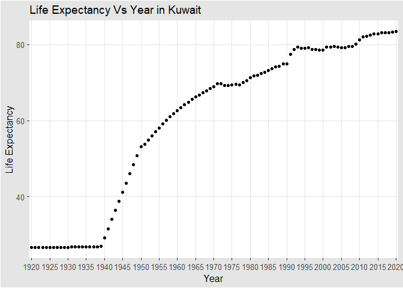
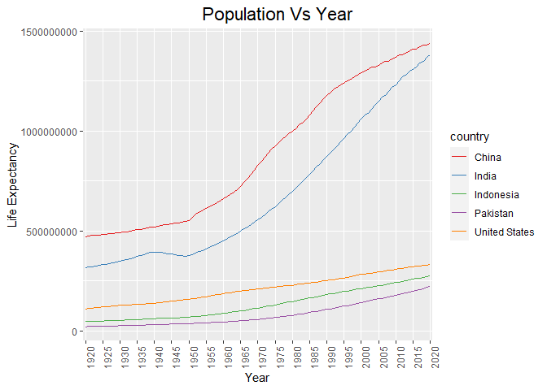

## Instructions
Answer the following questions and complete the exercises in RMarkdown. Please embed all of your code and push your final work to your repository. Your code should be organized, clean, and run free from errors. Be sure to **add your name** to the author header above. You may use any resources to answer these questions (including each other), but you may not post questions to Open Stacks or external help sites. There are 10 total questions.  

Make sure to use the formatting conventions of RMarkdown to make your report neat and clean! Your plots should use consistent aesthetics throughout. Feel free to be creative- there are many possible solutions to these questions!  

This exam is due by **12:00p on Tuesday, February 23**.  

## Load the libraries

```r
library(tidyverse)
```

```
## Warning: package 'tidyverse' was built under R version 4.0.3
```

```
## -- Attaching packages ----------------------------------------------------- tidyverse 1.3.0 --
```

```
## v ggplot2 3.3.2     v purrr   0.3.4
## v tibble  3.0.3     v dplyr   1.0.0
## v tidyr   1.1.0     v stringr 1.4.0
## v readr   1.3.1     v forcats 0.5.0
```

```
## -- Conflicts -------------------------------------------------------- tidyverse_conflicts() --
## x dplyr::filter() masks stats::filter()
## x dplyr::lag()    masks stats::lag()
```

```r
library(janitor)
```

```
## 
## Attaching package: 'janitor'
```

```
## The following objects are masked from 'package:stats':
## 
##     chisq.test, fisher.test
```

```r
library(here)
```

```
## Warning: package 'here' was built under R version 4.0.3
```

```
## here() starts at C:/Users/yamou/Desktop/BIS105L/BIS15W2021_ymoustafa
```

```r
library(ggthemes)
```

```
## Warning: package 'ggthemes' was built under R version 4.0.3
```

```r
library(RColorBrewer)
library(naniar)
```

```
## Warning: package 'naniar' was built under R version 4.0.3
```

```r
options(scipen=999) #disables scientific notation when printing
```

## Gapminder
For this assignment, we are going to use data from  [gapminder](https://www.gapminder.org/). Gapminder includes information about economics, population, social issues, and life expectancy from countries all over the world. We will use three data sets, so please load all three.  

One thing to note is that the data include years beyond 2021. These are projections based on modeling done by the gapminder organization. Start by importing the data.

```r
population <- read_csv(here("midterm2", "data", "population_total.csv"))
```

```
## Parsed with column specification:
## cols(
##   .default = col_double(),
##   country = col_character()
## )
```

```
## See spec(...) for full column specifications.
```

```r
population
```

```
## # A tibble: 195 x 302
##    country `1800` `1801` `1802` `1803` `1804` `1805` `1806` `1807` `1808` `1809`
##    <chr>    <dbl>  <dbl>  <dbl>  <dbl>  <dbl>  <dbl>  <dbl>  <dbl>  <dbl>  <dbl>
##  1 Afghan~ 3.28e6 3.28e6 3.28e6 3.28e6 3.28e6 3.28e6 3.28e6 3.28e6 3.28e6 3.28e6
##  2 Albania 4.00e5 4.02e5 4.04e5 4.05e5 4.07e5 4.09e5 4.11e5 4.13e5 4.14e5 4.16e5
##  3 Algeria 2.50e6 2.51e6 2.52e6 2.53e6 2.54e6 2.55e6 2.56e6 2.56e6 2.57e6 2.58e6
##  4 Andorra 2.65e3 2.65e3 2.65e3 2.65e3 2.65e3 2.65e3 2.65e3 2.65e3 2.65e3 2.65e3
##  5 Angola  1.57e6 1.57e6 1.57e6 1.57e6 1.57e6 1.57e6 1.57e6 1.57e6 1.57e6 1.57e6
##  6 Antigu~ 3.70e4 3.70e4 3.70e4 3.70e4 3.70e4 3.70e4 3.70e4 3.70e4 3.70e4 3.70e4
##  7 Argent~ 5.34e5 5.20e5 5.06e5 4.92e5 4.79e5 4.66e5 4.53e5 4.41e5 4.29e5 4.17e5
##  8 Armenia 4.13e5 4.13e5 4.13e5 4.13e5 4.13e5 4.13e5 4.13e5 4.13e5 4.13e5 4.13e5
##  9 Austra~ 2.00e5 2.05e5 2.11e5 2.16e5 2.22e5 2.27e5 2.33e5 2.39e5 2.46e5 2.52e5
## 10 Austria 3.00e6 3.02e6 3.04e6 3.05e6 3.07e6 3.09e6 3.11e6 3.12e6 3.14e6 3.16e6
## # ... with 185 more rows, and 291 more variables: `1810` <dbl>, `1811` <dbl>,
## #   `1812` <dbl>, `1813` <dbl>, `1814` <dbl>, `1815` <dbl>, `1816` <dbl>,
## #   `1817` <dbl>, `1818` <dbl>, `1819` <dbl>, `1820` <dbl>, `1821` <dbl>,
## #   `1822` <dbl>, `1823` <dbl>, `1824` <dbl>, `1825` <dbl>, `1826` <dbl>,
## #   `1827` <dbl>, `1828` <dbl>, `1829` <dbl>, `1830` <dbl>, `1831` <dbl>,
## #   `1832` <dbl>, `1833` <dbl>, `1834` <dbl>, `1835` <dbl>, `1836` <dbl>,
## #   `1837` <dbl>, `1838` <dbl>, `1839` <dbl>, `1840` <dbl>, `1841` <dbl>,
## #   `1842` <dbl>, `1843` <dbl>, `1844` <dbl>, `1845` <dbl>, `1846` <dbl>,
## #   `1847` <dbl>, `1848` <dbl>, `1849` <dbl>, `1850` <dbl>, `1851` <dbl>,
## #   `1852` <dbl>, `1853` <dbl>, `1854` <dbl>, `1855` <dbl>, `1856` <dbl>,
## #   `1857` <dbl>, `1858` <dbl>, `1859` <dbl>, `1860` <dbl>, `1861` <dbl>,
## #   `1862` <dbl>, `1863` <dbl>, `1864` <dbl>, `1865` <dbl>, `1866` <dbl>,
## #   `1867` <dbl>, `1868` <dbl>, `1869` <dbl>, `1870` <dbl>, `1871` <dbl>,
## #   `1872` <dbl>, `1873` <dbl>, `1874` <dbl>, `1875` <dbl>, `1876` <dbl>,
## #   `1877` <dbl>, `1878` <dbl>, `1879` <dbl>, `1880` <dbl>, `1881` <dbl>,
## #   `1882` <dbl>, `1883` <dbl>, `1884` <dbl>, `1885` <dbl>, `1886` <dbl>,
## #   `1887` <dbl>, `1888` <dbl>, `1889` <dbl>, `1890` <dbl>, `1891` <dbl>,
## #   `1892` <dbl>, `1893` <dbl>, `1894` <dbl>, `1895` <dbl>, `1896` <dbl>,
## #   `1897` <dbl>, `1898` <dbl>, `1899` <dbl>, `1900` <dbl>, `1901` <dbl>,
## #   `1902` <dbl>, `1903` <dbl>, `1904` <dbl>, `1905` <dbl>, `1906` <dbl>,
## #   `1907` <dbl>, `1908` <dbl>, `1909` <dbl>, ...
```


```r
income <- read_csv(here("midterm2","data", "income_per_person_gdppercapita_ppp_inflation_adjusted.csv"))
```

```
## Parsed with column specification:
## cols(
##   .default = col_double(),
##   country = col_character()
## )
```

```
## See spec(...) for full column specifications.
```

```r
income
```

```
## # A tibble: 193 x 242
##    country `1800` `1801` `1802` `1803` `1804` `1805` `1806` `1807` `1808` `1809`
##    <chr>    <dbl>  <dbl>  <dbl>  <dbl>  <dbl>  <dbl>  <dbl>  <dbl>  <dbl>  <dbl>
##  1 Afghan~    603    603    603    603    603    603    603    603    603    603
##  2 Albania    667    667    667    667    667    668    668    668    668    668
##  3 Algeria    715    716    717    718    719    720    721    722    723    724
##  4 Andorra   1200   1200   1200   1200   1210   1210   1210   1210   1220   1220
##  5 Angola     618    620    623    626    628    631    634    637    640    642
##  6 Antigu~    757    757    757    757    757    757    757    758    758    758
##  7 Argent~   1640   1640   1650   1650   1660   1660   1670   1680   1680   1690
##  8 Armenia    514    514    514    514    514    514    514    514    514    514
##  9 Austra~    817    822    826    831    836    841    845    850    855    860
## 10 Austria   1850   1850   1860   1870   1880   1880   1890   1900   1910   1920
## # ... with 183 more rows, and 231 more variables: `1810` <dbl>, `1811` <dbl>,
## #   `1812` <dbl>, `1813` <dbl>, `1814` <dbl>, `1815` <dbl>, `1816` <dbl>,
## #   `1817` <dbl>, `1818` <dbl>, `1819` <dbl>, `1820` <dbl>, `1821` <dbl>,
## #   `1822` <dbl>, `1823` <dbl>, `1824` <dbl>, `1825` <dbl>, `1826` <dbl>,
## #   `1827` <dbl>, `1828` <dbl>, `1829` <dbl>, `1830` <dbl>, `1831` <dbl>,
## #   `1832` <dbl>, `1833` <dbl>, `1834` <dbl>, `1835` <dbl>, `1836` <dbl>,
## #   `1837` <dbl>, `1838` <dbl>, `1839` <dbl>, `1840` <dbl>, `1841` <dbl>,
## #   `1842` <dbl>, `1843` <dbl>, `1844` <dbl>, `1845` <dbl>, `1846` <dbl>,
## #   `1847` <dbl>, `1848` <dbl>, `1849` <dbl>, `1850` <dbl>, `1851` <dbl>,
## #   `1852` <dbl>, `1853` <dbl>, `1854` <dbl>, `1855` <dbl>, `1856` <dbl>,
## #   `1857` <dbl>, `1858` <dbl>, `1859` <dbl>, `1860` <dbl>, `1861` <dbl>,
## #   `1862` <dbl>, `1863` <dbl>, `1864` <dbl>, `1865` <dbl>, `1866` <dbl>,
## #   `1867` <dbl>, `1868` <dbl>, `1869` <dbl>, `1870` <dbl>, `1871` <dbl>,
## #   `1872` <dbl>, `1873` <dbl>, `1874` <dbl>, `1875` <dbl>, `1876` <dbl>,
## #   `1877` <dbl>, `1878` <dbl>, `1879` <dbl>, `1880` <dbl>, `1881` <dbl>,
## #   `1882` <dbl>, `1883` <dbl>, `1884` <dbl>, `1885` <dbl>, `1886` <dbl>,
## #   `1887` <dbl>, `1888` <dbl>, `1889` <dbl>, `1890` <dbl>, `1891` <dbl>,
## #   `1892` <dbl>, `1893` <dbl>, `1894` <dbl>, `1895` <dbl>, `1896` <dbl>,
## #   `1897` <dbl>, `1898` <dbl>, `1899` <dbl>, `1900` <dbl>, `1901` <dbl>,
## #   `1902` <dbl>, `1903` <dbl>, `1904` <dbl>, `1905` <dbl>, `1906` <dbl>,
## #   `1907` <dbl>, `1908` <dbl>, `1909` <dbl>, ...
```


```r
life_expectancy <- read_csv(here("midterm2","data", "life_expectancy_years.csv"))
```

```
## Parsed with column specification:
## cols(
##   .default = col_double(),
##   country = col_character()
## )
```

```
## See spec(...) for full column specifications.
```

```r
life_expectancy
```

```
## # A tibble: 187 x 302
##    country `1800` `1801` `1802` `1803` `1804` `1805` `1806` `1807` `1808` `1809`
##    <chr>    <dbl>  <dbl>  <dbl>  <dbl>  <dbl>  <dbl>  <dbl>  <dbl>  <dbl>  <dbl>
##  1 Afghan~   28.2   28.2   28.2   28.2   28.2   28.2   28.1   28.1   28.1   28.1
##  2 Albania   35.4   35.4   35.4   35.4   35.4   35.4   35.4   35.4   35.4   35.4
##  3 Algeria   28.8   28.8   28.8   28.8   28.8   28.8   28.8   28.8   28.8   28.8
##  4 Andorra   NA     NA     NA     NA     NA     NA     NA     NA     NA     NA  
##  5 Angola    27     27     27     27     27     27     27     27     27     27  
##  6 Antigu~   33.5   33.5   33.5   33.5   33.5   33.5   33.5   33.5   33.5   33.5
##  7 Argent~   33.2   33.2   33.2   33.2   33.2   33.2   33.2   33.2   33.2   33.2
##  8 Armenia   34     34     34     34     34     34     34     34     34     34  
##  9 Austra~   34     34     34     34     34     34     34     34     34     34  
## 10 Austria   34.4   34.4   34.4   34.4   34.4   34.4   34.4   34.4   34.4   34.4
## # ... with 177 more rows, and 291 more variables: `1810` <dbl>, `1811` <dbl>,
## #   `1812` <dbl>, `1813` <dbl>, `1814` <dbl>, `1815` <dbl>, `1816` <dbl>,
## #   `1817` <dbl>, `1818` <dbl>, `1819` <dbl>, `1820` <dbl>, `1821` <dbl>,
## #   `1822` <dbl>, `1823` <dbl>, `1824` <dbl>, `1825` <dbl>, `1826` <dbl>,
## #   `1827` <dbl>, `1828` <dbl>, `1829` <dbl>, `1830` <dbl>, `1831` <dbl>,
## #   `1832` <dbl>, `1833` <dbl>, `1834` <dbl>, `1835` <dbl>, `1836` <dbl>,
## #   `1837` <dbl>, `1838` <dbl>, `1839` <dbl>, `1840` <dbl>, `1841` <dbl>,
## #   `1842` <dbl>, `1843` <dbl>, `1844` <dbl>, `1845` <dbl>, `1846` <dbl>,
## #   `1847` <dbl>, `1848` <dbl>, `1849` <dbl>, `1850` <dbl>, `1851` <dbl>,
## #   `1852` <dbl>, `1853` <dbl>, `1854` <dbl>, `1855` <dbl>, `1856` <dbl>,
## #   `1857` <dbl>, `1858` <dbl>, `1859` <dbl>, `1860` <dbl>, `1861` <dbl>,
## #   `1862` <dbl>, `1863` <dbl>, `1864` <dbl>, `1865` <dbl>, `1866` <dbl>,
## #   `1867` <dbl>, `1868` <dbl>, `1869` <dbl>, `1870` <dbl>, `1871` <dbl>,
## #   `1872` <dbl>, `1873` <dbl>, `1874` <dbl>, `1875` <dbl>, `1876` <dbl>,
## #   `1877` <dbl>, `1878` <dbl>, `1879` <dbl>, `1880` <dbl>, `1881` <dbl>,
## #   `1882` <dbl>, `1883` <dbl>, `1884` <dbl>, `1885` <dbl>, `1886` <dbl>,
## #   `1887` <dbl>, `1888` <dbl>, `1889` <dbl>, `1890` <dbl>, `1891` <dbl>,
## #   `1892` <dbl>, `1893` <dbl>, `1894` <dbl>, `1895` <dbl>, `1896` <dbl>,
## #   `1897` <dbl>, `1898` <dbl>, `1899` <dbl>, `1900` <dbl>, `1901` <dbl>,
## #   `1902` <dbl>, `1903` <dbl>, `1904` <dbl>, `1905` <dbl>, `1906` <dbl>,
## #   `1907` <dbl>, `1908` <dbl>, `1909` <dbl>, ...
```

1. (3 points) Once you have an idea of the structure of the data, please make each data set tidy and store them as new objects. You will need both the original and tidy data!

```r
pop_longer <- population %>% 
  pivot_longer(-country, names_to = "year",
               values_to="population_n")
```


```r
income_longer <- income %>% 
  pivot_longer(-country, names_to = "year",
               values_to="income_n")
```


```r
le_longer <- life_expectancy %>% 
  pivot_longer(-country, names_to = "year",
               values_to="life_expectancy_n")
```

2. (1 point) How many different countries are represented in the data? Provide the total number and their names. Since each data set includes different numbers of countries, you will need to do this for each one.

```r
population %>% 
  summarize(n_distinct(country))
```

```
## # A tibble: 1 x 1
##   `n_distinct(country)`
##                   <int>
## 1                   195
```

```r
table(population$country)
```

```
## 
##                    Afghanistan                        Albania 
##                              1                              1 
##                        Algeria                        Andorra 
##                              1                              1 
##                         Angola            Antigua and Barbuda 
##                              1                              1 
##                      Argentina                        Armenia 
##                              1                              1 
##                      Australia                        Austria 
##                              1                              1 
##                     Azerbaijan                        Bahamas 
##                              1                              1 
##                        Bahrain                     Bangladesh 
##                              1                              1 
##                       Barbados                        Belarus 
##                              1                              1 
##                        Belgium                         Belize 
##                              1                              1 
##                          Benin                         Bhutan 
##                              1                              1 
##                        Bolivia         Bosnia and Herzegovina 
##                              1                              1 
##                       Botswana                         Brazil 
##                              1                              1 
##                         Brunei                       Bulgaria 
##                              1                              1 
##                   Burkina Faso                        Burundi 
##                              1                              1 
##                       Cambodia                       Cameroon 
##                              1                              1 
##                         Canada                     Cape Verde 
##                              1                              1 
##       Central African Republic                           Chad 
##                              1                              1 
##                          Chile                          China 
##                              1                              1 
##                       Colombia                        Comoros 
##                              1                              1 
##               Congo, Dem. Rep.                    Congo, Rep. 
##                              1                              1 
##                     Costa Rica                  Cote d'Ivoire 
##                              1                              1 
##                        Croatia                           Cuba 
##                              1                              1 
##                         Cyprus                 Czech Republic 
##                              1                              1 
##                        Denmark                       Djibouti 
##                              1                              1 
##                       Dominica             Dominican Republic 
##                              1                              1 
##                        Ecuador                          Egypt 
##                              1                              1 
##                    El Salvador              Equatorial Guinea 
##                              1                              1 
##                        Eritrea                        Estonia 
##                              1                              1 
##                       Eswatini                       Ethiopia 
##                              1                              1 
##                           Fiji                        Finland 
##                              1                              1 
##                         France                          Gabon 
##                              1                              1 
##                         Gambia                        Georgia 
##                              1                              1 
##                        Germany                          Ghana 
##                              1                              1 
##                         Greece                        Grenada 
##                              1                              1 
##                      Guatemala                         Guinea 
##                              1                              1 
##                  Guinea-Bissau                         Guyana 
##                              1                              1 
##                          Haiti                       Holy See 
##                              1                              1 
##                       Honduras                        Hungary 
##                              1                              1 
##                        Iceland                          India 
##                              1                              1 
##                      Indonesia                           Iran 
##                              1                              1 
##                           Iraq                        Ireland 
##                              1                              1 
##                         Israel                          Italy 
##                              1                              1 
##                        Jamaica                          Japan 
##                              1                              1 
##                         Jordan                     Kazakhstan 
##                              1                              1 
##                          Kenya                       Kiribati 
##                              1                              1 
##                         Kuwait                Kyrgyz Republic 
##                              1                              1 
##                            Lao                         Latvia 
##                              1                              1 
##                        Lebanon                        Lesotho 
##                              1                              1 
##                        Liberia                          Libya 
##                              1                              1 
##                  Liechtenstein                      Lithuania 
##                              1                              1 
##                     Luxembourg                     Madagascar 
##                              1                              1 
##                         Malawi                       Malaysia 
##                              1                              1 
##                       Maldives                           Mali 
##                              1                              1 
##                          Malta               Marshall Islands 
##                              1                              1 
##                     Mauritania                      Mauritius 
##                              1                              1 
##                         Mexico          Micronesia, Fed. Sts. 
##                              1                              1 
##                        Moldova                         Monaco 
##                              1                              1 
##                       Mongolia                     Montenegro 
##                              1                              1 
##                        Morocco                     Mozambique 
##                              1                              1 
##                        Myanmar                        Namibia 
##                              1                              1 
##                          Nauru                          Nepal 
##                              1                              1 
##                    Netherlands                    New Zealand 
##                              1                              1 
##                      Nicaragua                          Niger 
##                              1                              1 
##                        Nigeria                    North Korea 
##                              1                              1 
##                North Macedonia                         Norway 
##                              1                              1 
##                           Oman                       Pakistan 
##                              1                              1 
##                          Palau                      Palestine 
##                              1                              1 
##                         Panama               Papua New Guinea 
##                              1                              1 
##                       Paraguay                           Peru 
##                              1                              1 
##                    Philippines                         Poland 
##                              1                              1 
##                       Portugal                          Qatar 
##                              1                              1 
##                        Romania                         Russia 
##                              1                              1 
##                         Rwanda                          Samoa 
##                              1                              1 
##                     San Marino          Sao Tome and Principe 
##                              1                              1 
##                   Saudi Arabia                        Senegal 
##                              1                              1 
##                         Serbia                     Seychelles 
##                              1                              1 
##                   Sierra Leone                      Singapore 
##                              1                              1 
##                Slovak Republic                       Slovenia 
##                              1                              1 
##                Solomon Islands                        Somalia 
##                              1                              1 
##                   South Africa                    South Korea 
##                              1                              1 
##                    South Sudan                          Spain 
##                              1                              1 
##                      Sri Lanka            St. Kitts and Nevis 
##                              1                              1 
##                      St. Lucia St. Vincent and the Grenadines 
##                              1                              1 
##                          Sudan                       Suriname 
##                              1                              1 
##                         Sweden                    Switzerland 
##                              1                              1 
##                          Syria                     Tajikistan 
##                              1                              1 
##                       Tanzania                       Thailand 
##                              1                              1 
##                    Timor-Leste                           Togo 
##                              1                              1 
##                          Tonga            Trinidad and Tobago 
##                              1                              1 
##                        Tunisia                         Turkey 
##                              1                              1 
##                   Turkmenistan                         Tuvalu 
##                              1                              1 
##                         Uganda                        Ukraine 
##                              1                              1 
##           United Arab Emirates                 United Kingdom 
##                              1                              1 
##                  United States                        Uruguay 
##                              1                              1 
##                     Uzbekistan                        Vanuatu 
##                              1                              1 
##                      Venezuela                        Vietnam 
##                              1                              1 
##                          Yemen                         Zambia 
##                              1                              1 
##                       Zimbabwe 
##                              1
```


```r
income %>% 
  summarize(n_distinct(country))
```

```
## # A tibble: 1 x 1
##   `n_distinct(country)`
##                   <int>
## 1                   193
```

```r
table(income$country)
```

```
## 
##                    Afghanistan                        Albania 
##                              1                              1 
##                        Algeria                        Andorra 
##                              1                              1 
##                         Angola            Antigua and Barbuda 
##                              1                              1 
##                      Argentina                        Armenia 
##                              1                              1 
##                      Australia                        Austria 
##                              1                              1 
##                     Azerbaijan                        Bahamas 
##                              1                              1 
##                        Bahrain                     Bangladesh 
##                              1                              1 
##                       Barbados                        Belarus 
##                              1                              1 
##                        Belgium                         Belize 
##                              1                              1 
##                          Benin                         Bhutan 
##                              1                              1 
##                        Bolivia         Bosnia and Herzegovina 
##                              1                              1 
##                       Botswana                         Brazil 
##                              1                              1 
##                         Brunei                       Bulgaria 
##                              1                              1 
##                   Burkina Faso                        Burundi 
##                              1                              1 
##                       Cambodia                       Cameroon 
##                              1                              1 
##                         Canada                     Cape Verde 
##                              1                              1 
##       Central African Republic                           Chad 
##                              1                              1 
##                          Chile                          China 
##                              1                              1 
##                       Colombia                        Comoros 
##                              1                              1 
##               Congo, Dem. Rep.                    Congo, Rep. 
##                              1                              1 
##                     Costa Rica                  Cote d'Ivoire 
##                              1                              1 
##                        Croatia                           Cuba 
##                              1                              1 
##                         Cyprus                 Czech Republic 
##                              1                              1 
##                        Denmark                       Djibouti 
##                              1                              1 
##                       Dominica             Dominican Republic 
##                              1                              1 
##                        Ecuador                          Egypt 
##                              1                              1 
##                    El Salvador              Equatorial Guinea 
##                              1                              1 
##                        Eritrea                        Estonia 
##                              1                              1 
##                       Eswatini                       Ethiopia 
##                              1                              1 
##                           Fiji                        Finland 
##                              1                              1 
##                         France                          Gabon 
##                              1                              1 
##                         Gambia                        Georgia 
##                              1                              1 
##                        Germany                          Ghana 
##                              1                              1 
##                         Greece                        Grenada 
##                              1                              1 
##                      Guatemala                         Guinea 
##                              1                              1 
##                  Guinea-Bissau                         Guyana 
##                              1                              1 
##                          Haiti                       Honduras 
##                              1                              1 
##                        Hungary                        Iceland 
##                              1                              1 
##                          India                      Indonesia 
##                              1                              1 
##                           Iran                           Iraq 
##                              1                              1 
##                        Ireland                         Israel 
##                              1                              1 
##                          Italy                        Jamaica 
##                              1                              1 
##                          Japan                         Jordan 
##                              1                              1 
##                     Kazakhstan                          Kenya 
##                              1                              1 
##                       Kiribati                         Kuwait 
##                              1                              1 
##                Kyrgyz Republic                            Lao 
##                              1                              1 
##                         Latvia                        Lebanon 
##                              1                              1 
##                        Lesotho                        Liberia 
##                              1                              1 
##                          Libya                      Lithuania 
##                              1                              1 
##                     Luxembourg                     Madagascar 
##                              1                              1 
##                         Malawi                       Malaysia 
##                              1                              1 
##                       Maldives                           Mali 
##                              1                              1 
##                          Malta               Marshall Islands 
##                              1                              1 
##                     Mauritania                      Mauritius 
##                              1                              1 
##                         Mexico          Micronesia, Fed. Sts. 
##                              1                              1 
##                        Moldova                         Monaco 
##                              1                              1 
##                       Mongolia                     Montenegro 
##                              1                              1 
##                        Morocco                     Mozambique 
##                              1                              1 
##                        Myanmar                        Namibia 
##                              1                              1 
##                          Nauru                          Nepal 
##                              1                              1 
##                    Netherlands                    New Zealand 
##                              1                              1 
##                      Nicaragua                          Niger 
##                              1                              1 
##                        Nigeria                    North Korea 
##                              1                              1 
##                North Macedonia                         Norway 
##                              1                              1 
##                           Oman                       Pakistan 
##                              1                              1 
##                          Palau                      Palestine 
##                              1                              1 
##                         Panama               Papua New Guinea 
##                              1                              1 
##                       Paraguay                           Peru 
##                              1                              1 
##                    Philippines                         Poland 
##                              1                              1 
##                       Portugal                          Qatar 
##                              1                              1 
##                        Romania                         Russia 
##                              1                              1 
##                         Rwanda                          Samoa 
##                              1                              1 
##                     San Marino          Sao Tome and Principe 
##                              1                              1 
##                   Saudi Arabia                        Senegal 
##                              1                              1 
##                         Serbia                     Seychelles 
##                              1                              1 
##                   Sierra Leone                      Singapore 
##                              1                              1 
##                Slovak Republic                       Slovenia 
##                              1                              1 
##                Solomon Islands                        Somalia 
##                              1                              1 
##                   South Africa                    South Korea 
##                              1                              1 
##                    South Sudan                          Spain 
##                              1                              1 
##                      Sri Lanka            St. Kitts and Nevis 
##                              1                              1 
##                      St. Lucia St. Vincent and the Grenadines 
##                              1                              1 
##                          Sudan                       Suriname 
##                              1                              1 
##                         Sweden                    Switzerland 
##                              1                              1 
##                          Syria                     Tajikistan 
##                              1                              1 
##                       Tanzania                       Thailand 
##                              1                              1 
##                    Timor-Leste                           Togo 
##                              1                              1 
##                          Tonga            Trinidad and Tobago 
##                              1                              1 
##                        Tunisia                         Turkey 
##                              1                              1 
##                   Turkmenistan                         Tuvalu 
##                              1                              1 
##                         Uganda                        Ukraine 
##                              1                              1 
##           United Arab Emirates                 United Kingdom 
##                              1                              1 
##                  United States                        Uruguay 
##                              1                              1 
##                     Uzbekistan                        Vanuatu 
##                              1                              1 
##                      Venezuela                        Vietnam 
##                              1                              1 
##                          Yemen                         Zambia 
##                              1                              1 
##                       Zimbabwe 
##                              1
```


```r
life_expectancy %>% 
  summarize(n_distinct(country))
```

```
## # A tibble: 1 x 1
##   `n_distinct(country)`
##                   <int>
## 1                   187
```

```r
table(life_expectancy$country)
```

```
## 
##                    Afghanistan                        Albania 
##                              1                              1 
##                        Algeria                        Andorra 
##                              1                              1 
##                         Angola            Antigua and Barbuda 
##                              1                              1 
##                      Argentina                        Armenia 
##                              1                              1 
##                      Australia                        Austria 
##                              1                              1 
##                     Azerbaijan                        Bahamas 
##                              1                              1 
##                        Bahrain                     Bangladesh 
##                              1                              1 
##                       Barbados                        Belarus 
##                              1                              1 
##                        Belgium                         Belize 
##                              1                              1 
##                          Benin                         Bhutan 
##                              1                              1 
##                        Bolivia         Bosnia and Herzegovina 
##                              1                              1 
##                       Botswana                         Brazil 
##                              1                              1 
##                         Brunei                       Bulgaria 
##                              1                              1 
##                   Burkina Faso                        Burundi 
##                              1                              1 
##                       Cambodia                       Cameroon 
##                              1                              1 
##                         Canada                     Cape Verde 
##                              1                              1 
##       Central African Republic                           Chad 
##                              1                              1 
##                          Chile                          China 
##                              1                              1 
##                       Colombia                        Comoros 
##                              1                              1 
##               Congo, Dem. Rep.                    Congo, Rep. 
##                              1                              1 
##                     Costa Rica                  Cote d'Ivoire 
##                              1                              1 
##                        Croatia                           Cuba 
##                              1                              1 
##                         Cyprus                 Czech Republic 
##                              1                              1 
##                        Denmark                       Djibouti 
##                              1                              1 
##                       Dominica             Dominican Republic 
##                              1                              1 
##                        Ecuador                          Egypt 
##                              1                              1 
##                    El Salvador              Equatorial Guinea 
##                              1                              1 
##                        Eritrea                        Estonia 
##                              1                              1 
##                       Eswatini                       Ethiopia 
##                              1                              1 
##                           Fiji                        Finland 
##                              1                              1 
##                         France                          Gabon 
##                              1                              1 
##                         Gambia                        Georgia 
##                              1                              1 
##                        Germany                          Ghana 
##                              1                              1 
##                         Greece                        Grenada 
##                              1                              1 
##                      Guatemala                         Guinea 
##                              1                              1 
##                  Guinea-Bissau                         Guyana 
##                              1                              1 
##                          Haiti                       Honduras 
##                              1                              1 
##                        Hungary                        Iceland 
##                              1                              1 
##                          India                      Indonesia 
##                              1                              1 
##                           Iran                           Iraq 
##                              1                              1 
##                        Ireland                         Israel 
##                              1                              1 
##                          Italy                        Jamaica 
##                              1                              1 
##                          Japan                         Jordan 
##                              1                              1 
##                     Kazakhstan                          Kenya 
##                              1                              1 
##                       Kiribati                         Kuwait 
##                              1                              1 
##                Kyrgyz Republic                            Lao 
##                              1                              1 
##                         Latvia                        Lebanon 
##                              1                              1 
##                        Lesotho                        Liberia 
##                              1                              1 
##                          Libya                      Lithuania 
##                              1                              1 
##                     Luxembourg                     Madagascar 
##                              1                              1 
##                         Malawi                       Malaysia 
##                              1                              1 
##                       Maldives                           Mali 
##                              1                              1 
##                          Malta               Marshall Islands 
##                              1                              1 
##                     Mauritania                      Mauritius 
##                              1                              1 
##                         Mexico          Micronesia, Fed. Sts. 
##                              1                              1 
##                        Moldova                       Mongolia 
##                              1                              1 
##                     Montenegro                        Morocco 
##                              1                              1 
##                     Mozambique                        Myanmar 
##                              1                              1 
##                        Namibia                          Nepal 
##                              1                              1 
##                    Netherlands                    New Zealand 
##                              1                              1 
##                      Nicaragua                          Niger 
##                              1                              1 
##                        Nigeria                    North Korea 
##                              1                              1 
##                North Macedonia                         Norway 
##                              1                              1 
##                           Oman                       Pakistan 
##                              1                              1 
##                      Palestine                         Panama 
##                              1                              1 
##               Papua New Guinea                       Paraguay 
##                              1                              1 
##                           Peru                    Philippines 
##                              1                              1 
##                         Poland                       Portugal 
##                              1                              1 
##                          Qatar                        Romania 
##                              1                              1 
##                         Russia                         Rwanda 
##                              1                              1 
##                          Samoa          Sao Tome and Principe 
##                              1                              1 
##                   Saudi Arabia                        Senegal 
##                              1                              1 
##                         Serbia                     Seychelles 
##                              1                              1 
##                   Sierra Leone                      Singapore 
##                              1                              1 
##                Slovak Republic                       Slovenia 
##                              1                              1 
##                Solomon Islands                        Somalia 
##                              1                              1 
##                   South Africa                    South Korea 
##                              1                              1 
##                    South Sudan                          Spain 
##                              1                              1 
##                      Sri Lanka                      St. Lucia 
##                              1                              1 
## St. Vincent and the Grenadines                          Sudan 
##                              1                              1 
##                       Suriname                         Sweden 
##                              1                              1 
##                    Switzerland                          Syria 
##                              1                              1 
##                     Tajikistan                       Tanzania 
##                              1                              1 
##                       Thailand                    Timor-Leste 
##                              1                              1 
##                           Togo                          Tonga 
##                              1                              1 
##            Trinidad and Tobago                        Tunisia 
##                              1                              1 
##                         Turkey                   Turkmenistan 
##                              1                              1 
##                         Uganda                        Ukraine 
##                              1                              1 
##           United Arab Emirates                 United Kingdom 
##                              1                              1 
##                  United States                        Uruguay 
##                              1                              1 
##                     Uzbekistan                        Vanuatu 
##                              1                              1 
##                      Venezuela                        Vietnam 
##                              1                              1 
##                          Yemen                         Zambia 
##                              1                              1 
##                       Zimbabwe 
##                              1
```

## Life Expectancy  

3. (2 points) Let's limit the data to the past 100 years (1920-2020). For these years, which country has the highest life expectancy? How about the lowest life expectancy?  

Highest

```r
le_longer %>% 
  filter(between(year, 1920, 2020)) %>% 
  group_by(country) %>% 
  summarize(meanle = mean(life_expectancy_n, na.rm = T)) %>%
  arrange(desc(meanle))
```

```
## `summarise()` ungrouping output (override with `.groups` argument)
```

```
## # A tibble: 187 x 2
##    country     meanle
##    <chr>        <dbl>
##  1 Andorra       79.8
##  2 Sweden        73.5
##  3 Norway        73.2
##  4 Netherlands   73.0
##  5 Dominica      73.0
##  6 Iceland       72.9
##  7 Australia     72.7
##  8 Switzerland   72.7
##  9 Denmark       71.9
## 10 Canada        71.8
## # ... with 177 more rows
```
#### Andorra has the highest average life expectanct in the past 100 years ####

Lowest

```r
le_longer %>% 
  filter(between(year, 1920, 2020)) %>% 
  group_by(country) %>% 
  summarize(meanle = mean(life_expectancy_n, na.rm = T)) %>% 
  arrange(meanle)
```

```
## `summarise()` ungrouping output (override with `.groups` argument)
```

```
## # A tibble: 187 x 2
##    country                  meanle
##    <chr>                     <dbl>
##  1 Central African Republic   41.8
##  2 Mali                       41.8
##  3 Ethiopia                   42.6
##  4 Sierra Leone               42.6
##  5 Guinea-Bissau              42.6
##  6 Burundi                    42.8
##  7 Malawi                     42.8
##  8 Uganda                     43.3
##  9 Eritrea                    43.4
## 10 Yemen                      43.6
## # ... with 177 more rows
```
#### Central African Republic has the lowest life expectancy in the past 100 years ####

4. (3 points) Although we can see which country has the highest life expectancy for the past 100 years, we don't know which countries have changed the most. What are the top 5 countries that have experienced the biggest improvement in life expectancy between 1920-2020?

```r
le_longer %>% 
  filter(year == 1920 | year == 2020) %>% 
  filter(!is.na(life_expectancy_n)) %>% 
  arrange(country, year) %>% 
  mutate(le_change=ifelse(year==2020,
                          life_expectancy_n-lag(life_expectancy_n), NA)) %>%
  arrange(desc(le_change)) %>% 
  top_n(5,le_change)
```

```
## # A tibble: 5 x 4
##   country         year  life_expectancy_n le_change
##   <chr>           <chr>             <dbl>     <dbl>
## 1 Kuwait          2020               83.4      56.8
## 2 Kyrgyz Republic 2020               73.1      56.5
## 3 Turkmenistan    2020               70.5      55.3
## 4 South Korea     2020               83.2      55  
## 5 Tajikistan      2020               71        54.3
```
### Here I'm just finding the change in life expectancy for the countries that did not have data in 1920 or 2020. Marshall Islands has no life expectancy data ###

```r
le_longer %>% 
  filter(country =="Andorra"|
           country=="Dominica"|year=="Marshall Islands") %>%
  filter(year == 1970 | year == 2017) %>% 
  arrange(country, year) %>% 
  mutate(le_change=ifelse(year==2017,
                          life_expectancy_n-lag(life_expectancy_n), NA))
```

```
## # A tibble: 4 x 4
##   country  year  life_expectancy_n le_change
##   <chr>    <chr>             <dbl>     <dbl>
## 1 Andorra  1970               75.5     NA   
## 2 Andorra  2017               82.7      7.2 
## 3 Dominica 1970               68.2     NA   
## 4 Dominica 2017               72.8      4.60
```


5. (3 points) Make a plot that shows the change over the past 100 years for the country with the biggest improvement in life expectancy. Be sure to add appropriate aesthetics to make the plot clean and clear. Once you have made the plot, do a little internet searching and see if you can discover what historical event may have contributed to this remarkable change.  

### This may be attributed to their development of their petroleum industry and greater government spending on healthcare ###


```r
le_longer %>% 
  filter(country=="Kuwait") %>% 
  filter(between(year, 1920,2020)) %>%
  ggplot(aes(x=year, y=life_expectancy_n))+
  geom_point()+
  scale_x_discrete(breaks=seq(1920, 2020, by = 5))+
  theme(axis.text.x = element_text(angle = 90, hjust = 1), plot.title =
          element_text(size = rel(1.5), hjust = 0.7))+
   labs(title = "Life Expectancy Vs Year in Kuwait",
       x = "Year",
       y = "Life Expectancy")+
  theme_igray()
```

<!-- -->


## Population Growth
6. (3 points) Which 5 countries have had the highest population growth over the past 100 years (1920-2020)?

```r
pop_longer %>% 
  filter(year == 1920 | year == 2020) %>% 
  filter(!is.na(population_n)) %>% 
  arrange(country, year) %>% 
  mutate(pop_change=ifelse(year==2020,
                          population_n-lag(population_n), NA)) %>%
  arrange(desc(pop_change)) %>% 
  top_n(5,pop_change)
```

```
## # A tibble: 5 x 4
##   country       year  population_n pop_change
##   <chr>         <chr>        <dbl>      <dbl>
## 1 India         2020    1380000000 1063000000
## 2 China         2020    1440000000  968000000
## 3 Indonesia     2020     274000000  226700000
## 4 United States 2020     331000000  220000000
## 5 Pakistan      2020     221000000  199300000
```

7. (4 points) Produce a plot that shows the 5 countries that have had the highest population growth over the past 100 years (1920-2020). Which countries appear to have had exponential growth?  

```r
pop_longer %>% 
  filter(country=="India"|country =="China"|
           country=="Indonesia"|country=="United States"|
           country=="Pakistan") %>% 
  filter(between(year, 1920,2020)) %>%
  ggplot(aes(x=year, y=population_n, color=country, group=country))+
  #scale_y_log10()+
  geom_line()+
  scale_x_discrete(breaks=seq(1920, 2020, by = 5))+
  theme(axis.text.x = element_text(angle = 90, hjust = 1), 
        plot.title = element_text(size = rel(1.5), hjust = 0.6),
        panel.background = element_rect(fill="grey")
        )+
   labs(title = "Population Vs Year",
       x = "Year",
       y = "Life Expectancy")+
  scale_colour_brewer(palette = "GnBu")
```

<!-- -->

###  China and India appear to have exponential growth ###

## Income
The units used for income are gross domestic product per person adjusted for differences in purchasing power in international dollars.

8. (4 points) As in the previous questions, which countries have experienced the biggest growth in per person GDP. Show this as a table and then plot the changes for the top 5 countries. With a bit of research, you should be able to explain the dramatic downturns of the wealthiest economies that occurred during the 1980's.

### The dip in GDP for Brunei and Qatar in the 1980's can be attributed to the sharp decline in oil prices during this time ###


```r
income_longer %>% 
  filter(year == 1800 | year == 2020) %>% 
  arrange(country, year) %>% 
  mutate(inc_change=ifelse(year==2020,
                          income_n-lag(income_n), NA)) %>% 
  arrange(desc(inc_change)) %>% 
  top_n(5, inc_change)
```

```
## # A tibble: 5 x 4
##   country    year  income_n inc_change
##   <chr>      <chr>    <dbl>      <dbl>
## 1 Qatar      2020    116000     114900
## 2 Luxembourg 2020     95100      93650
## 3 Singapore  2020     90500      89480
## 4 Brunei     2020     75100      73590
## 5 Ireland    2020     74100      72640
```


```r
income_longer %>% 
  filter(country=="Qatar"|country =="Luxembourg"|
           country=="Singapore"|country=="Brunei"|
           country=="Ireland") %>% 
  ggplot(aes(x=year, y= income_n, group=country, colour = country))+
  geom_line()+
  scale_y_log10()+
  scale_x_discrete(breaks=seq(1800, 2020, by = 10))+
  theme(axis.text.x = element_text(angle = 90, hjust = 1), 
        plot.title = element_text(size = rel(1.5), hjust = 0.5),
        #panel.background = element_rect(fill="black")
        )+
   labs(title = "GDP Vs Year",
       x = "Year",
       y = "Log10(GDP)")+
  scale_colour_brewer(palette = "Dark2")
```

<!-- -->


9. (3 points) Create three new objects that restrict each data set (life expectancy, population, income) to the years 1920-2020. Hint: I suggest doing this with the long form of your data. Once this is done, merge all three data sets using the code I provide below. You may need to adjust the code depending on how you have named your objects. I called mine `life_expectancy_100`, `population_100`, and `income_100`. For some of you, learning these `joins` will be important for your project.  

life_expectancy_100

```r
life_expectancy_100<- le_longer %>% 
  filter(between(year,1920,2020))
```

population_100

```r
population_100<- pop_longer %>% 
  filter(between(year,1920,2020))
```

income_100

```r
income_100<-income_longer %>% 
  filter(between(year,1920,2020))
```


```r
gapminder_join <- inner_join(life_expectancy_100, population_100, by= c("country", "year"))
gapminder_join <- inner_join(gapminder_join, income_100, by= c("country", "year"))
gapminder_join
```

```
## # A tibble: 18,887 x 5
##    country     year  life_expectancy_n population_n income_n
##    <chr>       <chr>             <dbl>        <dbl>    <dbl>
##  1 Afghanistan 1920               30.6     10600000     1490
##  2 Afghanistan 1921               30.7     10500000     1520
##  3 Afghanistan 1922               30.8     10300000     1550
##  4 Afghanistan 1923               30.8      9710000     1570
##  5 Afghanistan 1924               30.9      9200000     1600
##  6 Afghanistan 1925               31        8720000     1630
##  7 Afghanistan 1926               31        8260000     1650
##  8 Afghanistan 1927               31.1      7830000     1680
##  9 Afghanistan 1928               31.1      7420000     1710
## 10 Afghanistan 1929               31.2      7100000     1740
## # ... with 18,877 more rows
```

10. (4 points) Use the joined data to perform an analysis of your choice. The analysis should include a comparison between two or more of the variables `life_expectancy`, `population`, or `income.`

```r
gapminder_join %>% 
  filter(between(year, 2000, 2020)) %>%
  group_by(country) %>% 
  summarise(meaninc=mean(income_n, na.rm = T),
            meanle=mean(life_expectancy_n,na.rm = T)) %>% 
  ggplot(aes(x=meaninc, y=meanle))+
  geom_point()+
  scale_x_log10()+
  geom_smooth(method='lm')+
  theme(axis.text.x = element_text(angle = 90, hjust = 1), 
        plot.title = element_text(size = rel(1.5), hjust = 0.5),
        #panel.background = element_rect(fill="black")
        )+
   labs(title = "Average GDP Vs Average Life Expectancy in the past 10 Years",
       x = "Log10(GDP)",
       y = "Average Life Expectancy")+
  theme_economist()
```

```
## `summarise()` ungrouping output (override with `.groups` argument)
```

```
## `geom_smooth()` using formula 'y ~ x'
```

<!-- -->


